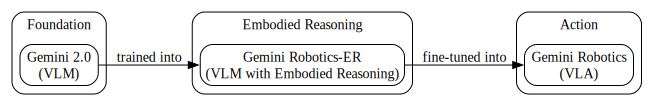
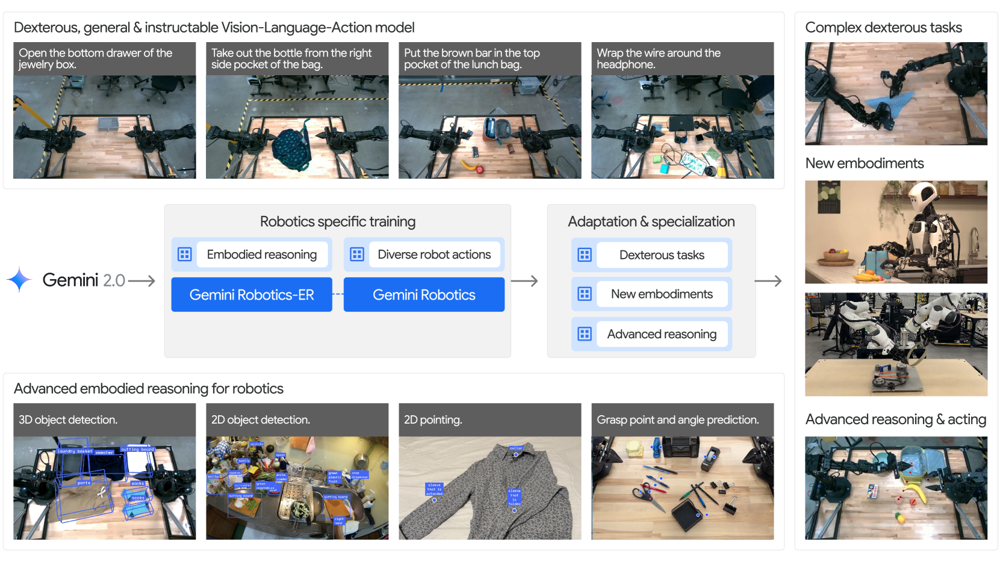
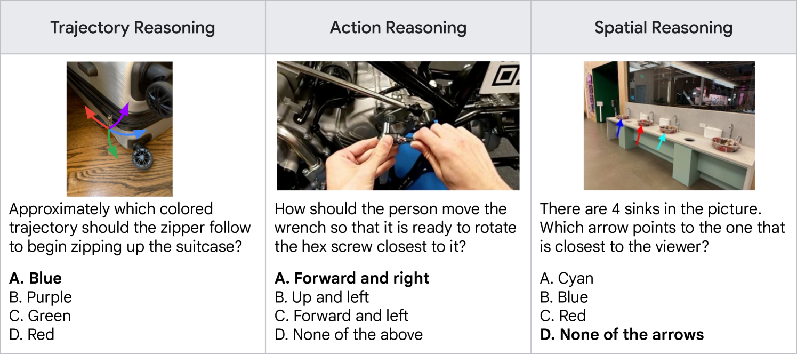
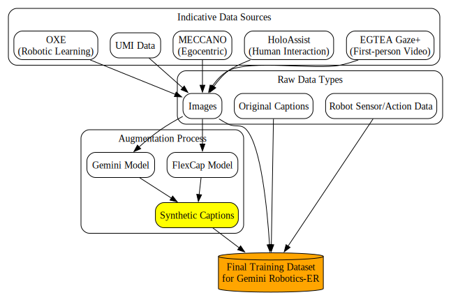
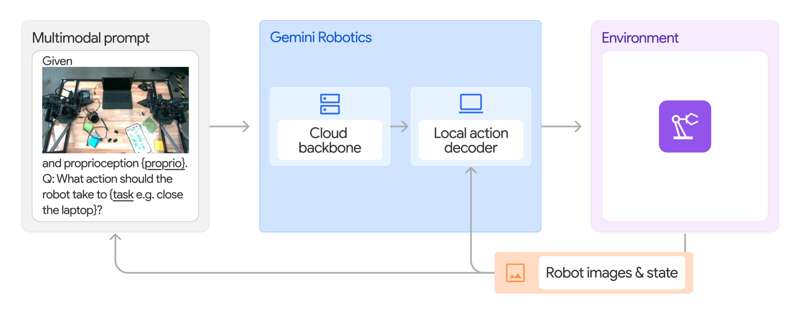
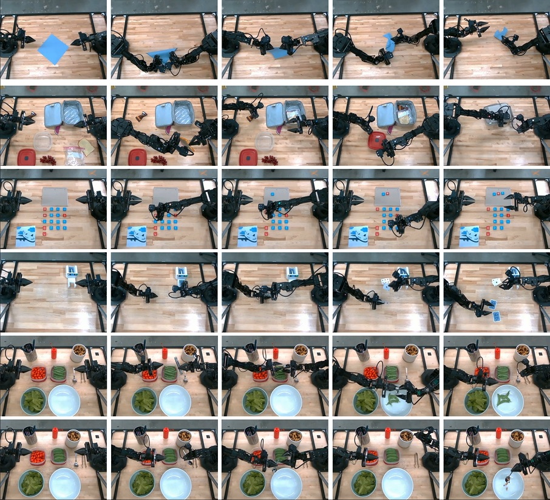

# Relationship between ER Model and VLA Model

Based on the source paper, the Gemini Robotics family of models illustrates a clear hierarchical and evolutionary relationship. It starts with a general-purpose foundation model, which is then specialized for embodied reasoning, and finally, this specialized model is further adapted for direct robot action. This creates a pipeline from understanding to action.

## Visualization

The following graph illustrates the relationship:

---

## The Models

### 1. Gemini 2.0: The Foundation

#### What It Is
Gemini 2.0 is a powerful, general-purpose **Vision-Language Model (VLM)**. It serves as the foundational model for the entire Gemini Robotics family. It possesses advanced multimodal understanding and reasoning capabilities, processing information from text, images, audio, and video.

#### Capabilities
Even without specific robotics training, Gemini 2.0 exhibits innate **embodied reasoning (ER)** capabilities, which include:
- **Spatial Reasoning:** Understanding spatial relationships between objects.
- **Object Recognition:** Identifying objects in a scene.
- **Code Generation:** Writing code to control robots in a zero-shot manner.
- **Natural Language Understanding:** Interpreting complex instructions.

---

### 2. Gemini Robotics-ER: The Embodied Reasoner

#### What It Is
Gemini Robotics-ER (Embodied Reasoning) is a version of Gemini 2.0 that has been specialized to enhance its understanding of the physical world. It is a **VLM with strong embodied reasoning capabilities**, making it highly suitable for a wide range of robotics-related perception tasks.

#### Derivation and Training
- **Derived from:** Gemini 2.0.
- **Training:** Gemini 2.0 is **trained into** the Gemini Robotics-ER model through a "comprehensive training" process designed to enhance its embodied reasoning capabilities.

##### Training Data and Procedure
The paper does not provide an exhaustive list of the specific datasets used to train Gemini 2.0 into Gemini Robotics-ER, but it offers significant details about the *types* of data and the general procedure.

###### Data Composition
The training data is a rich mixture of multimodal information designed to build a deep understanding of the physical world. The model card specifies the general composition:

> **From the paper (Appendix A, Model Card):**
> "Gemini Robotics-ER and Gemini Robotics were trained on datasets comprised of images, text, and robot sensor and action data."

###### Data Augmentation with Synthetic Captions
A key part of the data pre-processing involves enriching the dataset with detailed descriptions, helping the model learn finer details about the images.

> **From the paper (Appendix A, Model Card):**
> "Each image in the dataset was paired with both original captions and synthetic captions. Synthetic captions were generated using Gemini and FlexCap models and allow the model to learn details about the image."

###### Indicative Data Sources from the ERQA Benchmark
While the paper uses the **Embodied Reasoning Question Answering (ERQA)** benchmark for *evaluation*, the sources of its data are highly indicative of the kind of datasets that would be used for training the ER model. These datasets focus on robotics, human-object interaction, and egocentric views.

> **From the paper (Section 2.1):**
> "Images (not questions) in the benchmark are either taken by ourselves or sourced from these datasets: **OXE** (Open X-Embodiment), **UMI Data**, **MECCANO** (multimodal egocentric dataset), **HoloAssist** (egocentric human interaction), and **EGTEA Gaze+** (gaze and actions in first-person video)."

These datasets provide a wide array of scenarios that are critical for an embodied agent to understand, including:
-   **Robotic manipulation** from the Open X-Embodiment dataset.
-   **Human-object interactions** in industrial-like settings from MECCANO.
-   **First-person perspectives** from HoloAssist and EGTEA Gaze+.

##### Data Sample
The following example from the ERQA benchmark illustrates the complex, multi-image, and spatial reasoning questions the model is trained to handle:

## Dataset Construction

The following graph visualizes the dataset construction process for the Gemini Robotics-ER model, as inferred from the paper:

#### Capabilities
Gemini Robotics-ER provides a rich set of features for understanding the environment:
- **2D/3D Object Detection:** Identifying objects and their bounding boxes in both 2D images and 3D space.
- **Pointing:** Locating specific points on objects or in space based on natural language descriptions (e.g., "the handle of the mug").
- **Trajectory Prediction:** Generating 2D motion paths.
- **Grasp Prediction:** Identifying optimal grasping poses for objects.
- **Multi-view Correspondence:** Correlating points and objects across multiple camera views to build a 3D understanding.

---

### 3. Gemini Robotics: The Actor

#### What It Is
Gemini Robotics is a state-of-the-art **Vision-Language-Action (VLA)** model designed for direct, high-frequency, and dexterous robot control. It bridges the gap between the passive perception of the ER model and active physical interaction.

#### Derivation and Training
- **Derived from:** Gemini Robotics-ER.
- **Training:** It is created by **fine-tuning the Gemini Robotics-ER model** on a large and diverse dataset that includes:
    - **Robot Action Data:** Thousands of hours of real-world, expert teleoperated robot demonstrations.
    - **Multimodal Data:** Web documents, code, and other multimodal content to improve its general understanding and reasoning.

#### Capabilities
The Gemini Robotics model can:
- **Execute Dexterous Tasks:** Perform a wide variety of complex, short-horizon manipulation tasks out of the box, such as folding clothes or pouring liquids.
- **Follow Language Instructions:** Accurately interpret and follow detailed natural language commands.
- **Generalize:** Adapt to variations in objects, environments, and instructions.
- **Fast Adaptation:** With additional fine-tuning on a small number of demonstrations (as few as 100), it can learn new tasks or be adapted to new robot embodiments, including humanoids.

---

## Analysis of ERQA Benchmark and Table 1

A key point of evaluation in the paper is the **Embodied Reasoning Question Answering (ERQA)** benchmark, with the results summarized in Table 1. This section analyzes the table and clarifies the role of the ERQA dataset based on a thorough review of the source paper.

|         | Gemini            |               |               | GPT       |             | Claude      |         |
| :------ | :---------------- | :------------ | :------------ | :-------- | :---------- | :---------- | :------ |
|         | **1.5 Flash**     | **1.5 Pro**   | **2.0 Flash** | **2.0 Pro** | **4o-mini** | **4o**      | **3.5 Sonnet** |
| ERQA    | 42.3              | 41.8          | 46.3          | 48.3        | 37.3      | 47.0        | 35.5        |

*Table 1 from the source paper, comparing VLM performance on the ERQA benchmark.*

### How to Interpret Table 1
1.  **Purpose**: The primary purpose of Table 1 is to **benchmark the zero-shot embodied reasoning capabilities** of several state-of-the-art VLMs. It serves as a baseline to demonstrate which models have the strongest innate abilities for physical world understanding *before* any further robotics-specific fine-tuning.

2.  **Gemini 2.0's Foundational Strength**: The results establish **Gemini 2.0** as a superior foundation model for robotics. Its models (Flash and Pro Experimental) outperform competitors on the ERQA benchmark, indicating a more advanced pre-existing grasp of the spatial and physical concepts necessary for robotics tasks.

3.  **A Challenging Benchmark**: The paper highlights that ERQA is a difficult benchmark, which underscores the strength of Gemini 2.0's performance. The tasks in ERQA require complex reasoning beyond simple object recognition.

### Was the Gemini 2.0 Model Trained on the ERQA Dataset?
After a comprehensive scan of the entire paper, the evidence overwhelmingly indicates that the **ERQA dataset was used exclusively for evaluation (as a benchmark), not for training.**

1.  **ERQA is a Benchmark, Not a Training Set**: The paper repeatedly refers to ERQA as a "benchmark" designed to "evaluate" and "capture progress" in embodied reasoning. It is never mentioned as a training or fine-tuning dataset.
    > **From the paper (Section 2.1):**
    > "To capture progress in embodied reasoning for VLMs, we introduce ERQA, short for Embodied Reasoning Question Answering, a benchmark that focuses specifically on capabilities likely required by an embodied agent..."

2.  **Novelty of Questions**: The paper clarifies that while the *images* in the ERQA benchmark may come from existing public datasets (which the models might have seen during their original pre-training), the *questions* and *labels* are new. This is a standard and crucial methodology in machine learning to ensure that a benchmark is testing a model's reasoning ability, not just its ability to memorize seen data.
    > **From the paper (Section 2.1):**
    > "We manually labeled all questions in ERQA to ensure correctness and quality."

3.  **No Evidence of Use in Training**: The paper provides no information to suggest that any portion of the ERQA question-answer pairs was used during the training phase of Gemini 2.0 or Gemini Robotics-ER. The model's performance on ERQA is presented as a zero-shot or few-shot (with CoT prompting) evaluation.

**Conclusion:** The Gemini 2.0 models were **not** trained on the ERQA dataset. Their high scores in Table 1 are a demonstration of their powerful, pre-existing generalization capabilities in the domain of embodied reasoning. The paper uses ERQA to prove *why* Gemini 2.0 is a good starting point, not to show the results of training on ERQA.

---
### What Dataset is Used to Train Gemini Robotics-ER?

The source paper does **not** provide an explicit, exhaustive list of the datasets used to train Gemini 2.0 into Gemini Robotics-ER. However, by synthesizing information from the model card and the description of the ERQA benchmark, we can construct a detailed picture of the training data's composition.

1.  **Explicitly Stated Data Types**: The most direct statement about the training data comes from the model card in the appendix. It confirms a mixture of general and robotics-specific data.
    > **From the paper (Appendix A, Model Card):**
    > "Gemini Robotics-ER and Gemini Robotics were trained on datasets comprised of **images, text, and robot sensor and action data**."

2.  **Inferred Data Sources from the ERQA Benchmark**: The paper provides a strong clue by listing the public datasets from which the *images* for the ERQA evaluation benchmark were sourced. While it doesn't state these were used for training, these datasets are emblematic of the data required to build embodied reasoning skills.
    > **From the paper (Section 2.1):**
    > "Images (not questions) in the benchmark are either taken by ourselves or sourced from these datasets: **OXE** (Open X-Embodiment), **UMI Data**, **MECCANO** (multimodal egocentric dataset), **HoloAssist** (egocentric human interaction), and **EGTEA Gaze+** (gaze and actions in first-person video)."
    This implies that the training mixture likely contained data from these, or very similar, sources to cover scenarios involving robotic manipulation, human-object interaction, and first-person perspectives.

3.  **Data Pre-processing and Augmentation**: The paper specifies a key step in the data preparation process: the use of synthetic captions to enrich the visual data. This creates more detailed training examples.
    > **From the paper (Appendix A, Model Card):**
    > "Each image in the dataset was paired with both original captions and **synthetic captions**. Synthetic captions were generated using Gemini and FlexCap models and allow the model to learn details about the image."

**Conclusion on Training Data**:
The training data for Gemini Robotics-ER is a diverse, multimodal collection. While the exact datasets and their proportions are not disclosed, the evidence from the paper points to a mixture of:
-   **General web-scale data** (images and text, inherent to the Gemini 2.0 foundation).
-   **Public robotics and human-interaction datasets** (like those listed in the ERQA section, e.g., Open X-Embodiment).
-   **Proprietary robotics data** ("robot sensor and action data").
-   **Augmented data**, where images are paired with detailed, synthetically generated captions.

The training process is therefore not based on a single, simple dataset but on a rich and complex curriculum designed to ground the VLM in the specifics of the physical world.
---
### What is "Robot Sensor/Action Data"?
The term "Robot Sensor/Action Data" is used in the paper to describe the proprietary, real-world robotics data collected for training. While the paper does not give a granular breakdown of this data, it provides a high-level description when discussing the training of the *next* model in the hierarchy, the Gemini Robotics VLA model. This VLA model is fine-tuned on the ER model, and its training data provides the best available insight into what "robot sensor and action data" entails.

This data is described as:
> **From the paper (Section 3.1):**
> "...a large-scale teleoperated robot action dataset on a fleet of ALOHA 2 robots over 12 months, which consists of thousands of hours of real-world expert robot demonstrations. This dataset contains thousands of diverse tasks, covering scenarios with varied manipulation skills, objects, task difficulties, episode horizons, and dexterity requirements."

This description implies that the "robot sensor and action data" used for the ER model would be of a similar nature, likely consisting of:
-   **Sensor Data:**
    -   **Images:** From multiple camera views (e.g., wrist, head-mounted).
    -   **Proprioceptive Data:** Joint angles, gripper positions, etc.
-   **Action Data:**
    -   **Teleoperated Trajectories:** Recordings of expert humans controlling the robot arms.
    -   **Task Labels:** Descriptions of the tasks being performed.

In essence, this is the data that grounds the model's understanding in the physical cause and effect of robot movements.
