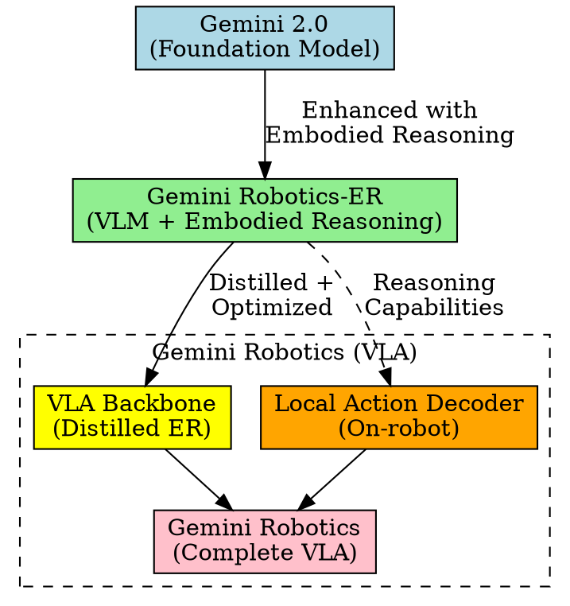
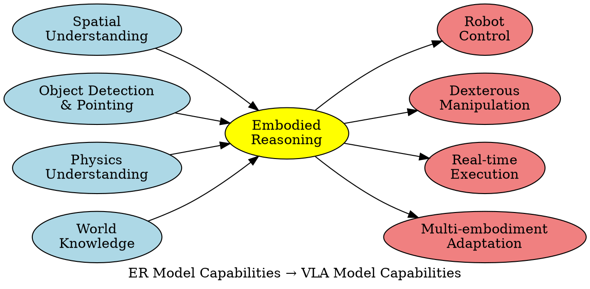
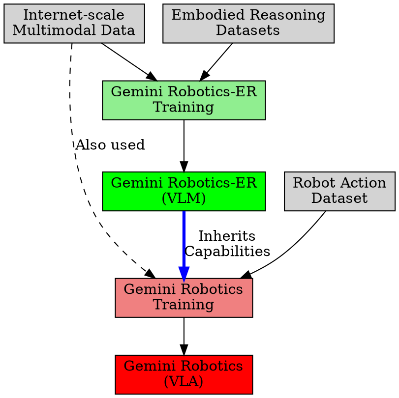

# Relationship Between Gemini Robotics-ER and Gemini Robotics VLA Models

Based on the analysis of the `source-paper` (reading/source-paper/gemini-robotics-paper.md), this document presents a comprehensive analysis of the relationship between the Embodied Reasoning (ER) model and the Vision-Language-Action (VLA) model in the Gemini Robotics family.

## Executive Summary

The Gemini Robotics family consists of two complementary models that work in a hierarchical relationship:

1. **Gemini Robotics-ER**: A Vision-Language Model (VLM) with enhanced embodied reasoning capabilities
2. **Gemini Robotics**: A Vision-Language-Action (VLA) model that **builds on top of** Gemini Robotics-ER

The key insight is that the VLA model is not independent but rather **inherits and leverages** the embodied reasoning capabilities from the ER model to enable direct robot control.

## Architecture Overview

<svg width="390pt" height="433pt" viewBox="0.00 0.00 390.00 433.00" xmlns="http://www.w3.org/2000/svg" xmlns:xlink="http://www.w3.org/1999/xlink">
<g id="graph0" class="graph" transform="scale(1 1) rotate(0) translate(4 429.13)">
<title>er_vla_architecture</title>
<polygon fill="white" stroke="none" points="-4,4 -4,-429.13 386,-429.13 386,4 -4,4"/>
<g id="clust1" class="cluster">
<title>cluster_vla</title>
<polygon fill="none" stroke="red" stroke-dasharray="5,2" points="8,-8 8,-193.5 232,-193.5 232,-8 8,-8"/>
<text text-anchor="middle" x="120" y="-176.2" font-family="Times New Roman,serif" font-size="14.00">Gemini Robotics VLA System</text>
</g>
<g id="clust2" class="cluster">
<title>cluster_legend</title>
<polygon fill="none" stroke="black" points="240,-12 240,-417.13 374,-417.13 374,-12 240,-12"/>
<text text-anchor="middle" x="307" y="-399.83" font-family="Times New Roman,serif" font-size="14.00">Model Types</text>
</g>
<!-- gemini20 -->
<g id="node1" class="node">
<title>gemini20</title>
<ellipse fill="lightblue" stroke="black" cx="101" cy="-366.63" rx="70.18" ry="22.63"/>
<text text-anchor="middle" x="101" y="-369.13" font-family="Arial" font-size="10.00">Gemini 2.0</text>
<text text-anchor="middle" x="101" y="-357.13" font-family="Arial" font-size="10.00">(Foundation Model)</text>
</g>
<!-- er_model -->
<g id="node2" class="node">
<title>er_model</title>
<polygon fill="lightgreen" stroke="black" points="174.62,-287 27.38,-287 27.38,-251 174.62,-251 174.62,-287"/>
<text text-anchor="middle" x="101" y="-271.5" font-family="Arial" font-size="10.00">Gemini Robotics-ER</text>
<text text-anchor="middle" x="101" y="-259.5" font-family="Arial" font-size="10.00">(VLM + Embodied Reasoning)</text>
</g>
<!-- gemini20->er_model -->
<g id="edge1" class="edge">
<title>gemini20->er_model</title>
<path fill="none" stroke="blue" d="M101,-343.93C101,-330.58 101,-313.32 101,-298.83"/>
<polygon fill="blue" stroke="blue" points="104.5,-298.98 101,-288.98 97.5,-298.98 104.5,-298.98"/>
<text text-anchor="middle" x="145.62" y="-317.45" font-family="Arial" font-size="9.00">Enhanced with</text>
<text text-anchor="middle" x="145.62" y="-306.95" font-family="Arial" font-size="9.00">Embodied Reasoning</text>
</g>
<!-- vla_backbone -->
<g id="node3" class="node">
<title>vla_backbone</title>
<polygon fill="yellow" stroke="black" points="96.25,-161 15.75,-161 15.75,-117 96.25,-117 96.25,-161"/>
<text text-anchor="middle" x="56" y="-147.5" font-family="Arial" font-size="10.00">VLA Backbone</text>
<text text-anchor="middle" x="56" y="-135.5" font-family="Arial" font-size="10.00">(Distilled ER)</text>
<text text-anchor="middle" x="56" y="-123.5" font-family="Arial" font-size="10.00">Cloud-hosted</text>
</g>
<!-- er_model->vla_backbone -->
<g id="edge2" class="edge">
<title>er_model->vla_backbone</title>
<path fill="none" stroke="red" d="M76.81,-250.62C71.46,-245.56 66.44,-239.6 63.25,-233 54.28,-214.46 52.44,-191.4 52.85,-172.88"/>
<polygon fill="red" stroke="red" points="56.34,-173.12 53.32,-162.96 49.35,-172.79 56.34,-173.12"/>
<text text-anchor="middle" x="104.12" y="-224.45" font-family="Arial" font-size="9.00">Distilled +</text>
<text text-anchor="middle" x="104.12" y="-213.95" font-family="Arial" font-size="9.00">Optimized</text>
<text text-anchor="middle" x="104.12" y="-203.45" font-family="Arial" font-size="9.00">(seconds → 160ms)</text>
</g>
<!-- action_decoder -->
<g id="node4" class="node">
<title>action_decoder</title>
<polygon fill="orange" stroke="black" points="223.5,-161 114.5,-161 114.5,-117 223.5,-117 223.5,-161"/>
<text text-anchor="middle" x="169" y="-147.5" font-family="Arial" font-size="10.00">Local Action Decoder</text>
<text text-anchor="middle" x="169" y="-135.5" font-family="Arial" font-size="10.00">(On-robot)</text>
<text text-anchor="middle" x="169" y="-123.5" font-family="Arial" font-size="10.00">~250ms latency</text>
</g>
<!-- er_model->action_decoder -->
<g id="edge5" class="edge">
<title>er_model->action_decoder</title>
<path fill="none" stroke="purple" stroke-dasharray="5,2" d="M128.31,-250.78C134.56,-245.72 140.64,-239.71 145,-233 156.67,-215.02 162.67,-191.64 165.76,-172.82"/>
<polygon fill="purple" stroke="purple" points="169.21,-173.39 167.15,-163 162.28,-172.41 169.21,-173.39"/>
<text text-anchor="middle" x="183.32" y="-219.2" font-family="Arial" font-size="9.00">Reasoning</text>
<text text-anchor="middle" x="183.32" y="-208.7" font-family="Arial" font-size="9.00">Capabilities</text>
</g>
<!-- vla_complete -->
<g id="node5" class="node">
<title>vla_complete</title>
<polygon fill="pink" stroke="black" points="147.38,-60 58.62,-60 58.62,-16 147.38,-16 147.38,-60"/>
<text text-anchor="middle" x="103" y="-46.5" font-family="Arial" font-size="10.00">Gemini Robotics</text>
<text text-anchor="middle" x="103" y="-34.5" font-family="Arial" font-size="10.00">(Complete VLA)</text>
<text text-anchor="middle" x="103" y="-22.5" font-family="Arial" font-size="10.00">50Hz control</text>
</g>
<!-- vla_backbone->vla_complete -->
<g id="edge3" class="edge">
<title>vla_backbone->vla_complete</title>
<path fill="none" stroke="black" d="M66.2,-116.52C72.54,-103.16 80.81,-85.73 87.91,-70.79"/>
<polygon fill="black" stroke="black" points="91.05,-72.34 92.17,-61.81 84.72,-69.34 91.05,-72.34"/>
<text text-anchor="middle" x="106.21" y="-90.45" font-family="Arial" font-size="9.00">High-level</text>
<text text-anchor="middle" x="106.21" y="-79.95" font-family="Arial" font-size="9.00">Reasoning</text>
</g>
<!-- action_decoder->vla_complete -->
<g id="edge4" class="edge">
<title>action_decoder->vla_complete</title>
<path fill="none" stroke="black" d="M156.92,-116.52C150.19,-104.91 141.48,-90.45 133,-78 131.04,-75.13 128.95,-72.18 126.81,-69.26"/>
<polygon fill="black" stroke="black" points="129.67,-67.23 120.87,-61.34 124.07,-71.44 129.67,-67.23"/>
<text text-anchor="middle" x="165.38" y="-90.45" font-family="Arial" font-size="9.00">Low-level</text>
<text text-anchor="middle" x="165.38" y="-79.95" font-family="Arial" font-size="9.00">Actions</text>
</g>
<!-- legend -->
<g id="node6" class="node">
<title>legend1</title>
<ellipse fill="lightblue" stroke="black" cx="307" cy="-366.63" rx="56.07" ry="18"/>
<text text-anchor="middle" x="307" y="-363.13" font-family="Arial" font-size="10.00">Foundation Model</text>
</g>
<g id="node7" class="node">
<title>legend2</title>
<polygon fill="lightgreen" stroke="black" points="365.62,-287 248.38,-287 248.38,-251 365.62,-251 365.62,-287"/>
<text text-anchor="middle" x="307" y="-265.5" font-family="Arial" font-size="10.00">VLM (Vision-Language)</text>
</g>
<g id="node8" class="node">
<title>legend3</title>
<polygon fill="yellow" stroke="black" points="353.25,-157 260.75,-157 260.75,-121 353.25,-121 353.25,-157"/>
<text text-anchor="middle" x="307" y="-135.5" font-family="Arial" font-size="10.00">VLA Components</text>
</g>
<g id="node9" class="node">
<title>legend4</title>
<polygon fill="pink" stroke="black" points="350.62,-56 263.38,-56 263.38,-20 350.62,-20 350.62,-56"/>
<text text-anchor="middle" x="307" y="-34.5" font-family="Arial" font-size="10.00">Final VLA Model</text>
</g>
</g>
</svg>

## Foundational Relationship

### Foundation Model
Both models are built upon **Gemini 2.0** as the foundation model:

> "This report introduces a new family of AI models purposefully designed for robotics and built upon the foundation of Gemini 2.0."

### Hierarchical Structure

```
Gemini 2.0 (Foundation)
    ↓
Gemini Robotics-ER (VLM + Embodied Reasoning)
    ↓
Gemini Robotics (VLA = ER + Action Capabilities)
```

The paper explicitly states:

> "This is made possible because **Gemini Robotics builds on top of the Gemini Robotics-ER model**, the second model we introduce in this work."

## Key Relationships and Dependencies

### 1. Capability Inheritance

The VLA model inherits the embodied reasoning capabilities from the ER model:

> "Gemini Robotics follows open vocabulary instructions effectively and exhibits strong zero-shot generalization, demonstrating its ability to **leverage the embodied reasoning capabilities of Gemini Robotics-ER**."

### 2. Architecture Integration

The VLA model consists of two components that work together:

- **VLA Backbone (Cloud)**: A distilled version of Gemini Robotics-ER
- **Local Action Decoder (On-robot)**: Compensates for latency and generates low-level actions

> "The Gemini Robotics backbone is formed by **a distilled version of Gemini Robotics-ER** and its query-to-response latency has been optimized from seconds to under 160ms."

### 3. Bridging Perception and Action

The ER model provides the "understanding" while the VLA model adds the "action" component:

> "Gemini Robotics, a generalist Vision-Language-Action Model that **builds on the foundations of Gemini Robotics-ER** and bridges the gap between **passive perception and active embodied interaction**."

## Detailed Capability Flow

<svg width="502pt" height="493pt" viewBox="0.00 0.00 502.00 493.00" xmlns="http://www.w3.org/2000/svg" xmlns:xlink="http://www.w3.org/1999/xlink">
<g id="graph0" class="graph" transform="scale(1 1) rotate(0) translate(4 489)">
<title>capability_flow</title>
<polygon fill="white" stroke="none" points="-4,4 -4,-489 497.81,-489 497.81,4 -4,4"/>
<g id="clust1" class="cluster">
<title>cluster_er</title>
<polygon fill="lightblue" stroke="blue" points="8,-8 8,-477 155.88,-477 155.88,-8 8,-8"/>
<text text-anchor="middle" x="81.94" y="-459.7" font-family="Times New Roman,serif" font-size="14.00">ER Model Capabilities</text>
</g>
<g id="clust2" class="cluster">
<title>cluster_vla</title>
<polygon fill="lightcoral" stroke="red" points="336.88,-8 336.88,-397 487.88,-397 487.88,-8 336.88,-8"/>
<text text-anchor="middle" x="412.38" y="-379.7" font-family="Times New Roman,serif" font-size="14.00">VLA Model Capabilities</text>
</g>
<!-- ER Capabilities -->
<g id="node1" class="node">
<title>spatial</title>
<ellipse fill="lightblue" stroke="black" cx="81.94" cy="-47" rx="58.51" ry="31.11"/>
<text text-anchor="middle" x="81.94" y="-55.5" font-family="Arial" font-size="10.00">Spatial</text>
<text text-anchor="middle" x="81.94" y="-43.5" font-family="Arial" font-size="10.00">Understanding</text>
<text text-anchor="middle" x="81.94" y="-31.5" font-family="Arial" font-size="10.00">(3D perception)</text>
</g>
<g id="node2" class="node">
<title>objects</title>
<ellipse fill="lightblue" stroke="black" cx="81.94" cy="-127" rx="63.29" ry="31.11"/>
<text text-anchor="middle" x="81.94" y="-135.5" font-family="Arial" font-size="10.00">Object Detection</text>
<text text-anchor="middle" x="81.94" y="-123.5" font-family="Arial" font-size="10.00">&amp; Pointing</text>
<text text-anchor="middle" x="81.94" y="-111.5" font-family="Arial" font-size="10.00">(2D/3D)</text>
</g>
<g id="node3" class="node">
<title>physics</title>
<ellipse fill="lightblue" stroke="black" cx="81.94" cy="-207" rx="65.94" ry="31.11"/>
<text text-anchor="middle" x="81.94" y="-215.5" font-family="Arial" font-size="10.00">Physics</text>
<text text-anchor="middle" x="81.94" y="-203.5" font-family="Arial" font-size="10.00">Understanding</text>
<text text-anchor="middle" x="81.94" y="-191.5" font-family="Arial" font-size="10.00">(Intuitive physics)</text>
</g>
<g id="node4" class="node">
<title>world</title>
<ellipse fill="lightblue" stroke="black" cx="81.94" cy="-287" rx="57.45" ry="31.11"/>
<text text-anchor="middle" x="81.94" y="-295.5" font-family="Arial" font-size="10.00">World</text>
<text text-anchor="middle" x="81.94" y="-283.5" font-family="Arial" font-size="10.00">Knowledge</text>
<text text-anchor="middle" x="81.94" y="-271.5" font-family="Arial" font-size="10.00">(Internet-scale)</text>
</g>
<g id="node5" class="node">
<title>trajectory</title>
<ellipse fill="lightblue" stroke="black" cx="81.94" cy="-359" rx="42.07" ry="22.63"/>
<text text-anchor="middle" x="81.94" y="-361.5" font-family="Arial" font-size="10.00">Trajectory</text>
<text text-anchor="middle" x="81.94" y="-349.5" font-family="Arial" font-size="10.00">Prediction</text>
</g>
<g id="node6" class="node">
<title>affordance</title>
<ellipse fill="lightblue" stroke="black" cx="81.94" cy="-422" rx="55.86" ry="22.63"/>
<text text-anchor="middle" x="81.94" y="-424.5" font-family="Arial" font-size="10.00">Affordance</text>
<text text-anchor="middle" x="81.94" y="-412.5" font-family="Arial" font-size="10.00">Understanding</text>
</g>
<!-- Bridging -->
<g id="node7" class="node">
<title>reasoning</title>
<polygon fill="yellow" stroke="black" points="246.38,-251 183.88,-207 246.38,-163 308.88,-207 246.38,-251"/>
<text text-anchor="middle" x="246.38" y="-215.5" font-family="Arial" font-size="10.00">Embodied</text>
<text text-anchor="middle" x="246.38" y="-203.5" font-family="Arial" font-size="10.00">Reasoning</text>
<text text-anchor="middle" x="246.38" y="-191.5" font-family="Arial" font-size="10.00">Integration</text>
</g>
<!-- VLA Capabilities -->
<g id="node8" class="node">
<title>control</title>
<ellipse fill="lightcoral" stroke="black" cx="411.88" cy="-47" rx="50.56" ry="31.11"/>
<text text-anchor="middle" x="411.88" y="-55.5" font-family="Arial" font-size="10.00">Direct Robot</text>
<text text-anchor="middle" x="411.88" y="-43.5" font-family="Arial" font-size="10.00">Control</text>
<text text-anchor="middle" x="411.88" y="-31.5" font-family="Arial" font-size="10.00">(End-to-end)</text>
</g>
<g id="node9" class="node">
<title>dexterity</title>
<ellipse fill="lightcoral" stroke="black" cx="411.88" cy="-127" rx="50.03" ry="31.11"/>
<text text-anchor="middle" x="411.88" y="-135.5" font-family="Arial" font-size="10.00">Dexterous</text>
<text text-anchor="middle" x="411.88" y="-123.5" font-family="Arial" font-size="10.00">Manipulation</text>
<text text-anchor="middle" x="411.88" y="-111.5" font-family="Arial" font-size="10.00">(Bi-manual)</text>
</g>
<g id="node10" class="node">
<title>realtime</title>
<ellipse fill="lightcoral" stroke="black" cx="411.88" cy="-207" rx="42.07" ry="31.11"/>
<text text-anchor="middle" x="411.88" y="-215.5" font-family="Arial" font-size="10.00">Real-time</text>
<text text-anchor="middle" x="411.88" y="-203.5" font-family="Arial" font-size="10.00">Execution</text>
<text text-anchor="middle" x="411.88" y="-191.5" font-family="Arial" font-size="10.00">(50Hz)</text>
</g>
<g id="node11" class="node">
<title>adaptation</title>
<ellipse fill="lightcoral" stroke="black" cx="411.88" cy="-279" rx="65.94" ry="22.63"/>
<text text-anchor="middle" x="411.88" y="-281.5" font-family="Arial" font-size="10.00">Multi-embodiment</text>
<text text-anchor="middle" x="411.88" y="-269.5" font-family="Arial" font-size="10.00">Adaptation</text>
</g>
<g id="node12" class="node">
<title>generalization</title>
<ellipse fill="lightcoral" stroke="black" cx="411.88" cy="-342" rx="55.33" ry="22.63"/>
<text text-anchor="middle" x="411.88" y="-344.5" font-family="Arial" font-size="10.00">Zero-shot</text>
<text text-anchor="middle" x="411.88" y="-332.5" font-family="Arial" font-size="10.00">Generalization</text>
</g>
<!-- Flow from ER to Reasoning -->
<path fill="none" stroke="blue" d="M126.98,-67.19C137.02,-72.84 147.27,-79.51 155.88,-87 182.02,-109.73 205.2,-141.33 221.42,-166.39"/>
<polygon fill="blue" stroke="blue" points="218.38,-168.14 226.69,-174.72 224.3,-164.4 218.38,-168.14"/>
<path fill="none" stroke="blue" d="M127.32,-148.86C149.38,-159.72 176.04,-172.85 198.43,-183.88"/>
<polygon fill="blue" stroke="blue" points="196.84,-187 207.36,-188.28 199.94,-180.72 196.84,-187"/>
<path fill="none" stroke="blue" d="M148.07,-207C155.84,-207 163.81,-207 171.69,-207"/>
<polygon fill="blue" stroke="blue" points="171.62,-210.5 181.62,-207 171.62,-203.5 171.62,-210.5"/>
<path fill="none" stroke="blue" d="M125.19,-266.19C147.69,-255.11 175.42,-241.45 198.57,-230.05"/>
<polygon fill="blue" stroke="blue" points="200.07,-233.22 207.49,-225.66 196.97,-226.94 200.07,-233.22"/>
<path fill="none" stroke="blue" d="M118.75,-347.57C131.28,-342.51 144.94,-335.69 155.88,-327 182.99,-305.44 206.14,-273.79 222.09,-248.41"/>
<polygon fill="blue" stroke="blue" points="225.03,-250.32 227.27,-239.97 219.06,-246.67 225.03,-250.32"/>
<path fill="none" stroke="blue" d="M128.03,-408.77C138.03,-404.31 148,-398.49 155.88,-391 195.03,-353.79 219.25,-295.87 232.46,-254.96"/>
<polygon fill="blue" stroke="blue" points="235.74,-256.21 235.37,-245.62 229.05,-254.13 235.74,-256.21"/>
<!-- Flow from Reasoning to VLA -->
<path fill="none" stroke="red" d="M265.21,-175.95C281.38,-149.8 307.18,-112.66 336.88,-87 343.87,-80.96 351.92,-75.46 360.09,-70.6"/>
<polygon fill="red" stroke="red" points="361.72,-73.7 368.72,-65.75 358.29,-67.6 361.72,-73.7"/>
<path fill="none" stroke="red" d="M284.07,-189.05C306.89,-177.88 336.52,-163.38 361.4,-151.21"/>
<polygon fill="red" stroke="red" points="362.93,-154.35 370.38,-146.81 359.86,-148.07 362.93,-154.35"/>
<path fill="none" stroke="red" d="M309.65,-207C325.62,-207 342.64,-207 358.07,-207"/>
<polygon fill="red" stroke="red" points="358.01,-210.5 368.01,-207 358.01,-203.5 358.01,-210.5"/>
<path fill="none" stroke="red" d="M285.22,-224.03C301.15,-231.17 319.89,-239.53 336.88,-247 344.1,-250.18 351.74,-253.51 359.25,-256.77"/>
<polygon fill="red" stroke="red" points="357.78,-259.95 368.35,-260.71 360.57,-253.53 357.78,-259.95"/>
<path fill="none" stroke="red" d="M267.17,-236.78C283.59,-259.6 308.74,-290.55 336.88,-311 343.23,-315.62 350.38,-319.71 357.66,-323.28"/>
<polygon fill="red" stroke="red" points="356.05,-326.39 366.6,-327.35 358.95,-320.02 356.05,-326.39"/>
</g>
</svg>

### Embodied Reasoning Capabilities (From ER Model)

1. **Spatial Understanding**
   - 3D perception and understanding
   - Multi-view correspondence
   - Spatial relationships

2. **Object Detection and Interaction**
   - Object detection and pointing
   - Trajectory prediction
   - Grasp prediction
   - Affordance understanding

3. **World Knowledge**
   - Physics understanding
   - Object relationships
   - Scene understanding

### Action Capabilities (Added by VLA Model)

1. **Direct Robot Control**
   - Low-level action generation
   - Real-time control (50Hz effective frequency)
   - Smooth and reactive movements

2. **Dexterous Manipulation**
   - Complex manipulation tasks
   - Bi-manual coordination
   - Contact-rich interactions

## Performance Characteristics

### ER Model Limitations for Robot Control

The paper identifies specific limitations of using the ER model alone for robot control:

> "However, as a VLM, there are **inherent limitations for robot control**, especially for more dexterous tasks, due to the **intermediate steps needed to connect the model's innate embodied reasoning capabilities to robotic actions**."

### VLA Model Advantages

The VLA model addresses these limitations by:

1. **End-to-End Control**: Direct action output without intermediate steps
2. **Low Latency**: ~250ms end-to-end latency (vs. seconds for pure ER model)
3. **Real-Time Performance**: 50Hz effective control frequency
4. **Dexterous Capabilities**: Support for complex manipulation tasks

## Training and Data Relationship

<svg width="560pt" height="465pt" viewBox="0.00 0.00 560.00 465.00" xmlns="http://www.w3.org/2000/svg" xmlns:xlink="http://www.w3.org/1999/xlink">
<g id="graph0" class="graph" transform="scale(1 1) rotate(0) translate(4 461)">
<title>training_flow</title>
<polygon fill="white" stroke="none" points="-4,4 -4,-461 556.25,-461 556.25,4 -4,4"/>
<g id="clust1" class="cluster">
<title>cluster_data</title>
<polygon fill="none" stroke="gray" stroke-dasharray="5,2" points="8,-352.5 8,-449 487,-449 487,-352.5 8,-352.5"/>
<text text-anchor="middle" x="247.5" y="-431.7" font-family="Times New Roman,serif" font-size="14.00">Training Data Sources</text>
</g>
<g id="clust2" class="cluster">
<title>cluster_models</title>
<polygon fill="none" stroke="black" points="221,-94.5 221,-203 497,-203 497,-94.5 221,-94.5"/>
<text text-anchor="middle" x="359" y="-185.7" font-family="Times New Roman,serif" font-size="14.00">Final Models</text>
</g>
<!-- Data Sources -->
<g id="node1" class="node">
<title>internet</title>
<polygon fill="lightgray" stroke="black" points="355.5,-410.5 246.5,-410.5 246.5,-366.5 355.5,-366.5 355.5,-410.5"/>
<text text-anchor="middle" x="301" y="-397" font-family="Arial" font-size="10.00">Internet-scale</text>
<text text-anchor="middle" x="301" y="-385" font-family="Arial" font-size="10.00">Multimodal Data</text>
<text text-anchor="middle" x="301" y="-373" font-family="Arial" font-size="10.00">(Images, Text, Video)</text>
</g>
<g id="node2" class="node">
<title>er_data</title>
<polygon fill="lightgray" stroke="black" points="125.5,-410.5 16.5,-410.5 16.5,-366.5 125.5,-366.5 125.5,-410.5"/>
<text text-anchor="middle" x="71" y="-397" font-family="Arial" font-size="10.00">Embodied Reasoning</text>
<text text-anchor="middle" x="71" y="-385" font-family="Arial" font-size="10.00">Datasets</text>
<text text-anchor="middle" x="71" y="-373" font-family="Arial" font-size="10.00">(ERQA benchmark)</text>
</g>
<g id="node3" class="node">
<title>vqa_data</title>
<polygon fill="lightgray" stroke="black" points="228.88,-406.5 143.12,-406.5 143.12,-370.5 228.88,-370.5 228.88,-406.5"/>
<text text-anchor="middle" x="186" y="-391" font-family="Arial" font-size="10.00">Visual Question</text>
<text text-anchor="middle" x="186" y="-379" font-family="Arial" font-size="10.00">Answering Data</text>
</g>
<g id="node4" class="node">
<title>robot_data</title>
<polygon fill="lightgray" stroke="black" points="478.62,-416.5 373.38,-416.5 373.38,-360.5 478.62,-360.5 478.62,-416.5"/>
<text text-anchor="middle" x="426" y="-403" font-family="Arial" font-size="10.00">Robot Action</text>
<text text-anchor="middle" x="426" y="-391" font-family="Arial" font-size="10.00">Dataset</text>
<text text-anchor="middle" x="426" y="-379" font-family="Arial" font-size="10.00">(Thousands of hours</text>
<text text-anchor="middle" x="426" y="-367" font-family="Arial" font-size="10.00">ALOHA 2 demos)</text>
</g>
<!-- Training Processes -->
<g id="node5" class="node">
<title>er_training</title>
<polygon fill="lightgreen" stroke="black" points="164,-314 46.75,-282 164,-250 281.25,-282 164,-314"/>
<text text-anchor="middle" x="164" y="-284.5" font-family="Arial" font-size="10.00">ER Model Training</text>
<text text-anchor="middle" x="164" y="-272.5" font-family="Arial" font-size="10.00">(Gemini 2.0 + ER data)</text>
</g>
<g id="node6" class="node">
<title>vla_training</title>
<polygon fill="lightcoral" stroke="black" points="426,-314 299.75,-282 426,-250 552.25,-282 426,-314"/>
<text text-anchor="middle" x="426" y="-284.5" font-family="Arial" font-size="10.00">VLA Model Training</text>
<text text-anchor="middle" x="426" y="-272.5" font-family="Arial" font-size="10.00">(ER model + Action data)</text>
</g>
<!-- Final Models -->
<g id="node7" class="node">
<title>er_final</title>
<polygon fill="green" stroke="black" points="345.25,-170.5 228.75,-170.5 228.75,-102.5 345.25,-102.5 345.25,-170.5"/>
<text text-anchor="middle" x="287" y="-157" font-family="Arial" font-size="10.00">Gemini Robotics-ER</text>
<text text-anchor="middle" x="287" y="-145" font-family="Arial" font-size="10.00">(VLM)</text>
<text text-anchor="middle" x="287" y="-133" font-family="Arial" font-size="10.00">• Spatial understanding</text>
<text text-anchor="middle" x="287" y="-121" font-family="Arial" font-size="10.00">• Object detection</text>
<text text-anchor="middle" x="287" y="-109" font-family="Arial" font-size="10.00">• Physics reasoning</text>
</g>
<g id="node8" class="node">
<title>vla_final</title>
<polygon fill="red" stroke="black" points="488.75,-170.5 363.25,-170.5 363.25,-102.5 488.75,-102.5 488.75,-170.5"/>
<text text-anchor="middle" x="426" y="-157" font-family="Arial" font-size="10.00">Gemini Robotics</text>
<text text-anchor="middle" x="426" y="-145" font-family="Arial" font-size="10.00">(VLA)</text>
<text text-anchor="middle" x="426" y="-133" font-family="Arial" font-size="10.00">• Direct robot control</text>
<text text-anchor="middle" x="426" y="-121" font-family="Arial" font-size="10.00">• Real-time execution</text>
<text text-anchor="middle" x="426" y="-109" font-family="Arial" font-size="10.00">• Dexterous manipulation</text>
</g>
<!-- Specialization -->
<g id="node9" class="node">
<title>specialization</title>
<polygon fill="purple" stroke="black" points="483.88,-56 368.12,-56 368.12,0 483.88,0 483.88,-56"/>
<text text-anchor="middle" x="426" y="-42.5" font-family="Arial" font-size="10.00">Optional Specialization</text>
<text text-anchor="middle" x="426" y="-30.5" font-family="Arial" font-size="10.00">• Long-horizon tasks</text>
<text text-anchor="middle" x="426" y="-18.5" font-family="Arial" font-size="10.00">• New embodiments</text>
<text text-anchor="middle" x="426" y="-6.5" font-family="Arial" font-size="10.00">• Enhanced reasoning</text>
</g>
<!-- Key Insight -->
<g id="node10" class="node">
<title>key_insight</title>
<polygon fill="yellow" stroke="black" points="337.38,-50 230.62,-50 230.62,-6 343.38,-6 343.38,-44 337.38,-50"/>
<polyline fill="none" stroke="black" points="337.38,-50 337.38,-44"/>
<polyline fill="none" stroke="black" points="343.38,-44 337.38,-44"/>
<text text-anchor="middle" x="287" y="-36.5" font-family="Arial" font-size="10.00">Key Insight:</text>
<text text-anchor="middle" x="287" y="-24.5" font-family="Arial" font-size="10.00">VLA builds on ER</text>
<text text-anchor="middle" x="287" y="-12.5" font-family="Arial" font-size="10.00">rather than replacing it</text>
</g>
<!-- Data Flow -->
<path fill="none" stroke="blue" d="M272.95,-366.1C252.85,-350.78 225.53,-329.94 203.28,-312.96"/>
<polygon fill="blue" stroke="blue" points="205.67,-310.39 195.6,-307.1 201.43,-315.95 205.67,-310.39"/>
<path fill="none" stroke="blue" d="M90.04,-366.1C102.81,-351.76 119.87,-332.59 134.38,-316.28"/>
<polygon fill="blue" stroke="blue" points="136.67,-318.98 140.7,-309.18 131.44,-314.32 136.67,-318.98"/>
<path fill="none" stroke="blue" d="M182.37,-370.24C179.69,-357.53 175.93,-339.69 172.52,-323.46"/>
<polygon fill="blue" stroke="blue" points="176.02,-323.1 170.53,-314.04 169.17,-324.54 176.02,-323.1"/>
<path fill="none" stroke="green" d="M185.71,-255.68C203.78,-234.59 229.9,-204.12 251.08,-179.41"/>
<polygon fill="green" stroke="green" points="253.51,-181.95 257.36,-172.08 248.2,-177.39 253.51,-181.95"/>
<path fill="none" stroke="gray" stroke-dasharray="5,2" d="M326.6,-366.1C344.52,-351.12 368.74,-330.87 388.79,-314.11"/>
<polygon fill="gray" stroke="gray" points="390.79,-317 396.22,-307.9 386.3,-311.62 390.79,-317"/>
<path fill="none" stroke="red" d="M426,-360.04C426,-349.52 426,-337.25 426,-325.64"/>
<polygon fill="red" stroke="red" points="429.5,-325.85 426,-315.85 422.5,-325.85 429.5,-325.85"/>
<path fill="none" stroke="blue" stroke-width="3" d="M316.29,-170.92C332.68,-189.29 353.7,-212.28 373.25,-232 378.06,-236.85 383.21,-241.86 388.35,-246.74"/>
<polygon fill="blue" stroke="blue" stroke-width="3" points="385.75,-249.1 395.45,-253.39 390.54,-244 385.75,-249.1"/>
<path fill="none" stroke="red" d="M426,-249.51C426,-229.79 426,-204.07 426,-182.25"/>
<polygon fill="red" stroke="red" points="429.5,-182.43 426,-172.43 422.5,-182.43 429.5,-182.43"/>
<path fill="none" stroke="black" stroke-dasharray="5,2" d="M426,-102.09C426,-91.14 426,-78.87 426,-67.57"/>
<polygon fill="black" stroke="black" points="429.5,-67.74 426,-57.74 422.5,-67.74 429.5,-67.74"/>
<!-- Labels -->
<text text-anchor="middle" x="387.5" y="-333.95" font-family="Arial" font-size="9.00">Also used</text>
<text text-anchor="middle" x="397.62" y="-223.45" font-family="Arial" font-size="9.00">Inherits</text>
<text text-anchor="middle" x="397.62" y="-212.95" font-family="Arial" font-size="9.00">Capabilities</text>
<text text-anchor="middle" x="449.25" y="-75.95" font-family="Arial" font-size="9.00">Fine-tuning</text>
</g>
</svg>

### ER Model Training Data
- Internet-scale multimodal data
- Embodied reasoning datasets
- Visual question answering data
- Spatial understanding data

### VLA Model Training Data
- **Inherits ER capabilities** from Gemini Robotics-ER
- Large-scale robot action dataset (thousands of hours)
- Teleoperated demonstrations
- Multi-task robot data
- Additional non-action multimodal data

## Practical Applications

### ER Model Use Cases
1. **Zero-shot robot control** via code generation
2. **Few-shot learning** via in-context learning
3. **Perception module** for object detection
4. **Planning module** for trajectory generation
5. **Spatial reasoning** for scene understanding

### VLA Model Use Cases
1. **Direct robot control** for dexterous tasks
2. **Real-time manipulation** in dynamic environments
3. **End-to-end task execution** without intermediate processing
4. **Multi-embodiment adaptation** across different robot types
5. **Complex manipulation** requiring fine motor control

## Enhanced Reasoning Integration

The paper describes how the VLA model leverages ER capabilities for improved performance:

> "We now explore how to **fully leverage the novel embodied reasoning capabilities from Gemini Robotics-ER**, such as spatial and physical understanding and world knowledge, to guide low-level robot actions for settings which require reasoning and more extensive generalization."

This is achieved through:

1. **Re-labeled Action Dataset**: Connecting action prediction to embodied reasoning capabilities
2. **Trajectory Understanding**: Bridging high-level reasoning with low-level control
3. **Spatial Reasoning**: Using ER capabilities for spatial understanding in action generation

## Success Factors

The paper attributes the success of the VLA model to three key factors:

1. **Capable Vision Language Model**: The enhanced embodied reasoning from Gemini Robotics-ER
2. **Robotics-Specific Training**: Combining robot action data with diverse non-robot data
3. **Unique Architecture**: Designed for low-latency robotic control

## Future Implications

The hierarchical relationship enables:

1. **Rapid Task Adaptation**: Leveraging ER capabilities for new tasks
2. **Cross-Embodiment Transfer**: Using spatial understanding across robot types
3. **Zero-Shot Generalization**: Applying world knowledge to novel scenarios
4. **Seamless Integration**: Combining abstract reasoning with precise execution

## Conclusion

The relationship between Gemini Robotics-ER and Gemini Robotics represents a sophisticated approach to building capable robotic systems. The ER model provides the foundational understanding of the physical world, while the VLA model adds the capability to act within that world. This hierarchical architecture allows the VLA model to leverage rich embodied reasoning capabilities while enabling real-time, dexterous robot control.

The key insight is that rather than building separate systems, the Gemini Robotics approach creates a unified architecture where understanding and action are intimately connected through the inheritance of embodied reasoning capabilities from the ER model to the VLA model.

---

## Graphs Source Code

### Architecture Relationship Graph


### Capability Flow Graph


### Training Data Flow Graph

