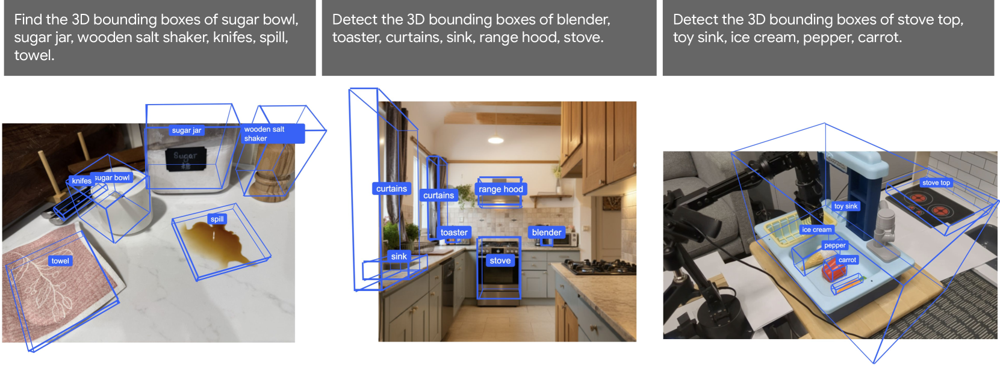
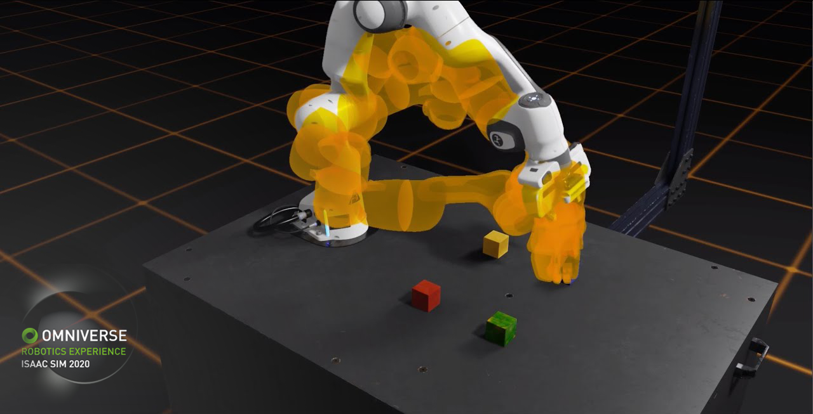
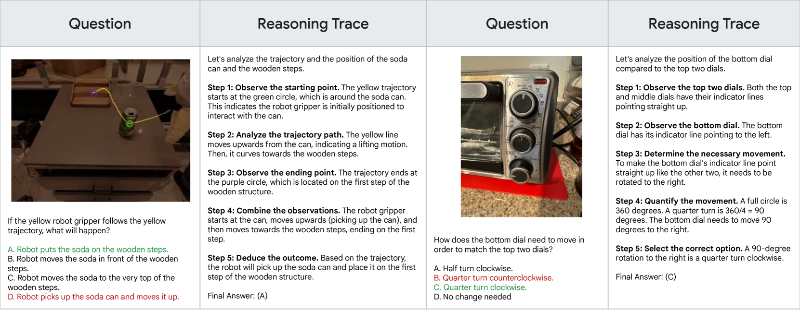
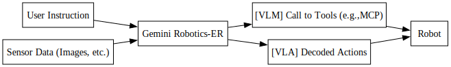
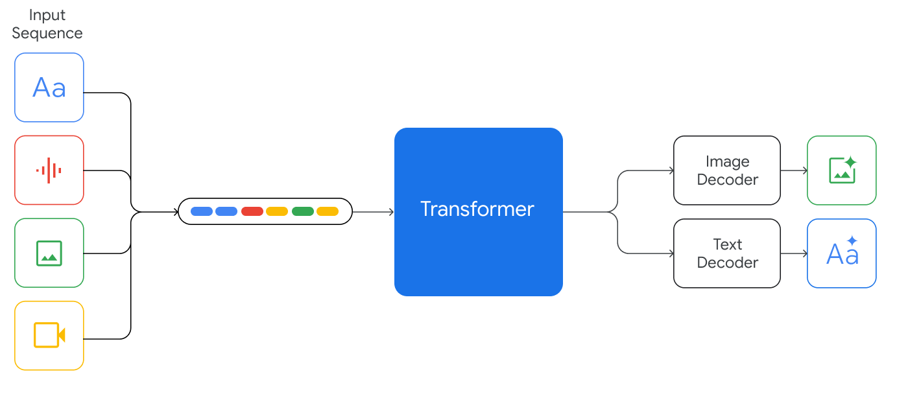

# The Gemini Robotics ER Model

## Embodied Reasoning

### What is Embodied Reasoning?

- **Definition and Examples:** Embodied Reasoning (ER) is the ability of a Vision-Language Model (VLM) to ground objects and spatial concepts in the real world, and the ability to synthesize those signals for downstream robotics applications. Examples include understanding 3D structure, interpreting inter-object relationships, and intuitive physics.

[Source](https://ai4ce.github.io/SeeDo/)

  - **Understanding 3D Structure:** The model can perceive the three-dimensional structure of an environment from 2D images. For example, it can predict 3D bounding boxes for objects from a single image.

*Source: [Gemini Robotics: Bringing AI into the Physical World](https://arxiv.org/html/2503.20020v1)*

  - **Interpreting Inter-Object Relationships & Intuitive Physics:** The model can reason about spatial relationships and predict the outcomes of physical actions. This is illustrated in the image below, which shows a physics-based simulation for robotics. The "Detailed Example of Embodied Reasoning" section below provides further concrete examples of these capabilities. The *Trajectory Reasoning* example illustrates intuitive physics, while the *Spatial and Action Reasoning* example demonstrates the model's ability to interpret inter-object relationships.

[Source](https://developer.nvidia.com/blog/announcing-newton-an-open-source-physics-engine-for-robotics-simulation/)

- **Advantages:** ER allows robots to make sense of the physical world, interact competently and safely, and handle variations in object types and positions. It bridges the gap between passive perception and active physical interaction.

- **ER for VLMs vs. VLAs:** The key difference lies in the output. A Vision-Language Model (VLM) with Embodied Reasoning (ER) can understand a scene and describe the necessary action in text (e.g., "pick up the red block"). A Vision-Language-Action (VLA) model with ER goes a step further and can directly output executable robot commands (e.g., joint movements, gripper actions) to perform the task. This ability to generate actions, not just descriptions, is what allows a VLA to directly control a robot.

- **Detailed Example of Embodied Reasoning:** The paper shows how Chain-of-Thought (CoT) prompting can elicit detailed embodied reasoning. The following image from the paper shows the visual context for two reasoning examples.

  **Example 1: Trajectory Reasoning**
  
  **Question:** If the yellow robot gripper follows the yellow trajectory, what will happen?
  A. Robot puts the soda on the wooden steps.
  B. Robot moves the soda in front of the wooden steps.
  C. Robot moves the soda to the very top of the wooden steps.
  D. Robot picks up the soda can and moves it up.

  **Reasoning Trace:**
  Step 1: Observe the starting point. The yellow trajectory starts at the green circle, which is around the soda can. This indicates the robot gripper is initially positioned to interact with the can.
  Step 2: Analyze the trajectory path. The yellow line moves upwards from the can, indicating a lifting motion. Then, it curves towards the wooden steps.
  Step 3: Observe the ending point. The trajectory ends at the purple circle, which is located on the first step of the wooden structure.
  Step 4: Combine the observations. The robot gripper starts at the can, moves upwards (picking up the can), and then moves towards the wooden steps, ending on the first step.
  Step 5: Deduce the outcome. Based on the trajectory, the robot will pick up the soda can and place it on the first step of the wooden structure.

  **Final Answer:** (A)

  **示例 1：轨迹推理**
  
  **问题：** 如果黄色机器人夹爪遵循黄色轨迹，会发生什么？
  A. 机器人将苏打水放在木制台阶上。
  B. 机器人将苏打水移动到木制台阶前。
  C. 机器人将苏打水移动到木制台阶的最顶端。
  D. 机器人拿起苏打水罐并向上移动。

  **推理过程：**
  步骤 1：观察起点。黄色轨迹从绿色圆圈开始，该圆圈围绕着苏打水罐。这表明机器人夹爪最初的位置是为了与罐子互动。
  步骤 2：分析轨迹路径。黄线从罐子向上移动，表示一个提起的动作。然后，它朝着木制台阶弯曲。
  步骤 3：观察终点。轨迹结束于紫色圆圈，该圆圈位于木结构的第一级台阶上。
  步骤 4：结合观察结果。机器人夹爪从罐子开始，向上移动（拿起罐子），然后朝木制台阶移动，最后停在第一级台阶上。
  步骤 5：推断结果。根据轨迹，机器人将拿起苏打水罐并将其放在木结构的第一级台阶上。

  **最终答案：** (A)

  **Example 2: Spatial and Action Reasoning**
  
  **Question:** How does the bottom dial need to move in order to match the top two dials?
  A. Half turn clockwise.
  B. Quarter turn counterclockwise.
  C. Quarter turn clockwise.
  D. No change needed

  **Reasoning Trace:**
  Step 1: Observe the top two dials. Both the top and middle dials have their indicator lines pointing straight up.
  Step 2: Observe the bottom dial. The bottom dial has its indicator line pointing to the left.
  Step 3: Determine the necessary movement. To make the bottom dial's indicator line point straight up like the other two, it needs to be rotated to the right.
  Step 4: Quantify the movement. A full circle is 360 degrees. A quarter turn is 360/4 = 90 degrees. The bottom dial needs to move 90 degrees to the right.
  Step 5: Select the correct option. A 90-degree rotation to the right is a quarter turn clockwise.

  **Final Answer:** (C)

  **示例 2：空间与动作推理**
  
  **问题：** 底部的旋钮需要如何移动才能与顶部的两个旋钮匹配？
  A. 顺时针转半圈。
  B. 逆时针转四分之一圈。
  C. 顺时针转四分之一圈。
  D. 无需改变。

  **推理过程：**
  步骤 1：观察顶部的两个旋钮。顶部和中间的旋钮的指示线都指向上方。
  步骤 2：观察底部的旋钮。底部旋钮的指示线指向左边。
  步骤 3：确定必要的移动。为了使底部旋钮的指示线像其他两个一样指向上方，需要向右旋转。
  步骤 4：量化移动。一个完整的圆是360度。四分之一圈是360/4 = 90度。底部旋钮需要向右移动90度。
  步骤 5：选择正确的选项。向右旋转90度是顺时针转四分之一圈。

  **最终答案：** (C)

### How to integrate Embodied Reasoning into robotics?

- **Real-world application:** A model with ER can be used for zero-shot control via code generation or few-shot control via in-context learning. It can perform perception, state estimation, spatial reasoning, planning, and control.

- **System Components:** In a real robotics system, the ER model resides within the control stack. For example, the Gemini Robotics model has a VLA backbone hosted in the cloud and a local action decoder on the robot's computer. The ER model can be part of the perception and planning modules, providing the necessary understanding of the environment for the robot to act.

- **Pipeline Graphic:**

## Gemini Robotics ER Model

### Overview

- **Description of the model:** Gemini Robotics-ER is a Vision-Language Model (VLM) with enhanced embodied reasoning capabilities. It excels at understanding spatial and temporal concepts, which is critical for robotics applications.

- **Foundation Model:** The Gemini Robotics-ER model is built upon the **Gemini 2.0** foundation model, which is identified as a **Vision-Language Model (VLM)**.

  > This report introduces a new family of AI models purposefully designed for robotics and built upon the foundation of Gemini 2.0.
  >
  > *Source: [`source-paper`](../source-paper/gemini-robotics-paper.md), line 15*

  > Gemini 2.0 is a Vision-Language Model (VLM) that is capable of going beyond tasks that only require visual understanding and language processing.
  >
  > *Source: [`source-paper`](../source-paper/gemini-robotics-paper.md), line 136*

- **Architecture and components:** Gemini Robotics-ER is an extension of the Gemini 2.0 model. The full Gemini Robotics system consists of a VLA backbone (a distilled version of Gemini Robotics-ER) in the cloud and a local action decoder on the robot.

> Gemini models support interleaved sequences of text, image, audio, and video as inputs (illustrated by tokens of different colors in the input sequence). They can output responses with interleaved image and text.

[Source: Gemini: A Family of Highly Capable Multimodal Models](https://arxiv.org/abs/2312.11805)

- **Key features and capabilities:**
  - 2D and 3D Object Detection
  - 2D Pointing and Trajectory Prediction
  - Top-Down Grasp Prediction
  - Multi-View Correspondence
  - Zero-shot control via code generation
  - Few-shot control via in-context learning

### Training Data

- **Sources of training data:** The model is trained on a large and diverse dataset including:
  - Teleoperated robot action data from a fleet of ALOHA 2 robots.
  - Web documents and code.
  - Multimodal content (images, audio, video).
  - Embodied reasoning and visual question answering data.
  - Datasets like OXE, UMI Data, MECCANO, HoloAssist, and EGTEA Gaze+.

- **How to label data for training:** For robot action data, teleoperated demonstrations are collected. For other data, existing labels are used, or new labels are created, for instance, for the ERQA benchmark.

- **Example data points:** An example data point could consist of an image from a robot's camera, a text instruction like "pick up the apple", and the corresponding sequence of robot actions to achieve the task.

### Training Process

- **Overview of the training process:** The model is fine-tuned from a base Gemini 2.0 model. The training process involves using a combination of robot action data and other multimodal data to enhance the model's embodied reasoning capabilities.

- **How to define the training objective:** The training objective is to predict the correct robot actions given the visual input and language instruction. This is a form of supervised learning.

- **Techniques used for training:** The model is trained using supervised learning on a large dataset of teleoperated demonstrations and other labeled data.

### Evaluation

- **How to evaluate the model's performance:** The model's performance is evaluated on a variety of benchmarks and real-world robot tasks.
- **Metrics used for evaluation:**
  - **ERQA (Embodied Reasoning Question Answering):** A benchmark for evaluating a broad spectrum of ER capabilities.
  - **Task Success Rate:** The percentage of times the robot successfully completes a given task.
  - **Progress Score:** A continuous metric reflecting the proportion of a task completed.
  - **Pointing Accuracy:** Measured on benchmarks like Paco-LVIS, Pixmo-Point, and Where2place.
  - **3D Detection Performance:** Measured on benchmarks like SUN-RGBD.

- **Comparison with baseline models:** The Gemini Robotics models are compared to other state-of-the-art models like GPT-4o, Claude 3.5 Sonnet, and specialized models like Molmo and ImVoxelNet. Gemini Robotics-ER and Gemini Robotics consistently outperform these baselines on robotics-related tasks.

### Deployment

- **How to deploy the model in a real robotics system, with performance considerations:** The Gemini Robotics model is designed for low-latency control. It uses a cloud-hosted backbone and a local action decoder to achieve an end-to-end latency of approximately 250ms, with an effective control frequency of 50Hz. This architecture allows for smooth and reactive robot behavior.

## About

- **Online HTML Version of the Paper:** [https://arxiv.org/html/2503.20020v1](https://arxiv.org/html/2503.20020v1)
- **Local Markdown Version of the Paper:** [gemini-robotics-paper.md](../source-paper/gemini-robotics-paper.md)
- **Gemini 1.0 Paper:** [https://arxiv.org/abs/2312.11805](https://arxiv.org/abs/2312.11805)
