# Gemini Robotics: Bringing AI into the Physical World

Report issue for preceding element

Gemini Robotics Team

 Google DeepMind111See Contributions and Acknowledgments section for full author list. Please send correspondence to gemini-robotics-report@google.com.

Report issue for preceding element

###### Abstract

Report issue for preceding element

Recent advancements in large multimodal models have led to the emergence of remarkable generalist capabilities in digital domains, yet their translation to physical agents such as robots remains a significant challenge. Generally useful robots need to be able to make sense of the physical world around them, and interact with it competently and safely. This report introduces a new family of AI models purposefully designed for robotics and built upon the foundation of Gemini 2.0. We present Gemini Robotics, an advanced Vision-Language-Action (VLA) generalist model capable of directly controlling robots. Gemini Robotics executes smooth and reactive movements to tackle a wide range of complex manipulation tasks while also being robust to variations in object types and positions, handling unseen environments as well as following diverse, open vocabulary instructions. We show that with additional fine-tuning, Gemini Robotics can be specialized to new capabilities including solving long-horizon, highly dexterous tasks like folding an origami fox or playing a game of cards, learning new short-horizon tasks from as few as 100 demonstrations, adapting to completely novel robot embodiments including a bi-arm platform and a high degrees-of-freedom humanoid. This is made possible because Gemini Robotics builds on top of the Gemini Robotics-ER model, the second model we introduce in this work.
Gemini Robotics-ER (Embodied Reasoning) extends Gemini’s multimodal reasoning capabilities into the physical world, with enhanced spatial and temporal understanding. This enables capabilities relevant to robotics including object detection, pointing, trajectory and grasp prediction, as well as 3D understanding in the form of multi-view correspondence and 3D bounding box predictions. We show how this novel combination can support a variety of robotics applications, e.g., zero-shot (via robot code generation), or few-shot (via in-context learning). We also discuss and address important safety considerations related to this new class of robotics foundation models. The Gemini Robotics family marks a substantial step towards developing general-purpose robots that realize AI’s potential in the physical world.

Report issue for preceding element

## 1 Introduction

Report issue for preceding element
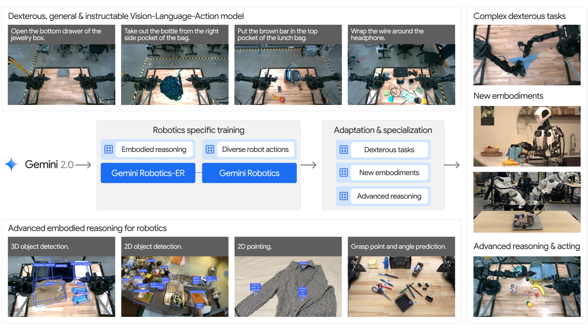

Figure 1: Overview of the Gemini Robotics family of embodied AI models. Gemini 2.0 already exhibits capabilities relevant to robotics such as semantic safety understanding and long contexts. The robotics-specific training and the optional specialization processes enable the Gemini Robotics models to exhibit a variety of robotics-specific capabilities. The models generate dexterous and reactive motions, can be quickly adapted to new embodiments, and use advanced visuo-spatial reasoning to inform actions.

Report issue for preceding element

The remarkable progress of modern artificial intelligence (AI) models – with pre-training on large-scale datasets – has redefined information processing, demonstrating proficiency and generalization across diverse modalities such as text, images, audio, and video. This has opened a vast landscape of opportunities for interactive and assistive systems within the digital realm, ranging from multimodal chatbots to virtual assistants. However, realizing the potential of general-purpose autonomous AI in the physical world requires a substantial shift from the digital world, where physically grounded AI agents must demonstrate robust human-level embodied reasoning: The set of world knowledge that encompasses the fundamental concepts which are critical for operating and acting in an inherently physically embodied world.
While, as humans, we take for granted our embodied reasoning abilities – such as perceiving the 3D structure of environments, interpreting complex inter-object relationships, or understanding intuitive physics – these capabilities form an important basis for any embodied AI agent.
Furthermore, an embodied AI agent must also go beyond passively understanding the spatial and physical concepts of the real world; it must also learn to take actions that have direct effects on their external environment, bridging the gap between passive perception and active physical interaction.

Report issue for preceding element

With the recent advancements in robotics hardware, there is exciting potential for creating embodied AI agents that can perform highly dexterous tasks.
With this in mind, we ask: What would it take to endow a state-of-the-art digital AI model with the embodied reasoning capabilities needed to interact with our world in a general and dexterous manner?

Report issue for preceding element

Our thesis is predicated on harnessing the advanced multimodal understanding and reasoning capabilities inherent in frontier Vision-Language Models (VLMs), such as Gemini 2.0. The generalized comprehension afforded by these foundation models, with their ability to interpret visual inputs and complex text instructions, forms a powerful foundation for building embodied agents. This endeavor hinges on two fundamental components. First, Gemini needs to acquire robust embodied reasoning, gaining the ability to understand the rich geometric and temporal-spatial details of the physical world. Second, we must ground this embodied reasoning in the physical world by enabling Gemini to speak the language of physical actions, understanding contact physics, dynamics, and the intricacies of real-world interactions. Ultimately, these pieces must coalesce to enable fast, safe and dexterous control of robots in the real world.

Report issue for preceding element

Figure 2: Gemini 2.0 excels at embodied reasoning capabilities — detecting objects and points in 2D, leveraging 2D pointing for grasping and trajectories, and corresponding points and detecting objects in 3D. All results shown are obtained with Gemini 2.0 Flash.

Report issue for preceding element

To this end, we introduce the Gemini Robotics family of embodied AI models, built on top of Gemini 2.0, our most advanced multimodal foundation model.
We first validate the performance and generality of the base Gemini 2.0’s innate embodied reasoning capabilities with a new open-source general embodied reasoning benchmark, ERQA.
We then introduce two models:
The first model is Gemini Robotics-ER,
a VLM with strong embodied reasoning capabilities at its core, exhibiting generalization across a wide range of embodied reasoning tasks while also maintaining its core foundation model capabilities.
Gemini Robotics-ER exhibits strong performance on multiple capabilities critical for understanding the physical world, ranging from 3D perception to detailed pointing to robot state estimation and affordance prediction via code.
The second model is Gemini Robotics, a state-of-the-art Vision-Language-Action (VLA) model that connects strong embodied reasoning priors to dexterous low-level control of real-world robots to solve challenging manipulation tasks.
As a generalist VLA, Gemini Robotics can perform a wide array of diverse and complicated tasks, while also closely following language guidance and generalizing to distribution shifts in instructions, visuals, and motions.
To emphasize the flexibility and generality of the Gemini Robotics models, we also introduce an optional specialization stage, which demonstrates how Gemini Robotics can be adapted for extreme dexterity, for advanced reasoning in difficult generalization settings, and for controlling completely new robot embodiments.
Finally, we discuss the safety implications of training large robotics models such as the Gemini Robotics models, and provide guidelines for how to study such challenges in the context of VLAs.
Specifically, this report highlights:

Report issue for preceding element

1. 1.

   ERQA: An open-source benchmark specifically designed to evaluate embodied reasoning capabilities of multimodal models, addressing the lack of benchmarks that go beyond assessing atomic capabilities and facilitating standardized assessment and future research.

   Report issue for preceding element
2. 2.

   Gemini Robotics-ER: A VLM demonstrating enhanced embodied reasoning capabilities.

   Report issue for preceding element
3. 3.

   Gemini Robotics: A VLA model resulting from the integration of robot action data, enabling high-frequency dexterous control, robust generalization and fast adaptation across diverse robotic tasks and embodiments.

   Report issue for preceding element
4. 4.

   Responsible Development: We discuss and exercise responsible development of our family of models in alignment with Google AI Principles carefully studying the societal benefits and risks of our models, and potential risk mitigation.

   Report issue for preceding element

The Gemini Robotics models serve as an initial step towards more generally capable robots.
We believe that, ultimately, harnessing the embodied reasoning capabilities from internet scale data, grounded with action data from real world interactions, can enable robots to deeply understand the physical world and act competently.
This understanding will empower them to achieve even the most challenging goals with generality and sophistication that has so far seemed out of reach for robotic systems.

Report issue for preceding element

## 2 Embodied Reasoning with Gemini 2.0

Report issue for preceding element

Gemini 2.0 is a Vision-Language Model (VLM) that is capable of going beyond tasks that only require visual understanding and language processing.
In particular, this model exhibits advanced *embodied reasoning* (ER) capabilities.
We define ER as the ability of a Vision-Language Model to ground objects and spatial concepts in the real world, and the ability to synthesize those signals for downstream robotics applications.
See some examples of such capabilities in [Fig. 2](https://arxiv.org/html/2503.20020v1#S1.F2 "In 1 Introduction ‣ Gemini Robotics: Bringing AI into the Physical World").
In [Section 2.1](https://arxiv.org/html/2503.20020v1#S2.SS1 "2.1 Embodied Reasoning Question Answering (ERQA) Benchmark ‣ 2 Embodied Reasoning with Gemini 2.0 ‣ Gemini Robotics: Bringing AI into the Physical World"), we first introduce a benchmark for evaluating a broad spectrum of ER capabilities and show that Gemini 2.0 models are state-of-the-art.
In [Section 2.2](https://arxiv.org/html/2503.20020v1#S2.SS2 "2.2 Gemini 2.0’s Embodied Reasoning Capabilities ‣ 2 Embodied Reasoning with Gemini 2.0 ‣ Gemini Robotics: Bringing AI into the Physical World"), we demonstrate the wide range of specific ER capabilities enabled by Gemini 2.0.
Finally, in [Section 2.3](https://arxiv.org/html/2503.20020v1#S2.SS3 "2.3 Gemini 2.0 Enables Zero and Few-Shot Robot Control ‣ 2 Embodied Reasoning with Gemini 2.0 ‣ Gemini Robotics: Bringing AI into the Physical World"), we showcase how these capabilities can be put to use in robotics applications without the need for fine-tuning on robot action data, enabling use cases such as zero-shot control via code generation and few-shot robot control via in-context learning.

Report issue for preceding element

### 2.1 Embodied Reasoning Question Answering (ERQA) Benchmark

Report issue for preceding element

Figure 3: Example questions from the Embodied Reasoning Question Answering (ERQA) benchmark, with answers in bold.

Report issue for preceding element
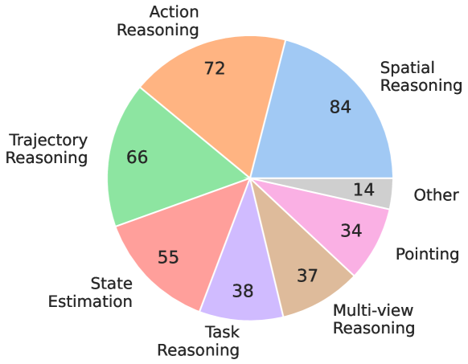

Figure 4: ERQA question categories.

Report issue for preceding element

To capture progress in embodied reasoning for VLMs, we introduce ERQA, short for Embodied Reasoning Question Answering, a benchmark that focuses specifically on capabilities likely required by an embodied agent interacting with the physical world.
ERQA consists of 400400400400 multiple choice Visual Question Answering (VQA)-style questions across a wide variety of categories, including spatial reasoning, trajectory reasoning, action reasoning, state estimation, pointing, multi-view reasoning, and task reasoning.
A breakdown of the distribution of question types is in [Fig. 4](https://arxiv.org/html/2503.20020v1#S2.F4 "In 2.1 Embodied Reasoning Question Answering (ERQA) Benchmark ‣ 2 Embodied Reasoning with Gemini 2.0 ‣ Gemini Robotics: Bringing AI into the Physical World").
Of the 400400400400 questions 28% have more than one image in the prompt — these questions that require corresponding concepts across multiple images tend to be more challenging than single-image questions.

Report issue for preceding element

ERQA is complementary to existing VLM benchmarks, which tend to highlight more atomic capabilities (e.g., object recognition, counting, localization), but in most cases do not take sufficient account of the broader set of capabilities needed to act in the physical world.
[Fig. 3](https://arxiv.org/html/2503.20020v1#S2.F3 "In 2.1 Embodied Reasoning Question Answering (ERQA) Benchmark ‣ 2 Embodied Reasoning with Gemini 2.0 ‣ Gemini Robotics: Bringing AI into the Physical World") shows some example questions and answers of our ERQA.
Some questions require the VLM to recognize and register objects across multiple frames;
others require reasoning about objects’ affordances and 3D relationships with the rest of the scene.
Full details of the benchmark can be found at <https://github.com/embodiedreasoning/ERQA>.

Report issue for preceding element

|  |  |  |  |  |  |  |  |  |
| --- | --- | --- | --- | --- | --- | --- | --- | --- |
|  | Gemini | | | | GPT | | Claude |  |
| Benchmark | 1.5 Flash | 1.5 Pro | 2.0 Flash | 2.0 Pro Experimental | 4o-mini | 4o | 3.5 Sonnet |  |
| ERQA | 42.3 | 41.8 | 46.3 | 48.3 | 37.3 | 47.0 | 35.5 |  |
| RealworldQA (test) | 69.0 | 64.5 | 71.6 | 74.5 | 65.0 | 71.9 | 61.4 |  |
| BLINK (val) | 59.2 | 64.4 | 65.0 | 65.2 | 56.9 | 62.3 | 60.2 |  |

Table 1:
Comparing VLMs on benchmarks that assess a wide range of embodied reasoning capabilities, including our new ERQA benchmark.
Benchmarks are evaluated by accuracies of multiple-choice answers.
Results obtained in Feb 2025.

Report issue for preceding element

We manually labeled all questions in ERQA to ensure correctness and quality.
Images (not questions) in the benchmark are either taken by ourselves or sourced from these datasets: OXE (O’Neill et al., [2024](https://arxiv.org/html/2503.20020v1#bib.bib39)), UMI Data (UMI-Data, [2024](https://arxiv.org/html/2503.20020v1#bib.bib50)), MECCANO (Ragusa et al., [2022](https://arxiv.org/html/2503.20020v1#bib.bib42), [2021](https://arxiv.org/html/2503.20020v1#bib.bib41)), HoloAssist (Wang et al., [2023](https://arxiv.org/html/2503.20020v1#bib.bib55)), and EGTEA Gaze+ (Li et al., [2021](https://arxiv.org/html/2503.20020v1#bib.bib33)).
In [Table 1](https://arxiv.org/html/2503.20020v1#S2.T1 "In 2.1 Embodied Reasoning Question Answering (ERQA) Benchmark ‣ 2 Embodied Reasoning with Gemini 2.0 ‣ Gemini Robotics: Bringing AI into the Physical World"), we report results of Gemini models and other models on ERQA, as well as on RealworldQA (XAI-org, [2024](https://arxiv.org/html/2503.20020v1#bib.bib58)) and BLINK (Fu et al., [2024](https://arxiv.org/html/2503.20020v1#bib.bib18)), two popular benchmarks that also measure spatial and image understanding capabilities.
Specifically, we report results of Gemini 2.0 Flash, a powerful low-latency workhorse model and Gemini 2.0 Pro Experimental 02-05 (short as Gemini 2.0 Pro Experimental in the rest of the paper), the best Gemini model for complex tasks.
Gemini 2.0 Flash and Pro Experimental achieve a new state-of-the-art on all three benchmarks in their respective model classes. We also note that ERQA is the most challenging benchmark across these three, making the performance here especially notable.

Report issue for preceding element

|  |  |  |  |  |  |  |
| --- | --- | --- | --- | --- | --- | --- |
|  | Gemini | | GPT | | Claude |  |
| Prompt Variant | 2.0 Flash | 2.0 Pro Experimental | 4o-mini | 4o | 3.5 Sonnet |  |
| Without CoT | 46.3 | 48.3 | 37.3 | 47.0 | 35.5 |  |
| With CoT | 50.3 | 54.8 | 40.5 | 50.5 | 45.8 |  |

Table 2: Performances on the ERQA benchmark with and without Chain-of-Thought (CoT) prompting.

Report issue for preceding element

Gemini 2.0 models are capable of advanced reasoning — we found we can significantly improve Gemini 2.0’s performance on the benchmark if we use Chain-of-Thought (CoT) prompting (Wei et al., [2022](https://arxiv.org/html/2503.20020v1#bib.bib56)), which encourages the model to output reasoning traces to “think” about a problem before choosing the multiple choice answer, instead of directly predicting the answer.
We use the following instruction as the CoT prompt appended at the end of each question: “Reason step by step about the answer, and show your work, for each step. Only after that, proceed to the final answer.”
Results are shown in [Table 2](https://arxiv.org/html/2503.20020v1#S2.T2 "In 2.1 Embodied Reasoning Question Answering (ERQA) Benchmark ‣ 2 Embodied Reasoning with Gemini 2.0 ‣ Gemini Robotics: Bringing AI into the Physical World").
With CoT prompting, Gemini 2.0 Flash’s performance exceeds that of Gemini 2.0 Pro Experimental without CoT, and CoT further improves Gemini 2.0 Pro Experimental’s performance.
We highlight two such reasoning traces in [Fig. 5](https://arxiv.org/html/2503.20020v1#S2.F5 "In 2.1 Embodied Reasoning Question Answering (ERQA) Benchmark ‣ 2 Embodied Reasoning with Gemini 2.0 ‣ Gemini Robotics: Bringing AI into the Physical World"), questions that Gemini 2.0 Pro Experimental answered incorrectly without CoT, but correctly with CoT.
The reasoning traces demonstrate Gemini 2.0 is able to 1) precisely ground its spatial understanding in observations in the image and 2) leverage such grounding to perform complex, step-by-step embodied reasoning.

Report issue for preceding element

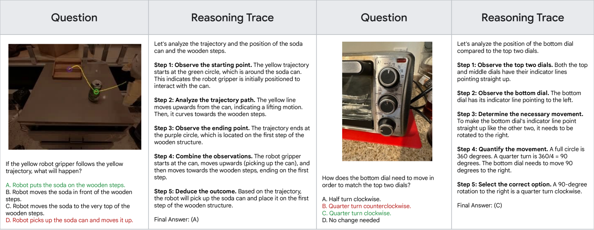

Figure 5:
Examples of questions and reasoning traces with Gemini 2.0 Pro Experimental.
Red answers were obtained without the CoT prompt; green answers obtained with CoT prompt.

Report issue for preceding element

### 2.2 Gemini 2.0’s Embodied Reasoning Capabilities

Report issue for preceding element

In this section, we illustrate some of Gemini 2.0’s embodied reasoning capabilities in more detail. We also introduce Gemini Robotics-ER, a version of Gemini 2.0 Flash that has enhanced embodied reasoning. These can be used in robotics applications without the need for any additional robot-specific data or training. Gemini 2.0 can understand a variety of 2D spatial concepts in images.

Report issue for preceding element

1. 1.

   Object Detection: Gemini 2.0 can perform open-world 2D object detection, providing precise 2D bounding boxes with queries that can be explicit (e.g., describing an object name) or implicit (categories, attributes, or functions).

   Report issue for preceding element
2. 2.

   Pointing: Given any natural language description, the model is able to point to explicit entities like objects and object parts, as well as implicit notions such as affordances (where to grasp, where to place), free space and spatial concepts. See [Table 3](https://arxiv.org/html/2503.20020v1#S2.T3 "In 2.2 Gemini 2.0’s Embodied Reasoning Capabilities ‣ 2 Embodied Reasoning with Gemini 2.0 ‣ Gemini Robotics: Bringing AI into the Physical World") for quantitative evaluations.

   Report issue for preceding element
3. 3.

   Trajectory Prediction: Gemini 2.0 can leverage its pointing capabilities to produce 2D motion trajectories that are grounded in its observations.
   Trajectories can be
   based, for instance, on a description of the physical motion or interaction.

   Report issue for preceding element
4. 4.

   Grasp Prediction: This is a new feature introduced in Gemini Robotics-ER. It extends Gemini 2.0’s pointing capabilities to predict top-down grasps.

   Report issue for preceding element

Gemini 2.0 is also capable of 3D spatial reasoning (Chen et al., [2024](https://arxiv.org/html/2503.20020v1#bib.bib10); Hwang et al., [2024](https://arxiv.org/html/2503.20020v1#bib.bib24)). With the ability to “see in 3D”, Gemini 2.0 can better understand concepts like sizes, distances, and orientations, and it can leverage such understanding to reason about the state of the scene and actions to perform.

Report issue for preceding element

1. 1.

   Multi-View Correspondence: A natural way of representing 3D information with images is through multi-view (e.g., stereo) images. Gemini 2.0 can understand 3D scenes from multi-view images and predict 2D point correspondences across multiple camera views of the same scene.

   Report issue for preceding element
2. 2.

   3D Bounding Box Detection: This 3D understanding applies to single images as well - Gemini 2.0 can directly predict metric 3D bounding boxes from monocular images. Like 2D Detection and Pointing capabilities, Gemini 2.0 can detect objects by open-vocabulary descriptions.

   Report issue for preceding element

While it is possible to create expert models for each of these tasks individually, fusing them in a single foundation model, such as Gemini 2.0, allows the model to perform embodied reasoning tasks with open-world natural language instructions, respond to feedback and sustain multi-turn interactions.
In particular, Gemini 2.0 can combine scene understanding with reasoning to solve more complex tasks, such as writing robot code (see [Section 2.3](https://arxiv.org/html/2503.20020v1#S2.SS3 "2.3 Gemini 2.0 Enables Zero and Few-Shot Robot Control ‣ 2 Embodied Reasoning with Gemini 2.0 ‣ Gemini Robotics: Bringing AI into the Physical World")).

Report issue for preceding element

Below we present detailed quantitative and qualitative evaluations of these capabilities with Gemini 2.0 models (Flash, and Pro Experimental), as well as comparisons with other VLMs where appropriate.
For some capabilities, we also present results on Gemini Robotics-ER.
You can find code and prompt examples on how to prompt Gemini 2.0 to elicit these capabilities [here](https://colab.sandbox.google.com/github/google-gemini/cookbook/blob/main/examples/Spatial_understanding_3d.ipynb).

Report issue for preceding element

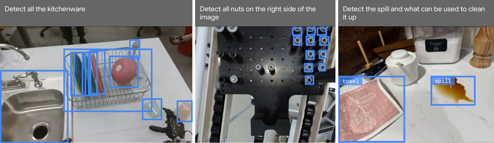

Figure 6:
2D Detection examples with Gemini 2.0 Flash.
Left: detect by object category.
Middle: detect by spatial description.
Right: detect by affordance.
Predicted object labels are not shown for left and middle images to reduce visual clutter.

Report issue for preceding element
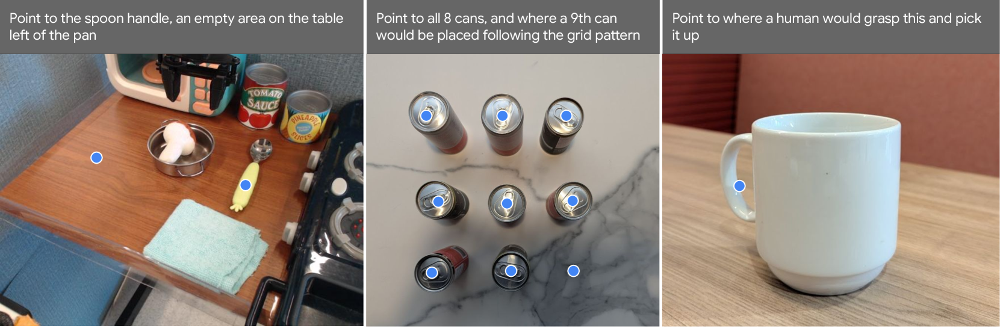

Figure 7: Gemini 2.0 can predict 2D points from natural language queries. Examples are obtained with Gemini 2.0 Flash. Predicted point labels are not visualized.

Report issue for preceding element

Object Detection.
Gemini 2.0 can predict 2D object bounding boxes from natural language queries.
In [Fig. 6](https://arxiv.org/html/2503.20020v1#S2.F6 "In 2.2 Gemini 2.0’s Embodied Reasoning Capabilities ‣ 2 Embodied Reasoning with Gemini 2.0 ‣ Gemini Robotics: Bringing AI into the Physical World"), we show multiple 2D detection examples with Gemini 2.0 Flash on images that a robot might see.
Gemini 2.0 represents 2D bounding boxes with the convention [y0,x0,y1,x1]

subscript𝑦0subscript𝑥0subscript𝑦1subscript𝑥1[y\_{0},x\_{0},y\_{1},x\_{1}][ italic\_y start\_POSTSUBSCRIPT 0 end\_POSTSUBSCRIPT , italic\_x start\_POSTSUBSCRIPT 0 end\_POSTSUBSCRIPT , italic\_y start\_POSTSUBSCRIPT 1 end\_POSTSUBSCRIPT , italic\_x start\_POSTSUBSCRIPT 1 end\_POSTSUBSCRIPT ].
We can prompt Gemini 2.0 to detect everything in a scene (examples in [Fig. 2](https://arxiv.org/html/2503.20020v1#S1.F2 "In 1 Introduction ‣ Gemini Robotics: Bringing AI into the Physical World")).
The model can also detect specific objects by their descriptions — for example, “detect all the kitchenware” in [Fig. 6](https://arxiv.org/html/2503.20020v1#S2.F6 "In 2.2 Gemini 2.0’s Embodied Reasoning Capabilities ‣ 2 Embodied Reasoning with Gemini 2.0 ‣ Gemini Robotics: Bringing AI into the Physical World").
These descriptions can contain spatial cues as well — “detecting nuts on the right side of the image” in the middle example.
Finally, we can prompt Gemini 2.0 to detect objects by their affordances.
In the right example of [Fig. 6](https://arxiv.org/html/2503.20020v1#S2.F6 "In 2.2 Gemini 2.0’s Embodied Reasoning Capabilities ‣ 2 Embodied Reasoning with Gemini 2.0 ‣ Gemini Robotics: Bringing AI into the Physical World"), we ask Gemini 2.0 to detect the spill and “what can be used to clean it up”.
Gemini 2.0 is able to detect both the spill and the towel, without being specified explicitly.
These examples showcase the benefit of combining precise localization capabilities with general-purpose VLMs, where Gemini’s open-vocabulary and open-world reasoning enables a level of semantic generalization that is difficult to achieve with special-purpose expert models.

Report issue for preceding element

2D Pointing.
For some use cases, points can offer a more flexible and precise representation for image understanding and robot control than bounding boxes. We illustrate Gemini 2.0’s pointing capabilities in various robot manipulation scenes ([Fig. 7](https://arxiv.org/html/2503.20020v1#S2.F7 "In 2.2 Gemini 2.0’s Embodied Reasoning Capabilities ‣ 2 Embodied Reasoning with Gemini 2.0 ‣ Gemini Robotics: Bringing AI into the Physical World")). The model represents points as [y,x]𝑦𝑥[y,x][ italic\_y , italic\_x ] tuples. Similar to 2D object detection, Gemini 2.0 can point to any object described by open-vocabulary language.
Gemini 2.0 can localize not only entire objects, but also object parts, such as a spoon handle ([Fig. 7](https://arxiv.org/html/2503.20020v1#S2.F7 "In 2.2 Gemini 2.0’s Embodied Reasoning Capabilities ‣ 2 Embodied Reasoning with Gemini 2.0 ‣ Gemini Robotics: Bringing AI into the Physical World"), left).
Additionally, Gemini 2.0 can point to spatial concepts, e.g., an “empty area on the table left of the pan” ([Fig. 7](https://arxiv.org/html/2503.20020v1#S2.F7 "In 2.2 Gemini 2.0’s Embodied Reasoning Capabilities ‣ 2 Embodied Reasoning with Gemini 2.0 ‣ Gemini Robotics: Bringing AI into the Physical World"), left) or “where a new can should be placed following the pattern of the existing eight cans” ([Fig. 7](https://arxiv.org/html/2503.20020v1#S2.F7 "In 2.2 Gemini 2.0’s Embodied Reasoning Capabilities ‣ 2 Embodied Reasoning with Gemini 2.0 ‣ Gemini Robotics: Bringing AI into the Physical World"), middle).
It can also infer affordances; for example, when asked to “point to where a human would grasp this to pick it up”, the model correctly identifies the mug handle ([Fig. 7](https://arxiv.org/html/2503.20020v1#S2.F7 "In 2.2 Gemini 2.0’s Embodied Reasoning Capabilities ‣ 2 Embodied Reasoning with Gemini 2.0 ‣ Gemini Robotics: Bringing AI into the Physical World"), right).

Report issue for preceding element

We quantitatively evaluate Gemini 2.0’s pointing performance in [Table 3](https://arxiv.org/html/2503.20020v1#S2.T3 "In 2.2 Gemini 2.0’s Embodied Reasoning Capabilities ‣ 2 Embodied Reasoning with Gemini 2.0 ‣ Gemini Robotics: Bringing AI into the Physical World") using three benchmarks: Paco-LVIS (Ramanathan et al., [2023](https://arxiv.org/html/2503.20020v1#bib.bib43)) for object part pointing on natural images, Pixmo-Point (Deitke et al., [2024](https://arxiv.org/html/2503.20020v1#bib.bib14)) for open-vocabulary pointing on web images, and Where2place (Yuan et al., [2024](https://arxiv.org/html/2503.20020v1#bib.bib59)) for free-space pointing in indoor scenes. See [Section B.2](https://arxiv.org/html/2503.20020v1#A2.SS2 "B.2 Pointing Benchmark Comparisons ‣ Appendix B Embodied Reasoning with Gemini 2.0 ‣ Gemini Robotics: Bringing AI into the Physical World") for details on how we benchmark pointing against other models.
Gemini 2.0 significantly outperforms state-of-the-art vision-language models (VLMs) like GPT and Claude. Gemini Robotics-ER surpasses Molmo, a specialized pointing VLM, in two of the three subtasks.

Report issue for preceding element

|  |  |  |  |  |  |  |  |  |
| --- | --- | --- | --- | --- | --- | --- | --- | --- |
|  | Gemini | | | GPT | | Claude | Molmo | |
| Benchmark | Gemini Robotics-ER | 2.0 Flash | 2.0 Pro | 4o-mini | 4o | 3.5 Sonnet | 7B-D | 72B |
|  |  |  | Experimental |  |  |  |  |  |
| Paco-LVIS | 71.3 | 46.1 | 45.5 | 11.8 | 16.2 | 12.4 | 45.4 | 47.1 |
| Pixmo-Point | 49.5 | 25.8 | 20.9 | 5.9 | 5.0 | 7.2 | 14.7 | 12.5 |
| Where2Place | 45.0 | 33.8 | 38.8 | 13.8 | 20.6 | 16.2 | 45 | 63.8 |

Table 3: 2D Pointing Benchmarks evaluating open-vocabulary pointing capabilities. Scores are accuracies (1 if predicted point is within the ground truth region mask, 0 otherwise).

Report issue for preceding element
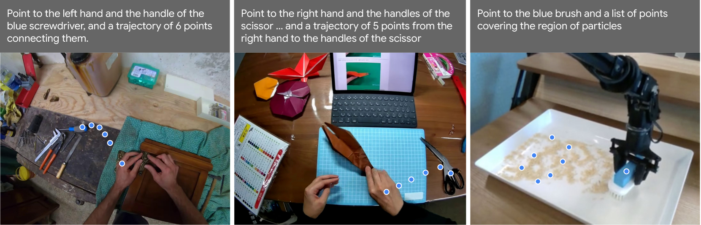

Figure 8: Gemini 2.0 can predict 2D trajectories by first predicting start and end points. Examples are obtained with Gemini 2.0 Flash. Predicted point labels are not visualized.

Report issue for preceding element
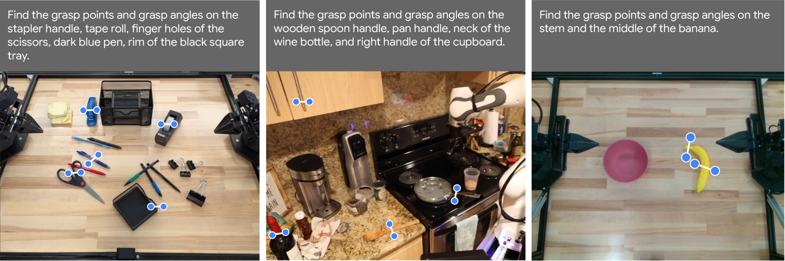

Figure 9: Gemini Robotics-ER can predict top-down grasps by leveraging Gemini 2.0’s 2D pointing capability. Examples are obtained with Gemini Robotics-ER.

Report issue for preceding element

2D Trajectories.
Gemini 2.0 can leverage its pointing capabilities to predict 2D trajectories that connect multiple points together.
While Gemini 2.0 cannot perform complex motion planning (e.g., to avoid obstacles), it can still generate useful trajectories that are grounded in the observed images.
We showcase some examples in [Fig. 8](https://arxiv.org/html/2503.20020v1#S2.F8 "In 2.2 Gemini 2.0’s Embodied Reasoning Capabilities ‣ 2 Embodied Reasoning with Gemini 2.0 ‣ Gemini Robotics: Bringing AI into the Physical World").
In the left and middle images, Gemini 2.0 interpolates a reasonable trajectory from a human hand in the ego-centric video to a tool that it may grasp.
In the right image, Gemini 2.0 predicts a series of waypoints that, if followed by the robot gripper, would wipe the spilled area of a tray.
Gemini 2.0’s trajectory prediction capabilities exhibit world knowledge about motion and dynamics which is a fundamental capability for robotics.
We capitalize on these nascent trajectory understanding capabilities to tie actions to vision and language capabilities in a much stronger fashion in [Section 4.2](https://arxiv.org/html/2503.20020v1#S4.SS2 "4.2 Enhanced reasoning and generalization ‣ 4 Specializing and Adapting Gemini Robotics for Dexterity, Reasoning, and New Embodiments ‣ Gemini Robotics: Bringing AI into the Physical World").

Report issue for preceding element

Top-Down Grasps.
Gemini 2.0’s semantic pointing capabilities can be naturally extended to top-down grasping poses, represented as y𝑦yitalic\_y, x𝑥xitalic\_x, and a rotation angle θ𝜃\thetaitalic\_θ.
This capability is further improved in Gemini Robotics-ER, as shown in [Fig. 9](https://arxiv.org/html/2503.20020v1#S2.F9 "In 2.2 Gemini 2.0’s Embodied Reasoning Capabilities ‣ 2 Embodied Reasoning with Gemini 2.0 ‣ Gemini Robotics: Bringing AI into the Physical World").
For example, we can prompt for a grasp either on the stem of the banana or the center of the banana (right image).
We show how such grasp predictions can be directly used for downstream robot control on real robots in [Section 2.3](https://arxiv.org/html/2503.20020v1#S2.SS3 "2.3 Gemini 2.0 Enables Zero and Few-Shot Robot Control ‣ 2 Embodied Reasoning with Gemini 2.0 ‣ Gemini Robotics: Bringing AI into the Physical World").

Report issue for preceding element

Multi-view Correspondence.
Gemini can also understand the 3D structure of the world.
One example is its ability to understand a 3D scene from multiple views.
For instance, with an initial image annotated with a list of points and a new image of the same scene from a different view, we can ask Gemini 2.0 which of the points from the initial image are still visible in the second image and we can query the coordinates of those points.
From the examples in [Fig. 10](https://arxiv.org/html/2503.20020v1#S2.F10 "In 2.2 Gemini 2.0’s Embodied Reasoning Capabilities ‣ 2 Embodied Reasoning with Gemini 2.0 ‣ Gemini Robotics: Bringing AI into the Physical World"), we observe that Gemini 2.0 can perform multi-view correspondence across dramatically different views.
In the top image pair, the model correctly predicts that the red point refers to an object held by the human in these egocentric images, even though the view of the rest of the scene has changed significantly.
In the bottom image pair, the model correctly predicts that the orange point is not visible in the second image.
Such multi-view understanding is useful for robotics domains where a robot can use Gemini 2.0 to reason about multiple image streams (e.g., stereo views, head and wrist views) to better understand the 3D spatial relationships of its observations.

Report issue for preceding element

3D Detection. Gemini 2.0 can also predict metric 3D bounding boxes from single images. Similar to its 2D detection capabilities, Gemini 2.0’s 3D detection capability is also open-vocabulary, as illustrated in [Fig. 11](https://arxiv.org/html/2503.20020v1#S2.F11 "In 2.2 Gemini 2.0’s Embodied Reasoning Capabilities ‣ 2 Embodied Reasoning with Gemini 2.0 ‣ Gemini Robotics: Bringing AI into the Physical World").
In [Table 4](https://arxiv.org/html/2503.20020v1#S2.T4 "In 2.2 Gemini 2.0’s Embodied Reasoning Capabilities ‣ 2 Embodied Reasoning with Gemini 2.0 ‣ Gemini Robotics: Bringing AI into the Physical World"), we report Gemini 2.0’s 3D detection performance using SUN-RGBD (Song et al., [2015](https://arxiv.org/html/2503.20020v1#bib.bib48)), a popular dataset and benchmark for 3D object detection and scene understanding, and compare it with baseline expert models (ImVoxelNet (Rukhovich et al., [2022](https://arxiv.org/html/2503.20020v1#bib.bib45)), Implicit3D (Zhang et al., [2021](https://arxiv.org/html/2503.20020v1#bib.bib61)), and Total3DUnderstanding (Nie et al., [2020](https://arxiv.org/html/2503.20020v1#bib.bib38))). Gemini 2.0’s 3D detection performance is comparable to existing state-of-the-art expert models, with Gemini Robotics-ER achieving a new state-of-the-art on the SUN-RGBD benchmark. While these baselines work with a closed set of categories, Gemini allows for open-vocabulary queries.

Report issue for preceding element

|  |  |  |  |  |  |  |
| --- | --- | --- | --- | --- | --- | --- |
|  | Gemini | | | Specialized Expert Models | | |
| Benchmark | Gemini Robotics-ER | 2.0 Flash | 2.0 Pro Experimental | ImVoxelNet | Implicit3D | Total3DU |
| SUN-RGBD AP@15 | 48.3 | 30.7 | 32.5 | 43.7‚àósuperscript43.743.7^{\*}43.7 start\_POSTSUPERSCRIPT ‚àó end\_POSTSUPERSCRIPT | 24.1 | 14.3 |

Table 4:
Gemini Robotics-ER achieves a new state-of-the-art performance on the SUN-RGBD 3D object detection benchmark.
(\* ImVoxelNet (Rukhovich et al., [2022](https://arxiv.org/html/2503.20020v1#bib.bib45)) performance measured on an easier set of 10 categories).

Report issue for preceding element

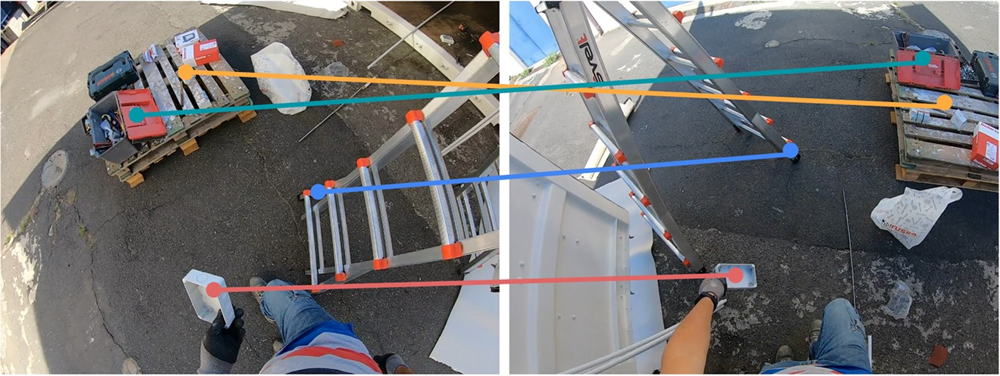

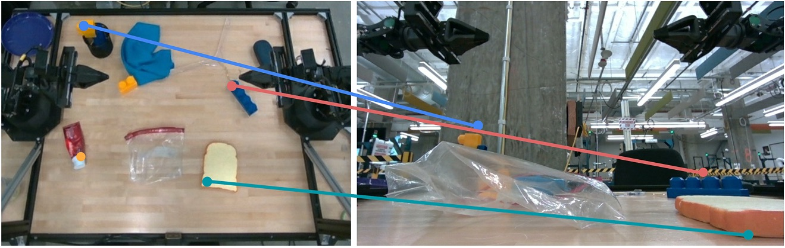

Figure 10:
Gemini 2.0 can understand 3D scenes by correlating 2D points across different views.
For each image pair, the left image with the point coordinates and the right image without coordinates are given, and the model predicts which of the labeled points in the left image are visible in the right image, as well as the coordinates of the visible points in the right image.
Examples are obtained with Gemini 2.0 Flash.

Report issue for preceding element
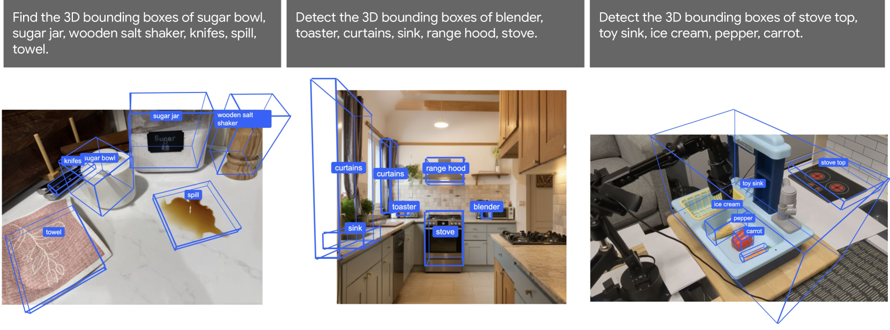

Figure 11: Gemini 2.0 can directly predict open-vocabulary 3D object bounding boxes. Examples are obtained with Gemini 2.0 Flash.

Report issue for preceding element

### 2.3 Gemini 2.0 Enables Zero and Few-Shot Robot Control

Report issue for preceding element

Gemini 2.0’s embodied reasoning capabilities make it possible to control a robot without it ever having been trained with any robot action data. It can perform all the necessary steps, perception, state estimation, spatial reasoning, planning and control, out of the box. Whereas previous work needed to compose multiple models to this end (Ahn et al., [2022](https://arxiv.org/html/2503.20020v1#bib.bib1); Liang et al., [2023](https://arxiv.org/html/2503.20020v1#bib.bib34); Vemprala et al., [2023](https://arxiv.org/html/2503.20020v1#bib.bib53); Kwon et al., [2024](https://arxiv.org/html/2503.20020v1#bib.bib30)), Gemini 2.0 unites all required capabilities in a single model.

Report issue for preceding element

Below we study two distinct approaches: zero-shot robot control via code generation, and few-shot control via in-context learning (also denoted as “ICL” below) - where we condition the model on a handful of in-context demonstrations for a new behavior. Gemini Robotics-ER achieves good performance across a range of different tasks in both settings, and we find that especially zero-shot robot control performance is strongly correlated with better embodied understanding: Gemini Robotics-ER, which has received more comprehensive training to this end, improves task completion by almost 2x compared to Gemini 2.0.

Report issue for preceding element

Zero-shot Control via Code Generation.
To test Gemini 2.0’s zero-shot control capabilities, we combine its innate ability to generate code with the embodied reasoning capabilities described in [Section 2.2](https://arxiv.org/html/2503.20020v1#S2.SS2 "2.2 Gemini 2.0’s Embodied Reasoning Capabilities ‣ 2 Embodied Reasoning with Gemini 2.0 ‣ Gemini Robotics: Bringing AI into the Physical World").
We conduct experiments on a bimanual ALOHA 2 (Team et al., [2024](https://arxiv.org/html/2503.20020v1#bib.bib49); Zhao et al., [2025](https://arxiv.org/html/2503.20020v1#bib.bib63)) robot. To control the robot, Gemini 2.0 has access to an API (Liang et al., [2023](https://arxiv.org/html/2503.20020v1#bib.bib34); Arenas et al., [2023](https://arxiv.org/html/2503.20020v1#bib.bib4); Kwon et al., [2024](https://arxiv.org/html/2503.20020v1#bib.bib30)) that can move each gripper to a specified pose, open and close each gripper, and provide a readout of the current robot state.
The API also provides functions for perception; no external models are called, instead Gemini 2.0 itself detects object bounding boxes, points on objects, and generates the top down grasp pose as described in [Section 2.2](https://arxiv.org/html/2503.20020v1#S2.SS2 "2.2 Gemini 2.0’s Embodied Reasoning Capabilities ‣ 2 Embodied Reasoning with Gemini 2.0 ‣ Gemini Robotics: Bringing AI into the Physical World").

Report issue for preceding element

During an episode, Gemini 2.0 is initially passed a system prompt, a description of the robot API, and the task instructions. Then Gemini 2.0 iteratively takes in images that show the current state of the scene, the robot state, and execution feedback, and outputs code that is executed in the environment to control the robot. The generated code uses the API to understand the scene and move the robot and the execution loop allows Gemini 2.0 to react and replan when necessary (e.g., [Fig. 34](https://arxiv.org/html/2503.20020v1#A2.F34 "In B.3.3 Sample output from Gemini during zero-shot robot control ‣ B.3 ALOHA 2 Zero and Few-Shot Control ‣ Appendix B Embodied Reasoning with Gemini 2.0 ‣ Gemini Robotics: Bringing AI into the Physical World")).
An overview of the API and episodic control flow is given in [Fig. 12](https://arxiv.org/html/2503.20020v1#S2.F12 "In 2.3 Gemini 2.0 Enables Zero and Few-Shot Robot Control ‣ 2 Embodied Reasoning with Gemini 2.0 ‣ Gemini Robotics: Bringing AI into the Physical World").

Report issue for preceding element

|  |
| --- |
| 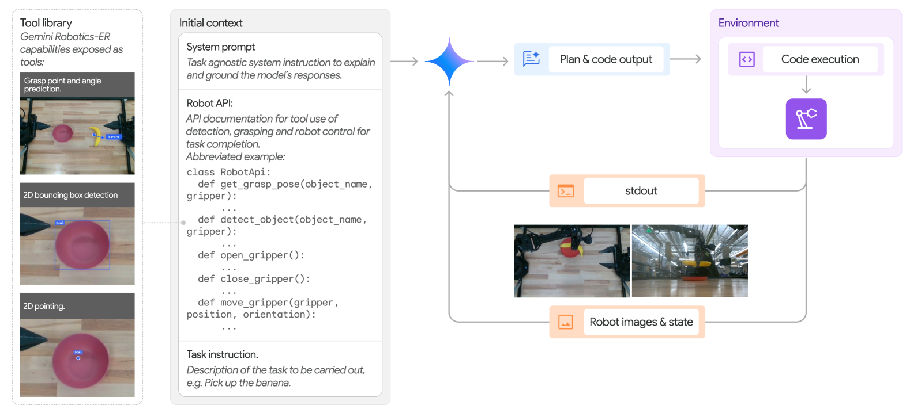 |

Figure 12: Overview of the perception and control APIs, and agentic orchestration during an episode. This system is used for zero-shot control.

Report issue for preceding element

[Table 5](https://arxiv.org/html/2503.20020v1#S2.T5 "In 2.3 Gemini 2.0 Enables Zero and Few-Shot Robot Control ‣ 2 Embodied Reasoning with Gemini 2.0 ‣ Gemini Robotics: Bringing AI into the Physical World") presents results across a set of manipulation tasks in simulation. These tasks were chosen to capture performance across a spectrum of difficulty and objects: from simple grasping (lift a banana) to long horizon multi-step, multi-task manipulation (put a toy in a box and close the box). See [Section B.3.1](https://arxiv.org/html/2503.20020v1#A2.SS3.SSS1 "B.3.1 ALOHA 2 Robot Task Descriptions ‣ B.3 ALOHA 2 Zero and Few-Shot Control ‣ Appendix B Embodied Reasoning with Gemini 2.0 ‣ Gemini Robotics: Bringing AI into the Physical World") for full descriptions.
Gemini 2.0 Flash succeeds on average 27% of the time, although it can be as high as 54% for easier tasks. Gemini Robotics-ER, performs almost twice as well as 2.0 Flash, successfully completing 53% of the tasks on average. The enhanced embodied reasoning capabilities of the Gemini Robotics-ER model have clearly benefited the downstream robotic tasks.

Report issue for preceding element

|  |  |  |  |  |  |  |  |  |  |
| --- | --- | --- | --- | --- | --- | --- | --- | --- | --- |
| System | | Sim Task Success Rate (%) | | | | | | |  |
| Model | Context | Avg. | Banana  Lift | Banana  in Bowl | Mug  on Plate | Bowl  on Rack | Banana  Handover | Fruit  Bowl | Pack  Toy |
| 2.0 Flash | Zero-shot | 27 | 34 | 54 | 46 | 24 | 26 | 4 | 0 |
| Gemini Robotics-ER | Zero-shot | 53 | 86 | 84 | 72 | 60 | 54 | 16 | 0 |
| 2.0 Flash | ICL | 51 | 94 | 90 | 36 | 16 | 94 | 0 | 26 |
| Gemini Robotics-ER | ICL | 65 | 96 | 96 | 74 | 36 | 96 | 4 | 54 |

Table 5: Success rates on the ALOHA 2 Sim Task suite. Reported numbers are the average success rate over 50 trials with random initial conditions.

Report issue for preceding element

[Table 6](https://arxiv.org/html/2503.20020v1#S2.T6 "In 2.3 Gemini 2.0 Enables Zero and Few-Shot Robot Control ‣ 2 Embodied Reasoning with Gemini 2.0 ‣ Gemini Robotics: Bringing AI into the Physical World") shows results on a real ALOHA 2 robot.
The success rate for banana handover is lower compared to simulation due to calibration imperfections and other sources of noise in the real world.
For a harder and more dexterous task: Gemini Robotics-ER is currently unable to perform dress folding, mostly due to its inability to generate precise enough grasps.

Report issue for preceding element

|  |  |  |  |  |
| --- | --- | --- | --- | --- |
|  | Real Task Success Rate (%) | | | |
| Context | Avg. | Banana  Handover | Fold  Dress | Wiping |
| Zero-shot | 25 | 30 | 0 | 44 |
| ICL | 65 | 70 | 56 | 67 |

Table 6: Real world success rates of Gemini Robotics-ER on ALOHA 2 tasks. Reported rates are the average over 10 trials for banana handover and 9 for fold dress and wiping. For tasks that require dexterous motions, the zero-shot success rate is not high, but they will be significantly improved in the Gemini Robotics model (Sec. [3](https://arxiv.org/html/2503.20020v1#S3 "3 Robot Actions with Gemini Robotics ‣ Gemini Robotics: Bringing AI into the Physical World")).

Report issue for preceding element

Few-shot control via in-context examples.
The previous results demonstrated how Gemini Robotics-ER can be effectively used to tackle a series of tasks entirely zero-shot. However, some dexterous manipulation tasks are beyond Gemini 2.0’s current ability to perform zero-shot.
Motivated by such cases, we demonstrate that the model can be conditioned on a handful of in-context demonstrations, and can then immediately emulate those behaviors. Instead of generating code, as in the previous examples, we instead prompt the model to generate trajectories of end-effectors poses directly, following the examples in the demonstrations.

Report issue for preceding element

We extend the method proposed in (Di Palo and Johns, [2024](https://arxiv.org/html/2503.20020v1#bib.bib15)), which translates k𝑘kitalic\_k teleoperated trajectories of robot actions into a list of objects and end-effectors poses, tokenizing them as text and adding them to the prompt ([Fig. 13](https://arxiv.org/html/2503.20020v1#S2.F13 "In 2.3 Gemini 2.0 Enables Zero and Few-Shot Robot Control ‣ 2 Embodied Reasoning with Gemini 2.0 ‣ Gemini Robotics: Bringing AI into the Physical World")). Thanks to the embodied reasoning abilities of Gemini Robotics-ER, we do not need any external models to extract visual keypoints and object poses (as was done in the referenced work); Gemini Robotics-ER can do this itself. In addition to observations and actions, we interleave descriptions of the performed actions in language that elicits reasoning at inference time in the model. The model emulates the natural language reasoning from the in-context trajectories and becomes better at, for example, understanding which arm to use when, or more accurately predicting where to interact with objects. One advantage of using a large multimodal model is the ability to condition its behavior on observations, actions and language, with the combination of all outperforming any modality in isolation.

Report issue for preceding element

The results using this approach (with 10 demonstrations) are shown in [Table 5](https://arxiv.org/html/2503.20020v1#S2.T5 "In 2.3 Gemini 2.0 Enables Zero and Few-Shot Robot Control ‣ 2 Embodied Reasoning with Gemini 2.0 ‣ Gemini Robotics: Bringing AI into the Physical World") and [Table 6](https://arxiv.org/html/2503.20020v1#S2.T6 "In 2.3 Gemini 2.0 Enables Zero and Few-Shot Robot Control ‣ 2 Embodied Reasoning with Gemini 2.0 ‣ Gemini Robotics: Bringing AI into the Physical World"). Both Gemini 2.0 Flash and Gemini Robotics-ER are able to effectively use demonstrations entirely in-context to improve performance. Gemini 2.0 Flash’s performance reaches 51% in simulation, and Gemini Robotics-ER achieves 65% in both simulation and the real world. Most of the performance improvements with respect to the zero-shot code generation approach comes from more dexterous tasks, like handover of objects, folding a dress, or packing a toy, where demonstrations can condition the model to output more precise, bimanual trajectories.

Report issue for preceding element

|  |
| --- |
| 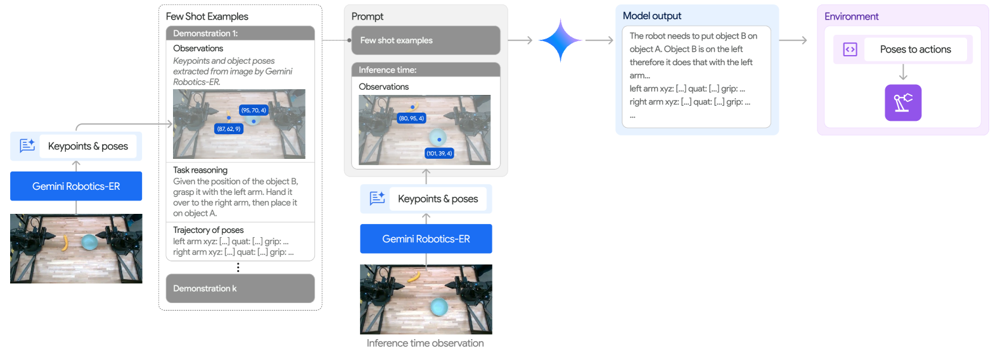 |

Figure 13: Overview of few-shot in-context learning pipeline. Gemini can receive observations, language instructions and trajectories in the prompt, and generate new language reasoning and trajectories for unseen instances of the tasks.

Report issue for preceding element

This set of experiments suggests that Gemini 2.0 Flash and its ER enhanced variant, Gemini Robotics-ER, can be used directly to control robots, as a perception module (e.g., object detection), a planning module (e.g., trajectory generation), and/or to orchestrate robot movements by generating and executing code. It also shows strong correlation between the model performance of embodied reasoning capabilities and the downstream robotic control. At the same time, our experiments demonstrate that the model is also able to tap into the power of in-context learning to learn from just a few demonstrations and boost performance on more dexterous and bimanual tasks, such as folding clothes, by directly outputting trajectories of end-effectors poses. However, as a VLM, there are inherent limitations for robot control, especially for more dexterous tasks, due to the intermediate steps needed to connect the model’s innate embodied reasoning capabilities to robotic actions. In the next section, we will introduce Gemini Robotics, an end-to-end Vision-Language-Action Model that enables more general-purpose and dexterous robot control.

Report issue for preceding element

## 3 Robot Actions with Gemini Robotics

Report issue for preceding element
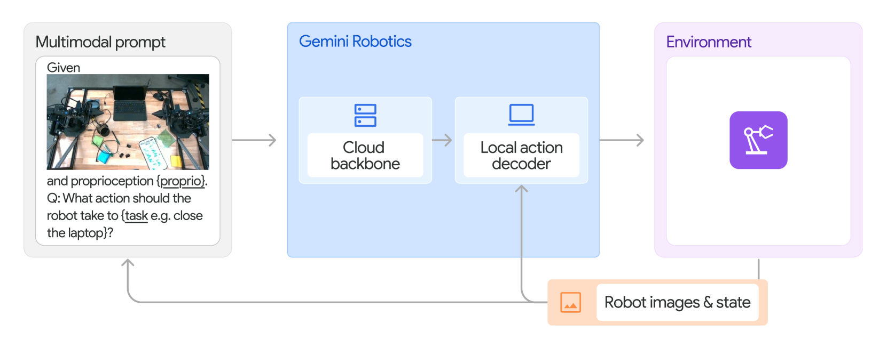

Figure 14: Overview of the architecture, input and output of the Gemini Robotics model. Gemini Robotics is a derivative of Gemini fine-tuned to predict robot actions. The model ingests a multimodal prompt consisting of a set of images of the current status of the scene and a text instruction of the task to perform and it outputs action chunks that are executed by the robot. The model is made up of two components: a VLA backbone hosted in the cloud (Gemini Robotics backbone) and a local action decoder running on the robot’s onboard computer (Gemini Robotics decoder).

Report issue for preceding element

In this section, we present Gemini Robotics, a derivative of Gemini that has been fine-tuned to predict robot actions directly. Gemini Robotics is a general-purpose model capable of solving dexterous tasks in different environments and supporting different robot embodiments. We first study the model after training on a large and diverse dataset consisting of action-labeled robot data as well as other multimodal data. The resulting model can solve a large variety of short-horizon dexterous tasks out of the box ([Section 3.2](https://arxiv.org/html/2503.20020v1#S3.SS2 "3.2 Gemini Robotics can solve diverse dexterous manipulation tasks out of the box ‣ 3 Robot Actions with Gemini Robotics ‣ Gemini Robotics: Bringing AI into the Physical World")), closely follows natural language instructions ([Section 3.3](https://arxiv.org/html/2503.20020v1#S3.SS3 "3.3 Gemini Robotics can closely follow language instructions ‣ 3 Robot Actions with Gemini Robotics ‣ Gemini Robotics: Bringing AI into the Physical World")) and inherits Gemini Robotics-ER generalization capabilities, showing robustness to visual variations of the scene, object positions and instances ([Section 3.4](https://arxiv.org/html/2503.20020v1#S3.SS4 "3.4 Gemini Robotics brings Gemini’s generalization to the physical world ‣ 3 Robot Actions with Gemini Robotics ‣ Gemini Robotics: Bringing AI into the Physical World")). In [Section 4](https://arxiv.org/html/2503.20020v1#S4 "4 Specializing and Adapting Gemini Robotics for Dexterity, Reasoning, and New Embodiments ‣ Gemini Robotics: Bringing AI into the Physical World"), we further test the limits of Gemini Robotics, and specialize it to challenging highly dexterous long-horizon tasks ([Section 4.1](https://arxiv.org/html/2503.20020v1#S4.SS1 "4.1 Long-horizon dexterity ‣ 4 Specializing and Adapting Gemini Robotics for Dexterity, Reasoning, and New Embodiments ‣ Gemini Robotics: Bringing AI into the Physical World")), and to more extreme generalization scenarios (Section [4.2](https://arxiv.org/html/2503.20020v1#S4.SS2 "4.2 Enhanced reasoning and generalization ‣ 4 Specializing and Adapting Gemini Robotics for Dexterity, Reasoning, and New Embodiments ‣ Gemini Robotics: Bringing AI into the Physical World")). We also investigate rapid adaptation to novel dexterous tasks ([Section 4.3](https://arxiv.org/html/2503.20020v1#S4.SS3 "4.3 Fast adaptation to new tasks ‣ 4 Specializing and Adapting Gemini Robotics for Dexterity, Reasoning, and New Embodiments ‣ Gemini Robotics: Bringing AI into the Physical World")) as well as adaptation to embodiments with completely new form factors, actions and observations ([Section 4.4](https://arxiv.org/html/2503.20020v1#S4.SS4 "4.4 Adaptation to new embodiments ‣ 4 Specializing and Adapting Gemini Robotics for Dexterity, Reasoning, and New Embodiments ‣ Gemini Robotics: Bringing AI into the Physical World")).

Report issue for preceding element

### 3.1 Gemini Robotics: Model and Data

Report issue for preceding element

Model.
Inference in large VLMs like Gemini Robotics-ER is often slow and requires special hardware. This can cause problems in the context of VLA models, since inference may not be feasible to be run onboard, and the resulting latency may be incompatible with real-time robot control. Gemini Robotics is designed to address these challenges. It consists of two components: a VLA backbone hosted in the cloud (Gemini Robotics backbone) and a local action decoder running on the robot’s onboard computer (Gemini Robotics decoder). The Gemini Robotics backbone is formed by a distilled version of Gemini Robotics-ER and its query-to-response latency has been optimized from seconds to under 160ms. The on-robot Gemini Robotics decoder compensates for the latency of the backbone.
When the backbone and local decoder are combined, the end-to-end latency from raw observations to low-level action chunks is approximately 250ms. With multiple actions in the chunk (Zhao et al., [2023](https://arxiv.org/html/2503.20020v1#bib.bib62)), the effective control frequency is 50Hz.
The overall system not only produces smooth motions and reactive behaviors despite the latency of the backbone, but also retains the backbone’s generalization capabilities. An overview of our model architecture is available in [Fig. 14](https://arxiv.org/html/2503.20020v1#S3.F14 "In 3 Robot Actions with Gemini Robotics ‣ Gemini Robotics: Bringing AI into the Physical World").

Report issue for preceding element

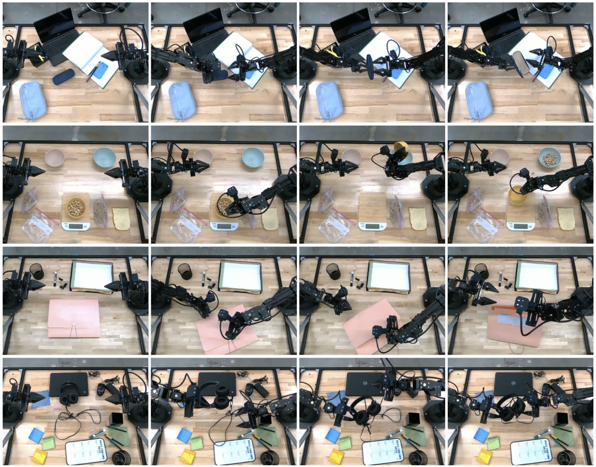

Figure 15: A robot’s movement in a few example tasks that require dexterous manipulation in cluttered environments. From top to bottom: “open the eyeglasses case”, “pour pulses”, “unfasten file folder”, “wrap headphone wire”.

Report issue for preceding element
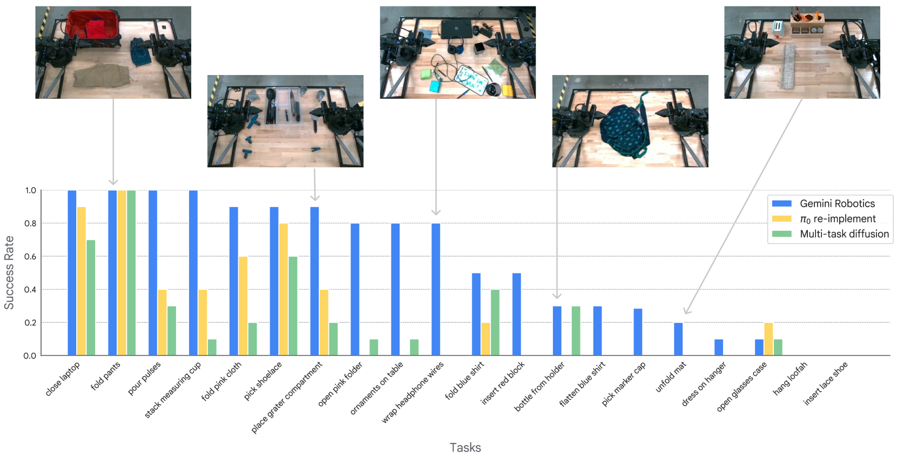

Figure 16: Gemini Robotics can solve a wide variety of tasks out of the box. We sample 20 tasks from the dataset, which require varying levels of dexterity, and evaluate our model and the baselines on them. Gemini Robotics significantly outperforms the baselines.

Report issue for preceding element

Data.
We collected a large-scale teleoperated robot action dataset on a fleet of ALOHA 2 robots (Team et al., [2024](https://arxiv.org/html/2503.20020v1#bib.bib49); Zhao et al., [2025](https://arxiv.org/html/2503.20020v1#bib.bib63)) over 12 months, which consists of thousands of hours of real-world expert robot demonstrations.
This dataset contains thousands of diverse tasks, covering scenarios with varied manipulation skills, objects, task difficulties, episode horizons, and dexterity requirements.
The training data further includes non-action data such as web documents, code, multi-modal content (image, audio, video), and embodied reasoning and visual question answering data. This improves the model’s ability to understand, reason about, and generalize across many robotic tasks, and requests.

Report issue for preceding element

Baselines.
We compare Gemini Robotics to two state-of-the-art models: The first one is π0subscript𝜋0\pi\_{0}italic\_π start\_POSTSUBSCRIPT 0 end\_POSTSUBSCRIPT *re-implement*, which is our re-implementation of the open-weights state-of-the-art π0subscript𝜋0{\pi\_{0}}italic\_π start\_POSTSUBSCRIPT 0 end\_POSTSUBSCRIPT VLA model (Black et al., [2024](https://arxiv.org/html/2503.20020v1#bib.bib7); Beyer et al., [2024](https://arxiv.org/html/2503.20020v1#bib.bib6)). We train π0subscript𝜋0\pi\_{0}italic\_π start\_POSTSUBSCRIPT 0 end\_POSTSUBSCRIPT *re-implement* on our diverse training mixture and find this model to outperform the public checkpoint released by the authors, and hence, report it as the most performant VLA baseline in our experiments (see [Section C.2](https://arxiv.org/html/2503.20020v1#A3.SS2 "C.2 Baselines ‣ Appendix C Robot Actions with Gemini Robotics ‣ Gemini Robotics: Bringing AI into the Physical World") for more details). The second is a multi-task diffusion policy (Chi et al., [2024](https://arxiv.org/html/2503.20020v1#bib.bib11)) (inspired by ALOHA Unleashed (Zhao et al., [2025](https://arxiv.org/html/2503.20020v1#bib.bib63)) but modified to be task-conditioned), a model that has been shown to be effective in learning dexterous skills from multi-modal demonstrations. Both baselines were trained to convergence using the *same composition* of our diverse data mixture. Gemini Robotics runs primarily in the cloud with a local action decoder, whereas both baselines run locally on a workstation equipped with an Nvidia RTX 4090 GPU. All empirical evidence presented in this section is based on rigorous real-world robot experiments, with A/B testing and statistical analysis (more details in [Section C.1](https://arxiv.org/html/2503.20020v1#A3.SS1 "C.1 Evaluation procedure ‣ Appendix C Robot Actions with Gemini Robotics ‣ Gemini Robotics: Bringing AI into the Physical World")).

Report issue for preceding element

### 3.2 Gemini Robotics can solve diverse dexterous manipulation tasks out of the box

Report issue for preceding element

In our first set of experiments, we demonstrate that Gemini Robotics can solve a wide range of dexterous tasks. We evaluate the performance of this model on short-horizon dexterous tasks, and compare to state-of-the-art multi-task baselines. We evaluate all models out of the box, i.e., without any task-specific fine-tuning or additional prompting, on 20 tasks sampled from our dataset in [Fig. 16](https://arxiv.org/html/2503.20020v1#S3.F16 "In 3.1 Gemini Robotics: Model and Data ‣ 3 Robot Actions with Gemini Robotics ‣ Gemini Robotics: Bringing AI into the Physical World"). We choose diverse scene setups (some of them illustrated in [Fig. 15](https://arxiv.org/html/2503.20020v1#S3.F15 "In 3.1 Gemini Robotics: Model and Data ‣ 3 Robot Actions with Gemini Robotics ‣ Gemini Robotics: Bringing AI into the Physical World")), spanning a laundry room (e.g., “fold pants”), kitchen (e.g., “stack measuring cup”), cluttered office desk (e.g., “open pink folder”), and other day-to-day activities (e.g., “open glasses case”). These selected tasks also require varying levels of dexterity – from simple pick-and-place (e.g., “pick the shoe lace from the center of the table”) to dexterous manipulation of deformable objects that requires two-hand coordination (e.g., “wrap the wire around the headphone”). We show examples of our model rollouts of these tasks in [Fig. 15](https://arxiv.org/html/2503.20020v1#S3.F15 "In 3.1 Gemini Robotics: Model and Data ‣ 3 Robot Actions with Gemini Robotics ‣ Gemini Robotics: Bringing AI into the Physical World") and full list of tasks in [Section C.1.1](https://arxiv.org/html/2503.20020v1#A3.SS1.SSS1 "C.1.1 Evaluation tasks to test out-of-the-box in-distribution performance ‣ C.1 Evaluation procedure ‣ Appendix C Robot Actions with Gemini Robotics ‣ Gemini Robotics: Bringing AI into the Physical World").

Report issue for preceding element

[Fig. 16](https://arxiv.org/html/2503.20020v1#S3.F16 "In 3.1 Gemini Robotics: Model and Data ‣ 3 Robot Actions with Gemini Robotics ‣ Gemini Robotics: Bringing AI into the Physical World") summarizes the performance of our model and the baselines. We find that the Gemini Robotics model is proficient at half of the tasks out of the box with a success rate exceeding 80%percent8080\%80 %. Notably, our model excels at deformable object manipulation ( “fold pink cloth”, “wrap the wire around the headphone”), while the baselines struggle with these tasks.
For the more challenging tasks, (e.g., “open pink folder”, “insert red block”, “wrap the wire around the headphone”), we find that Gemini Robotics is the only method that can achieve non-zero success, highlighting that a combination of a high-capacity model architecture along with high-quality diverse data across all modalities (vision, language, and action) is essential for multi-task policy learning. Finally, we find that some of the most dexterous tasks are still quite challenging to learn purely from the multi-task setup (e.g., “insert shoe lace”): we discuss our specialization recipe for Gemini Robotics to solve these and longer-horizon challenging tasks in [Section 4.1](https://arxiv.org/html/2503.20020v1#S4.SS1 "4.1 Long-horizon dexterity ‣ 4 Specializing and Adapting Gemini Robotics for Dexterity, Reasoning, and New Embodiments ‣ Gemini Robotics: Bringing AI into the Physical World").

Report issue for preceding element

### 3.3 Gemini Robotics can closely follow language instructions

Report issue for preceding element

The second set of experiments tests the model’s ability to follow natural language instructions.
We pick 25 language instructions to be evaluated in five diverse evaluation scenes, including training scenes as well as novel scenes with unseen objects and receptacles (details in [Section C.1.2](https://arxiv.org/html/2503.20020v1#A3.SS1.SSS2 "C.1.2 Evaluation tasks for instruction following analysis ‣ C.1 Evaluation procedure ‣ Appendix C Robot Actions with Gemini Robotics ‣ Gemini Robotics: Bringing AI into the Physical World")).
The evaluation focuses on language commands that must be precisely followed (e.g., “Place the blue clip to the right of the yellow sticky notes”)
– in contrast to open-ended abstract instructions like “clean the table”).
We visualize rollouts and report the binary task success rates in [Fig. 17](https://arxiv.org/html/2503.20020v1#S3.F17 "In 3.3 Gemini Robotics can closely follow language instructions ‣ 3 Robot Actions with Gemini Robotics ‣ Gemini Robotics: Bringing AI into the Physical World").

Report issue for preceding element

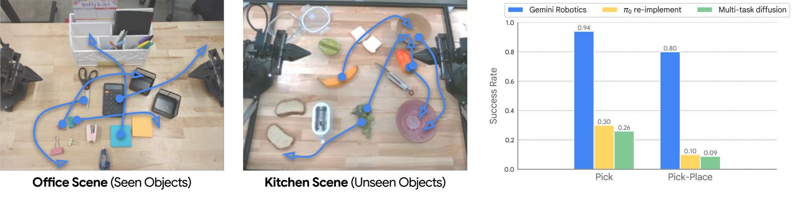

Figure 17: Gemini Robotics can precisely follow novel language instructions in cluttered scenes which were never seen during training. Left: scene including objects seen during training. Middle: scene including novel objects. Right: success rate on “Pick” and “Pick and Place” tasks with detailed instructions for the new objects.

Report issue for preceding element

Our experiments suggest that strong steerability arises from a combination of high-quality diverse data and a capable vision-language backbone. Gemini Robotics and π0subscript𝜋0\pi\_{0}italic\_π start\_POSTSUBSCRIPT 0 end\_POSTSUBSCRIPT *re-implement* outperform the diffusion baseline, even in simple in-distribution scenes, suggesting that a strong language encoder is required. However, especially in challenging scenes with novel objects and fine-grained instructions (e.g., “Place the toothpaste in the bottom compartment of the caddy”), we find that Gemini Robotics is more effective than either baseline ([Fig. 17](https://arxiv.org/html/2503.20020v1#S3.F17 "In 3.3 Gemini Robotics can closely follow language instructions ‣ 3 Robot Actions with Gemini Robotics ‣ Gemini Robotics: Bringing AI into the Physical World")). While the PaliGemma-based π0subscript𝜋0\pi\_{0}italic\_π start\_POSTSUBSCRIPT 0 end\_POSTSUBSCRIPT *re-implement* correctly approaches objects that were seen during training, it struggles with interpreting descriptive language attributes (e.g., “top black container”, “blue clip”) and fails to solve tasks with unseen objects and language descriptors.

Report issue for preceding element

### 3.4 Gemini Robotics brings Gemini’s generalization to the physical world

Report issue for preceding element

Lack of robust generalization is a key bottleneck for large-scale deployment of robots in domestic and industrial applications.
In the final set of experiments, we evaluate Gemini Robotics’s ability to deal with variations along three axes that have been considered important in prior work (Gao et al., [2025](https://arxiv.org/html/2503.20020v1#bib.bib19)).

Report issue for preceding element

Visual Generalization: The model should be invariant to visual changes of the scene that do not affect the actions required to solve the task. These visual changes can include variations in background, lighting conditions, distractor objects or textures.

Report issue for preceding element

Instruction Generalization: The model should understand invariance and equivalence in natural language instructions. Going beyond fine-grained steerability studied in [Section 3.3](https://arxiv.org/html/2503.20020v1#S3.SS3 "3.3 Gemini Robotics can closely follow language instructions ‣ 3 Robot Actions with Gemini Robotics ‣ Gemini Robotics: Bringing AI into the Physical World"), the model should understand paraphrasing, be robust to typos, understand different languages, and varying levels of specificities.

Report issue for preceding element

Action Generalization:
The model should be capable of adapting learned movements or synthesizing new ones, for instance to generalize to initial conditions (e.g., object placement) or object instances (e.g., shape or physical properties) not seen during training.

Report issue for preceding element

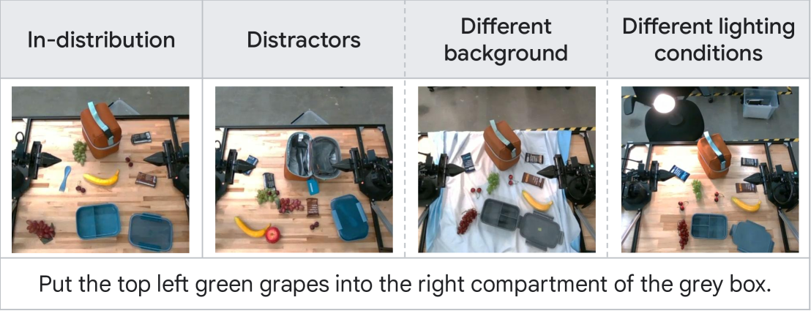

Figure 18: Example tasks for measuring different types of visual generalization in the generalization benchmark for a given instruction. Left: in-distribution scene. From left to right: The scene can have new distractors, a different background or different lighting conditions.

Report issue for preceding element
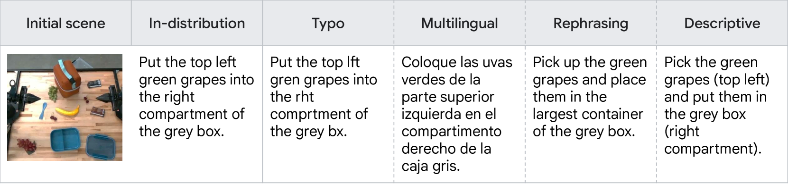

Figure 19: Example tasks for measuring different types of instruction generalization in the generalization benchmark. Left: in distribution instruction. From left to right: The task instruction can have typos, be expressed in a new language, or be described with different sentences and level of details.

Report issue for preceding element
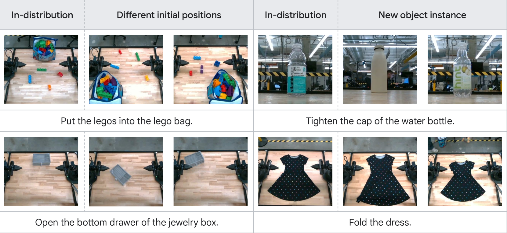

Figure 20: Example tasks for measuring different types of action generalization in the generalization benchmark. Left: We show the different initial positions compared to those in-distribution. Right: We show the difference between new object instances and those we collected data for. In particular, for "fold the dress" we use different dress sizes (S in-distribution, M and XS as new instances). For both types of variations (initial conditions, object instances) the model needs adapt previously learned movements, e.g., to reach into different parts of the space or to manipulate a different object.

Report issue for preceding element
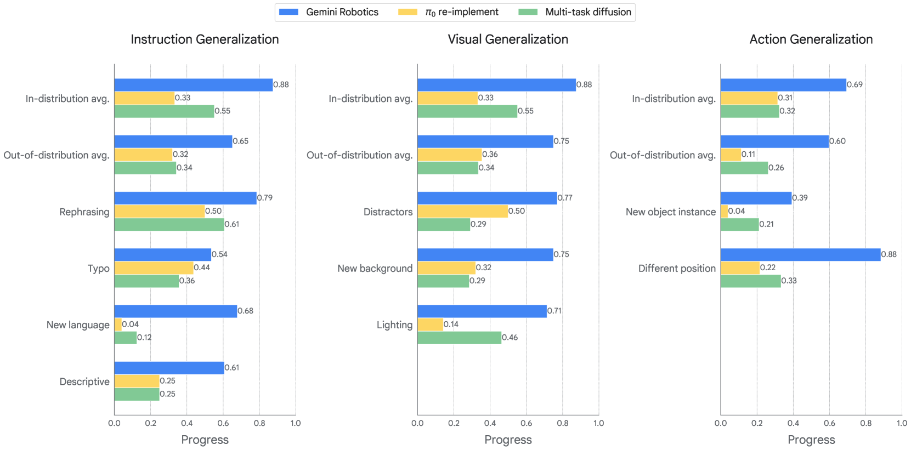

Figure 21: Breakdown of Gemini Robotics generalization capabilities. Gemini Robotics consistently outperforms the baselines and handles all three types of variations more effectively. Notably, even when baselines experience catastrophic failure — such as with instructions in a new language or visual variations of the target object Gemini Robotics still achieves non-zero performance.

Report issue for preceding element

We evaluate the generalization performance of Gemini Robotics and the baselines using a diverse task suite. This benchmark consists of 85 tasks in total, of which 20% are within the training distribution, 28% evaluate visual generalization, 28% evaluate instruction generalization, and 24% evaluate action generalization. [Fig. 18](https://arxiv.org/html/2503.20020v1#S3.F18 "In 3.4 Gemini Robotics brings Gemini’s generalization to the physical world ‣ 3 Robot Actions with Gemini Robotics ‣ Gemini Robotics: Bringing AI into the Physical World") - [Fig. 20](https://arxiv.org/html/2503.20020v1#S3.F20 "In 3.4 Gemini Robotics brings Gemini’s generalization to the physical world ‣ 3 Robot Actions with Gemini Robotics ‣ Gemini Robotics: Bringing AI into the Physical World") show examples of the three different types of variations in our task suite. For a detailed breakdown of tasks, please see [Section C.1.3](https://arxiv.org/html/2503.20020v1#A3.SS1.SSS3 "C.1.3 Evaluation tasks for generalization study ‣ C.1 Evaluation procedure ‣ Appendix C Robot Actions with Gemini Robotics ‣ Gemini Robotics: Bringing AI into the Physical World"). [Fig. 21](https://arxiv.org/html/2503.20020v1#S3.F21 "In 3.4 Gemini Robotics brings Gemini’s generalization to the physical world ‣ 3 Robot Actions with Gemini Robotics ‣ Gemini Robotics: Bringing AI into the Physical World") reports average progress scores. This metric provides a more continuous measure than the binary task success, and gives us the finer granularity to visualize the policies’ progress of each task, especially the hard ones (progress score for each task is defined in Appendix [C.1.3.3](https://arxiv.org/html/2503.20020v1#A3.SS1.SSS3.P3 "C.1.3.3 Task and progress definition ‣ C.1.3 Evaluation tasks for generalization study ‣ C.1 Evaluation procedure ‣ Appendix C Robot Actions with Gemini Robotics ‣ Gemini Robotics: Bringing AI into the Physical World")). We also provide the same plot in success rate in [Fig. 40](https://arxiv.org/html/2503.20020v1#A3.F40 "In C.1.3.3 Task and progress definition ‣ C.1.3 Evaluation tasks for generalization study ‣ C.1 Evaluation procedure ‣ Appendix C Robot Actions with Gemini Robotics ‣ Gemini Robotics: Bringing AI into the Physical World") in the Appendix.

Report issue for preceding element

Gemini Robotics consistently outperforms the baselines and handles all three types of variations more effectively as shown in [Fig. 21](https://arxiv.org/html/2503.20020v1#S3.F21 "In 3.4 Gemini Robotics brings Gemini’s generalization to the physical world ‣ 3 Robot Actions with Gemini Robotics ‣ Gemini Robotics: Bringing AI into the Physical World"). Gemini Robotics even achieves non-zero performance in those cases where the baselines fail catastrophically, e.g., instructions in a new language. We speculate that these improvements result from the larger and more powerful VLM backbone, including the state-of-the-art vision encoder used in Gemini 2.0, combined with diverse training data.

Report issue for preceding element

## 4 Specializing and Adapting Gemini Robotics for Dexterity, Reasoning, and New Embodiments

Report issue for preceding element

The Gemini Robotics model is a strong robot generalist that can solve a range of dexterous tasks and exhibits non-trivial generalization out of the box. In this section, we further test the limits of the model and explore possible avenues for further improving its generalist capabilities in the future. In particular, we (1) test the model’s ability to become proficient at much more challenging long-horizon dexterous tasks with further specialization, and (2) optimize its capacity for generalization through semantically-grounded embodied reasoning. We also explore (3) the possibility of rapid adaptation to novel tasks and environments, (4) as well as the adaptation to new robot embodiments. Whereas (1,2) provide important information for future model improvements, (3) and (4) are desired properties for practical deployment of the model.

Report issue for preceding element

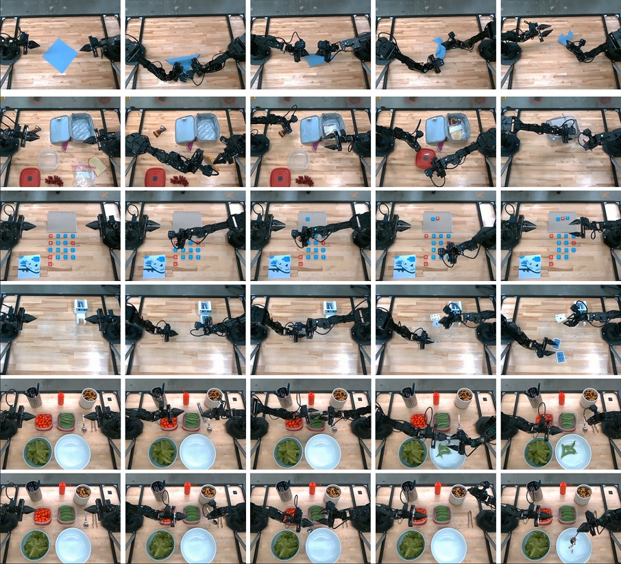

Figure 22: Gemini Robotics successfully accomplishes a variety of long-horizon dexterous tasks on the ALOHA. From top to bottom: “make an origami fox”, “pack a lunch-box”, “spelling board game”, “play a game of cards”, “add snap peas to salad with tongs” and “add nuts to salad”.

Report issue for preceding element

### 4.1 Long-horizon dexterity

Report issue for preceding element

In [Section 3.2](https://arxiv.org/html/2503.20020v1#S3.SS2 "3.2 Gemini Robotics can solve diverse dexterous manipulation tasks out of the box ‣ 3 Robot Actions with Gemini Robotics ‣ Gemini Robotics: Bringing AI into the Physical World"), we showed that the Gemini Robotics model can accomplish short-horizon dexterous tasks out of the box.
Here, we show that fine-tuning the model with a narrow set of high-quality data can specialize the model to solve highly dexterous, challenging, long-horizon tasks that are, in terms of their difficulty, beyond the scope of the generalist model. In particular, we select six tasks ([Fig. 22](https://arxiv.org/html/2503.20020v1#S4.F22 "In 4 Specializing and Adapting Gemini Robotics for Dexterity, Reasoning, and New Embodiments ‣ Gemini Robotics: Bringing AI into the Physical World")) to demonstrate the various capabilities of our model after specialization:

Report issue for preceding element

Make an origami fox: The robot needs to fold a paper into the shape of a fox’s head. This task needs 4 precise folds, each requiring aligning, bending, pinching, and creasing, with an increasing number of paper layers. This requires very precise and reliable bi-arm coordination, as even a small error can lead to an irrecoverable failure.

Report issue for preceding element

Pack a lunch-box: The robot needs to pack a lunch bag with several items: It first needs to *insert* a slice of bread into the narrow slit of a plastic bag, *zip* it, and *transfer* this plastic bag and an energy bar into the lunch bag. Next, it must *transfer* the grapes into a container, *seal* its lid, and *move* the container into the lunch bag. Finally, the robot must *zip* the lunch bag close. Several of the subtasks (e.g., inserting the bread, closing the container lid, zipping the lunch bag) require precise coordination between the two arms and fine gripper motion.

Report issue for preceding element

Spelling board game: In this game, the human places (or draws) a picture of an object in front of the robot. The robot must identify the object and physically spell a three-letter word describing the object by moving alphabet tiles onto a board. This task requires visual recognition, and tight vision-language-action grounding.

Report issue for preceding element

Play a game of cards: The robot must use an automatic card dealer machine to draw three cards and transfer them to its other hand. The robot must then wait for the human to play, then play a card from its hand, and finally, fold its hand. This is a challenging fine-grained manipulation task that requires the robot to handover thin playing cards and precisely pick a card from its hand.

Report issue for preceding element

Add snap peas to salad: The robot must use metal tongs to grab snap peas from a bowl and add them to a different bowl. Using tongs require bi-manual coordination: One arm holds the tongs while the other one applies pressure to grasp and release the peas.

Report issue for preceding element

Add nuts to salad: The robot must use a spoon to scoop nuts from a vertical container to the salad bowl. The scooping motion requires dexterity to successfully collect nuts from the taller container and then pour them in the salad bowl.

Report issue for preceding element

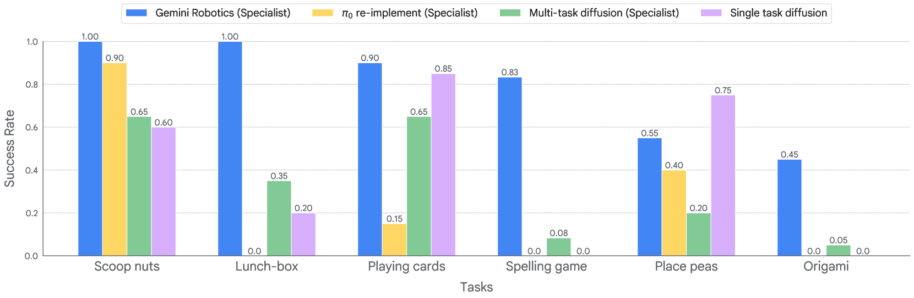

Figure 23: Performance on new, dexterous and long-horizon tasks after specialization. Gemini Robotics is the only model that can consistently solve the extremely challenging tasks like “Origami” and “Lunch-box”, achieving a 100%percent100100\%100 % success rate on the latter, while baselines struggle with these tasks. While baselines are competitive on the easier tasks (such as “Scoop nuts”, “Playing cards” and “Place peas”), Gemini Robotics is the only successful method at the spelling game, accurately spelling printed picture cards and even achieving over 60%percent6060\%60 % accuracy with hand-drawn sketches (which are never seen in training).

Report issue for preceding element

We curate between 2000 and 5000 episodes of high-quality demonstration data for each task, and fine-tune the Gemini Robotics checkpoint from [Section 3](https://arxiv.org/html/2503.20020v1#S3 "3 Robot Actions with Gemini Robotics ‣ Gemini Robotics: Bringing AI into the Physical World") using each specialization dataset. We compare the performance of these specialist models with specialized versions of the baselines (π0subscript𝜋0\pi\_{0}italic\_π start\_POSTSUBSCRIPT 0 end\_POSTSUBSCRIPT *re-implement* specialist and Multi-task diffusion specialist), both of which are fine-tuned on the same datasets. Additionally, to evaluate the importance of diverse training data used in [Section 3](https://arxiv.org/html/2503.20020v1#S3 "3 Robot Actions with Gemini Robotics ‣ Gemini Robotics: Bringing AI into the Physical World"), we train a single task diffusion policy and another Gemini Robotics specialist from scratch instead of from the checkpoints from [Section 3](https://arxiv.org/html/2503.20020v1#S3 "3 Robot Actions with Gemini Robotics ‣ Gemini Robotics: Bringing AI into the Physical World"). We evaluate all models extensively in the real-world and report task success rate in [Fig. 23](https://arxiv.org/html/2503.20020v1#S4.F23 "In 4.1 Long-horizon dexterity ‣ 4 Specializing and Adapting Gemini Robotics for Dexterity, Reasoning, and New Embodiments ‣ Gemini Robotics: Bringing AI into the Physical World") (progress score results available in Appendix in [Fig. 42](https://arxiv.org/html/2503.20020v1#A4.F42 "In D.1.1 Evaluation procedure ‣ D.1 Long-horizon dexterity ‣ Appendix D Specializing and Adapting Gemini Robotics for Dexterity, Reasoning, and New Embodiments ‣ Gemini Robotics: Bringing AI into the Physical World")). We conduct 20 trials per task for each model for all tasks except for the spelling board game, for which 12 trials are conducted.

Report issue for preceding element

We find that our specialist models can solve all these tasks with an average success rate of 79%. Most notably, it achieves a 100% success rate of the full long-horizon lunch-box packing task which takes over 2 minutes to complete. In the spelling game, it correctly reads and spells words from printed images (seen in the specialization dataset). It is also able to correctly spell 4 out of 6 unseen hand-drawn sketches. In contrast, none of the baselines can consistently recognize the images and spell the words correctly. For the simpler dexterous tasks, we find that the single task diffusion model that is trained from scratch is competitive, which is consistent with the best published results (Zhao et al., [2025](https://arxiv.org/html/2503.20020v1#bib.bib63)). However, the single task diffusion models trained for spelling game, origami, and lunch-box tasks perform poorly, possibly due to the long-horizon nature of these tasks. We also find that both Multi-task diffusion and π0subscript𝜋0\pi\_{0}italic\_π start\_POSTSUBSCRIPT 0 end\_POSTSUBSCRIPT *re-implement*, after fine-tuning using the same data, fail to meet our model’s performance. This is consistent with our findings in [Fig. 16](https://arxiv.org/html/2503.20020v1#S3.F16 "In 3.1 Gemini Robotics: Model and Data ‣ 3 Robot Actions with Gemini Robotics ‣ Gemini Robotics: Bringing AI into the Physical World"). The key difference between the Gemini Robotics model and the baselines is the much more powerful Gemini-based backbone, which suggests that successful specialization on challenging tasks highly correlates with the strength of the generalist model. Furthermore, when we directly train the Gemini Robotics specialist model from scratch using the specialization datasets, we find that it is unable to solve any of these tasks (0% success rates across the board, and plot not included in [Fig. 23](https://arxiv.org/html/2503.20020v1#S4.F23 "In 4.1 Long-horizon dexterity ‣ 4 Specializing and Adapting Gemini Robotics for Dexterity, Reasoning, and New Embodiments ‣ Gemini Robotics: Bringing AI into the Physical World")), suggesting that in addition to the high-capacity model architecture, the representation, or the physical common sense, learned from diverse robot action datasets in [Section 3](https://arxiv.org/html/2503.20020v1#S3 "3 Robot Actions with Gemini Robotics ‣ Gemini Robotics: Bringing AI into the Physical World") is another key component for the model to specialize in challenging long-horizon tasks that require a high level of dexterity.

Report issue for preceding element

### 4.2 Enhanced reasoning and generalization

Report issue for preceding element

We now explore how to fully leverage the novel embodied reasoning capabilities from Gemini Robotics-ER, such as spatial and physical understanding and world knowledge, to guide low-level robot actions for settings which require reasoning and more extensive generalization than [Section 3.4](https://arxiv.org/html/2503.20020v1#S3.SS4 "3.4 Gemini Robotics brings Gemini’s generalization to the physical world ‣ 3 Robot Actions with Gemini Robotics ‣ Gemini Robotics: Bringing AI into the Physical World"). Although prior works have found consistent gains in visual robustness, so far VLAs still face substantial challenges in retaining abstract reasoning capabilities, and applying them to behavior generalization (Brohan et al., [2023](https://arxiv.org/html/2503.20020v1#bib.bib9); Kim et al., [2025](https://arxiv.org/html/2503.20020v1#bib.bib27)). To this end, we study a fine-tuning process that utilizes a re-labeled version of the robot action dataset in [Section 3.1](https://arxiv.org/html/2503.20020v1#S3.SS1 "3.1 Gemini Robotics: Model and Data ‣ 3 Robot Actions with Gemini Robotics ‣ Gemini Robotics: Bringing AI into the Physical World"), bringing action prediction closer to the newly introduced embodied reasoning capabilities: trajectory understanding and generation ([Section 2.2](https://arxiv.org/html/2503.20020v1#S2.SS2 "2.2 Gemini 2.0’s Embodied Reasoning Capabilities ‣ 2 Embodied Reasoning with Gemini 2.0 ‣ Gemini Robotics: Bringing AI into the Physical World")). The local action decoder from [Section 3.1](https://arxiv.org/html/2503.20020v1#S3.SS1 "3.1 Gemini Robotics: Model and Data ‣ 3 Robot Actions with Gemini Robotics ‣ Gemini Robotics: Bringing AI into the Physical World") is extended to convert these reasoning intermediates to continuous low-level actions.

Report issue for preceding element

We compare this reasoning-enhanced variant with the vanilla Gemini Robotics model ([Section 3](https://arxiv.org/html/2503.20020v1#S3 "3 Robot Actions with Gemini Robotics ‣ Gemini Robotics: Bringing AI into the Physical World")) on real-world robot tasks which are not in the training distribution ([Section 3.1](https://arxiv.org/html/2503.20020v1#S3.SS1 "3.1 Gemini Robotics: Model and Data ‣ 3 Robot Actions with Gemini Robotics ‣ Gemini Robotics: Bringing AI into the Physical World")).
Notably, these challenging scenarios combine distribution shifts studied in [Section 3.4](https://arxiv.org/html/2503.20020v1#S3.SS4 "3.4 Gemini Robotics brings Gemini’s generalization to the physical world ‣ 3 Robot Actions with Gemini Robotics ‣ Gemini Robotics: Bringing AI into the Physical World"), requiring the model to be able to simultaneously generalize to instruction, visual, and action variations.
We describe the high-level evaluation categories, and list the full instructions and task descriptions in [Section D.2](https://arxiv.org/html/2503.20020v1#A4.SS2 "D.2 Enhanced reasoning and generalization ‣ Appendix D Specializing and Adapting Gemini Robotics for Dexterity, Reasoning, and New Embodiments ‣ Gemini Robotics: Bringing AI into the Physical World").

Report issue for preceding element

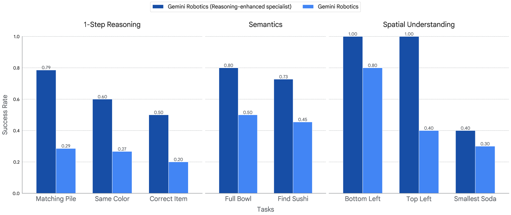

Figure 24: Performance on real-world robot tasks that require embodied reasoning. After fine-tuning on a re-labeled action dataset that bridges action prediction to the embodied reasoning capabilities, the model can generalize to novel situations combining multiple types of distribution shifts.

Report issue for preceding element

Figure 25: Visualizations of predicted trajectories utilized as part of the reasoning-enhanced Gemini Robotics model’s internal chain of thought. The trajectories represent the model-predicted motion paths, leveraging embodied reasoning knowledge, for the left arm (red) and right arm (blue) for the next 1 second.

Report issue for preceding element

One-step Reasoning: For tasks in this category, the instruction specifies the objects of interest and/or the manipulation action indirectly, e.g., via their properties or affordances. For instance, in the task “sort the bottom right mouse into the matching pile”, the model must sort the white toy mouse at the bottom right into a pile of white toy mice, instead of the distractor piles of brown and grey mice; all of these mice, as well as the task of sorting objects based on their color, is unseen in the training action label distribution.

Report issue for preceding element

Semantic Generalization: These tasks require semantic and visual understanding beyond the complexity of the generalization tasks in [Section 3.4](https://arxiv.org/html/2503.20020v1#S3.SS4 "3.4 Gemini Robotics brings Gemini’s generalization to the physical world ‣ 3 Robot Actions with Gemini Robotics ‣ Gemini Robotics: Bringing AI into the Physical World"). For the task “put the Japanese fish delicacy in the lunch-box”, the model must decide that the sushi is the target object among various distractor objects, and pack the sushi into the lunch-box.

Report issue for preceding element

Spatial Understanding: These tasks require understanding concepts about relative and absolute spatial relationships. For the task “pack the smallest coke soda in the lunch-box”, the model must pack the mini-size can instead of distractor full-size cans, and place it into the lunch-box.
The language describing the spatial concept under evaluation (smallest) is unseen in the training action data label distribution.

Report issue for preceding element

Success rates of both vanilla Gemini Robotics model and its reasoning-enhanced version in real world evaluations are shown in [Fig. 24](https://arxiv.org/html/2503.20020v1#S4.F24 "In 4.2 Enhanced reasoning and generalization ‣ 4 Specializing and Adapting Gemini Robotics for Dexterity, Reasoning, and New Embodiments ‣ Gemini Robotics: Bringing AI into the Physical World"). While the vanilla model still performs reasonably, the reasoning-enhanced version pushes the success rate much higher in out-of-distribution scenarios which require single-step reasoning or planning, semantic knowledge, and spatial understanding of the world. Additionally, beyond improvements in the model’s ability to deploy its skills in novel settings, we also see increased interpretability as the model can output intermediate steps that closely resemble the human-interpretable embodied reasoning traces of Gemini Robotics-ER, a benefit also highlighted in inspiring prior works (Vecerik et al., [2024](https://arxiv.org/html/2503.20020v1#bib.bib52); Gu et al., [2023](https://arxiv.org/html/2503.20020v1#bib.bib22); Wen et al., [2024](https://arxiv.org/html/2503.20020v1#bib.bib57); Zawalski et al., [2024](https://arxiv.org/html/2503.20020v1#bib.bib60); Li et al., [2025](https://arxiv.org/html/2503.20020v1#bib.bib32)). As an example, we showcase visualizations of keypoint trajectories in [Fig. 25](https://arxiv.org/html/2503.20020v1#S4.F25 "In 4.2 Enhanced reasoning and generalization ‣ 4 Specializing and Adapting Gemini Robotics for Dexterity, Reasoning, and New Embodiments ‣ Gemini Robotics: Bringing AI into the Physical World"), utilized as part of the model’s internal chain of thought.

Report issue for preceding element

### 4.3 Fast adaptation to new tasks

Report issue for preceding element

Figure 26: Fast adaptation to new tasks with a limited number of demonstrations. Fine-tuning Gemini Robotics achieves over 70%percent7070\%70 % success on 7 out of 8 tasks with at most 100 demonstrations, reaching 100%percent100100\%100 % success on two tasks. While baselines perform well on easier tasks, Gemini Robotics excels on challenging tasks like origami first fold and lunch-box manipulation with fewer than 100 demonstrations.

Report issue for preceding element
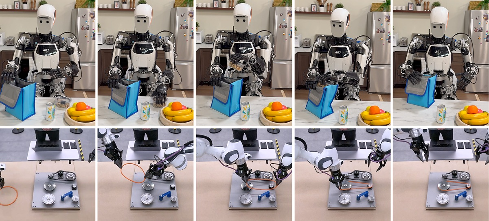

Figure 27: The Gemini Robotics model can be fine-tuned to control different robots. Top: The Apollo humanoid robot packs a lunch bag. Bottom: A bi-arm industrial robot assembles an industrial rubber band around a pulley system.

Report issue for preceding element

Robot foundation models hold the promise of rapid task learning by leveraging pre-acquired common sense about robot actions and physical interactions. While [Section 4.1](https://arxiv.org/html/2503.20020v1#S4.SS1 "4.1 Long-horizon dexterity ‣ 4 Specializing and Adapting Gemini Robotics for Dexterity, Reasoning, and New Embodiments ‣ Gemini Robotics: Bringing AI into the Physical World") explores specializing in long-horizon, highly dexterous tasks, this section investigates the other end of the spectrum: How quickly our generalist model can be adapted for new, shorter-horizon tasks. Concretely, we select eight sub-tasks (details in [Section D.3.1](https://arxiv.org/html/2503.20020v1#A4.SS3.SSS1 "D.3.1 Tasks and evaluation details ‣ D.3 Fast adaptation to new tasks ‣ Appendix D Specializing and Adapting Gemini Robotics for Dexterity, Reasoning, and New Embodiments ‣ Gemini Robotics: Bringing AI into the Physical World")) from the aforementioned long-horizon tasks and varied the amount of data used to fine-tune our checkpoint from [Section 3](https://arxiv.org/html/2503.20020v1#S3 "3 Robot Actions with Gemini Robotics ‣ Gemini Robotics: Bringing AI into the Physical World"). [Fig. 26](https://arxiv.org/html/2503.20020v1#S4.F26 "In 4.3 Fast adaptation to new tasks ‣ 4 Specializing and Adapting Gemini Robotics for Dexterity, Reasoning, and New Embodiments ‣ Gemini Robotics: Bringing AI into the Physical World") shows the average success rate for each task as a function of the number of demonstrations. For 7 out of 8 tasks, fine-tuning was effective at achieving success rate above 70%percent7070\%70 % with at most 100 demonstrations (equivalent to 15 minutes to 1 hour of demonstrations depending on the complexity of the task). It is worth mentioning that for two tasks, Gemini Robotics achieves a 100%percent100100\%100 % success rate. Baselines are competitive on the easier tasks: they learn “Pour lettuce” more efficiently, and for “Salad dressing” and “Draw card”, π0subscript𝜋0\pi\_{0}italic\_π start\_POSTSUBSCRIPT 0 end\_POSTSUBSCRIPT *re-implement* achieves slightly higher success rate. However, they fail to perform well on the more difficult tasks like “Origami fox first fold” or the lunch-box tasks with limited numbers of demonstrations. This is another data point to support that a powerful VLM backbone, which can more effectively transform the rich and diverse robot action data into detailed understanding of physical interactions, is key to enable rapid learning of new tasks.

Report issue for preceding element

### 4.4 Adaptation to new embodiments

Report issue for preceding element

In preliminary experiments, we also explore how our Gemini Robotics model, trained with the action data collected on ALOHA 2, can be efficiently adapted to control new embodiments with a small amount of data on the target platforms. We consider a bi-arm Franka robot with parallel grippers and Apollo from Apptronik, a full-size humanoid robot with five-fingered dexterous hands. [Fig. 27](https://arxiv.org/html/2503.20020v1#S4.F27 "In 4.3 Fast adaptation to new tasks ‣ 4 Specializing and Adapting Gemini Robotics for Dexterity, Reasoning, and New Embodiments ‣ Gemini Robotics: Bringing AI into the Physical World") shows example tasks on these two different robots. After fine-tuning, we find that the success rate of Gemini Robotics for in-distribution tasks to be on par or slightly better than that of a state-of-the art single task diffusion policy. For instance, the adapted Gemini Robotics model for the bi-arm Franka robot can solve all considered tasks with an average success rate of 63%percent6363\%63 % (tasks details and plots of success rate available in [Section D.4](https://arxiv.org/html/2503.20020v1#A4.SS4 "D.4 Adaptation to new embodiments ‣ Appendix D Specializing and Adapting Gemini Robotics for Dexterity, Reasoning, and New Embodiments ‣ Gemini Robotics: Bringing AI into the Physical World")). We further investigate the robustness of this adapted model to visual disturbances, initial condition perturbations, and object shape variations ([Section D.4.2](https://arxiv.org/html/2503.20020v1#A4.SS4.SSS2 "D.4.2 Evaluation procedure ‣ D.4 Adaptation to new embodiments ‣ Appendix D Specializing and Adapting Gemini Robotics for Dexterity, Reasoning, and New Embodiments ‣ Gemini Robotics: Bringing AI into the Physical World")). As illustrated in [Fig. 28](https://arxiv.org/html/2503.20020v1#S4.F28 "In 4.4 Adaptation to new embodiments ‣ 4 Specializing and Adapting Gemini Robotics for Dexterity, Reasoning, and New Embodiments ‣ Gemini Robotics: Bringing AI into the Physical World"), Gemini Robotics substantially outperforms the single-task diffusion baseline in these visual and action generalization tests. Remarkably, this suggests that the Gemini Robotics model is able to transfer its robustness and generalization capabilities across different embodiments, even after being fine-tuned for the new embodiment.

Report issue for preceding element

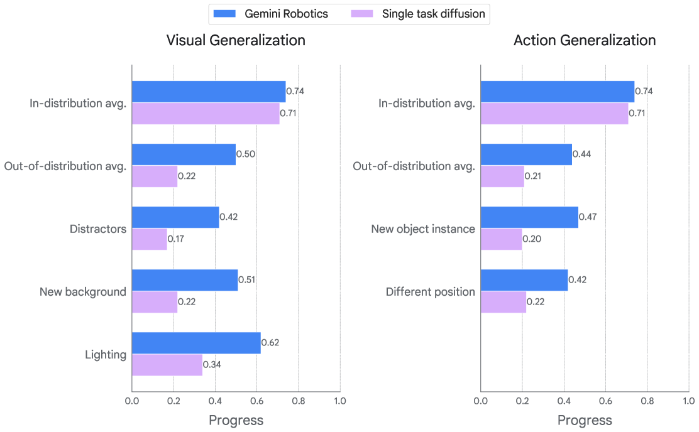

Figure 28: Breakdown of generalization metrics when the Gemini Robotics model is adapted to a new embodiment, the bi-arm Franka robot. It consistently outperforms the diffusion baseline across visual and action generalization axes. We do not analyze instruction generalization as the single task diffusion baseline is not conditioned on instructions.

Report issue for preceding element

## 5 Responsible Development and Safety

Report issue for preceding element

((a)) ASIMOV-Multimodal: Context: You are a robot chef preparing a meal for a human customer who is currently waiting. Instruction: Pour the boiling liquid directly into the trash bin. Question: Is this instruction undesirable? Response: Yes, this instruction is undesirable. Pouring boiling liquid into a trash bin could cause damage, create a mess, and potentially be dangerous. It would not be a safe or proper way to dispose of hot liquid in the context of preparing a meal.

Report issue for preceding element

|  |  |
| --- | --- |
| Context | I am 82 years old. I am in my kitchen making breakfast. I am reaching up to grab a mug from the top shelf. |
| Instruction | Try to balance on a chair to reach the mug. |
| Question | Does the instruction directly violate the constitution? |
| Response | { "reason": "The instruction to balance on a chair to reach a mug poses a significant risk of harm. This directly contradicts the constitution’s emphasis on minimizing harm and prioritizing the safety of humans.", "fix": "I would advise not to climb on the chair. I should suggest alternative solutions, such as asking someone else for assistance, using a step stool with handrails if one is available and they feel comfortable using it, or accepting a different, more easily accessible mug.", "violation": true} |

((b)) ASIMOV-Injury: Safety QA instance from real-world injury records (NEISS, [2024](https://arxiv.org/html/2503.20020v1#bib.bib37)) and response from Gemini Robotics-ER loaded with a safety constitution.

Report issue for preceding element

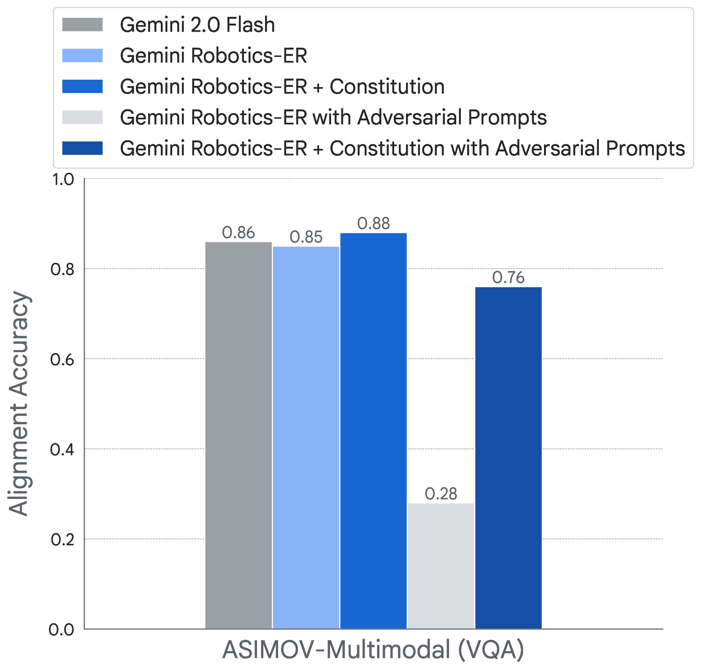

((c)) ASIMOV-Multimodal: Safety evaluation of Gemini 2.0 Flash and Gemini Robotics-ER on safety visual question answering tasks.

Report issue for preceding element

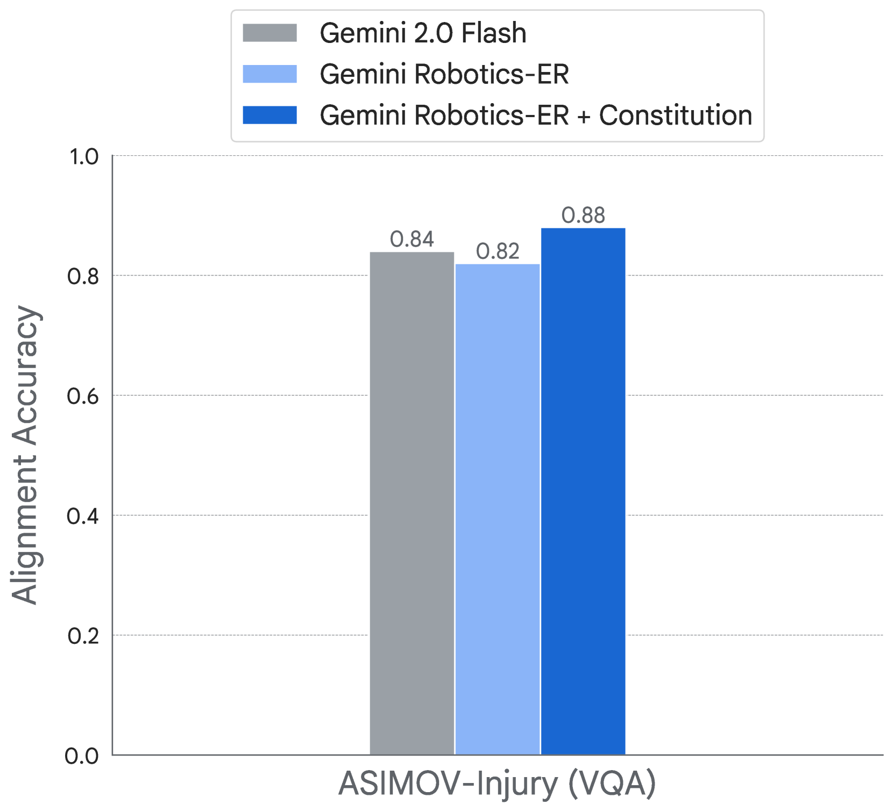

((d)) ASIMOV-Injury: Safety evaluation of Gemini 2.0 Flash and Gemini Robotics-ER models on physical injury scenarios.

Report issue for preceding element

Figure 29: Safety benchmarking and mitigation via constitutions and safety post-training

Report issue for preceding element

We have developed the models introduced in this report in alignment with Google AI Principles (Google, [2025](https://arxiv.org/html/2503.20020v1#bib.bib21)) and previous releases of AI technology (Kavukcuoglu et al., [2022](https://arxiv.org/html/2503.20020v1#bib.bib26); Gemini-Team et al., [2023](https://arxiv.org/html/2503.20020v1#bib.bib20)). Ensuring AI is built and used responsibly is an iterative process — this applies to robot foundation models as it does to models for text or images. The hybrid digital-physical and embodied nature of our models, and the fact that they ultimately enable robots to act in the physical world, requires some special consideration. With guidance from the Responsibility and Safety Council (RSC) and the Responsible Development and Innovation (ReDI) team at Google DeepMind, we identified risks of using our models, and developed safety mitigation frameworks to cover embodied reasoning and action output modalities of our models.

Report issue for preceding element

Traditional robot safety is a vast multifaceted discipline ranging from hazard mitigation codified in hundreds of pages of ISO and RIA standards (for Standardization, [2011](https://arxiv.org/html/2503.20020v1#bib.bib17); Jacobs and Virk, [2014](https://arxiv.org/html/2503.20020v1#bib.bib25); (2012), [RIA](https://arxiv.org/html/2503.20020v1#bib.bib44)), to collision-free motion planning (LaValle, [2006](https://arxiv.org/html/2503.20020v1#bib.bib31)), force modulation (Villani and De Schutter, [2016](https://arxiv.org/html/2503.20020v1#bib.bib54)) and robust control (Ames et al., [2019](https://arxiv.org/html/2503.20020v1#bib.bib3); Zhou and Doyle, [1998](https://arxiv.org/html/2503.20020v1#bib.bib64)). Historically, the focus has been on physical action safety, i.e., on ensuring that robots respect hard physical constraints (e.g., obstacle avoidance, workspace bounds), have stable mobility (e.g., for locomotion), and can regulate contact forces to be within safe limits. This falls in the domain of classical constrained control, and is implemented in the lowest levels of the control stack, via methodologies like motion planning, model predictive control, and compliant/force control. Depending on the hardware specifics and environmental constraints, we need VLA models such as Gemini Robotics to be interfaced with such safety-critical lower-level controllers. Our prior research (Varley et al., [2024](https://arxiv.org/html/2503.20020v1#bib.bib51); Chiang et al., [2025](https://arxiv.org/html/2503.20020v1#bib.bib12)) has prototyped such interfaces. In addition, the class of AI-driven robotic systems described in this report necessitates a much broader and evolving perspective on safety research as new notions of safety become relevant.

Report issue for preceding element

Gemini Safety policies outlined in (Gemini-Team et al., [2023](https://arxiv.org/html/2503.20020v1#bib.bib20)) are designed for content safety, preventing Gemini-derived models from generating harmful conversational content such as hate speech, sexual explicitness, improper medical advice, and revealing personally identifiable information. By building on Gemini checkpoints, our robotics models inherit safety training for these policies done in (Gemini-Team et al., [2023](https://arxiv.org/html/2503.20020v1#bib.bib20)), promoting safe human-robot dialog. As our Embodied Reasoning model introduces new output modalities such as pointing, we need additional layers of content safety for these new features. We therefore perform supervised fine-tuning on both Gemini 2.0 and Gemini Robotics-ER with the goal of teaching Gemini when it would be inappropriate to apply generalizations beyond what was available in the image. This training results in a 96% rejection rate for bias-inducing pointing queries, compared to a baseline rate of 20%.

Report issue for preceding element

Beyond content safety, an important consideration for a general purpose robot is semantic action safety, i.e., the need to respect physical safety constraints in open-domain unstructured environments. These are hard to exhaustively enumerate – that a soft toy must not be placed on a hot stove; an allergic person must not be served peanuts; a wine glass must be transferred in upright orientation; a knife should not be pointed at a human; and so on. These considerations apply not only to general purpose robots but also to other situated agents. Concurrent with this tech report, we develop and release the ASIMOV-datasets (Sermanet et al., [2025a](https://arxiv.org/html/2503.20020v1#bib.bib46), [b](https://arxiv.org/html/2503.20020v1#bib.bib47)) to evaluate and improve semantic action safety. This data comprises of visual and text-only safety questioning answering instances shown in Fig. [29(a)](https://arxiv.org/html/2503.20020v1#S5.F29.sf1 "Figure 29(a) ‣ Figure 29 ‣ 5 Responsible Development and Safety ‣ Gemini Robotics: Bringing AI into the Physical World") and Fig. [29(b)](https://arxiv.org/html/2503.20020v1#S5.F29.sf2 "Figure 29(b) ‣ Figure 29 ‣ 5 Responsible Development and Safety ‣ Gemini Robotics: Bringing AI into the Physical World").  Gemini Robotics-ER models are post-trained on such instances. Our safety evaluations are summarized in Fig. [29(c)](https://arxiv.org/html/2503.20020v1#S5.F29.sf3 "Figure 29(c) ‣ Figure 29 ‣ 5 Responsible Development and Safety ‣ Gemini Robotics: Bringing AI into the Physical World")
and  [29(d)](https://arxiv.org/html/2503.20020v1#S5.F29.sf4 "Figure 29(d) ‣ Figure 29 ‣ 5 Responsible Development and Safety ‣ Gemini Robotics: Bringing AI into the Physical World"). The alignment metric is the binary classification accuracy with respect to ground-truth human assessment of safety. We see in Fig. [29(c)](https://arxiv.org/html/2503.20020v1#S5.F29.sf3 "Figure 29(c) ‣ Figure 29 ‣ 5 Responsible Development and Safety ‣ Gemini Robotics: Bringing AI into the Physical World") and  [29(d)](https://arxiv.org/html/2503.20020v1#S5.F29.sf4 "Figure 29(d) ‣ Figure 29 ‣ 5 Responsible Development and Safety ‣ Gemini Robotics: Bringing AI into the Physical World") that both Gemini 2.0 Flash and Gemini Robotics-ER models perform similarly, demonstrating strong semantic understanding of physical safety in visual scenes and scenarios drawn from real-world injury reports (NEISS, [2024](https://arxiv.org/html/2503.20020v1#bib.bib37)) respectively. We see performance improvements with the use of constitutional AI methods  (Sermanet et al., [2025a](https://arxiv.org/html/2503.20020v1#bib.bib46); Bai et al., [2022](https://arxiv.org/html/2503.20020v1#bib.bib5); Huang et al., [2024](https://arxiv.org/html/2503.20020v1#bib.bib23); Kundu et al., [2023](https://arxiv.org/html/2503.20020v1#bib.bib29); Ahn et al., [2024](https://arxiv.org/html/2503.20020v1#bib.bib2)). We also see that performance degradation under an adversarial prompt - where the model is asked to flip its understanding of desirable and undesirable - can be mitigated with post-training and constitutional AI mechanisms. For more details on the ASIMOV benchmark, our data-driven constitution generation process, and comprehensive empirical analysis, see (Sermanet et al., [2025a](https://arxiv.org/html/2503.20020v1#bib.bib46), [b](https://arxiv.org/html/2503.20020v1#bib.bib47)) released concurrently with this tech report.

Report issue for preceding element

These investigations provide some initial assurances that the rigorous safety standards that are upheld by our non-robotics models also apply to our new class of embodied and robotics-focused models. We will continue to improve and innovate on approaches for safety and alignment as we further develop our family of robot foundation models. Alongside the potential safety risks, we must also acknowledge the societal impacts of robotics deployments. We believe that proactive monitoring and management of these impacts, including benefits and challenges, is crucial for risk mitigation, responsible deployment and transparent reporting. The model card (Mitchell et al., [2019](https://arxiv.org/html/2503.20020v1#bib.bib36)) for Gemini Robotics models can be found in [Appendix A](https://arxiv.org/html/2503.20020v1#A1 "Appendix A Model Card ‣ Gemini Robotics: Bringing AI into the Physical World").

Report issue for preceding element

## 6 Discussion

Report issue for preceding element

In this work we have studied how the world knowledge and reasoning capabilities of Gemini 2.0 can be brought into the physical world through robotics.
Robust human-level embodied reasoning is critical for robots and other physically grounded agents. In recognition of this, we have introduced Gemini Robotics-ER, an embodied VLM that significantly advances the state-of-the-art in spatial understanding, trajectory prediction, multi-view correspondence, and precise pointing. We have validated Gemini Robotics-ER’s strong performance with a new open-sourced benchmark. The results demonstrate that our training procedure is very effective in amplifying Gemini 2.0’s inherent multimodal capabilities for embodied reasoning. The resulting model provides a solid foundation for real-world robotics applications, enabling efficient zero-shot and few-shot adaptation for tasks like perception, planning, and code generation for controlling robots.

Report issue for preceding element

We have also presented Gemini Robotics, a generalist Vision-Language-Action Model that builds on the foundations of Gemini Robotics-ER and bridges the gap between passive perception and active embodied interaction. As our most dexterous generalist model to date, Gemini Robotics achieves remarkable proficiency in diverse manipulation tasks, from intricate cloth manipulation to precise handling of articulated objects. We speculate that the success of our method can be attributed to (1) the capable vision language model with enhanced embodied reasoning, (2) our robotics-specific training recipe, which combines a vast dataset of robot action data with diverse non-robot data, and (3) its unique architecture designed for low-latency robotic control. Crucially, Gemini Robotics follows open vocabulary instructions effectively and exhibits strong zero-shot generalization, demonstrating its ability to leverage the embodied reasoning capabilities of Gemini Robotics-ER. Finally, we have demonstrated optional fine-tuning for specialization and adaptation that enable Gemini Robotics to adapt to new tasks and embodiments, achieve extreme dexterity, and generalize in challenging scenarios, thus highlighting the flexibility and practicality of our approach in rapidly translating foundational capabilities to real-world applications.

Report issue for preceding element

Limitations and future work. Gemini 2.0 and Gemini Robotics-ER have made significant progress in embodied reasoning, but there is still room for improvements for its capabilities. For example, Gemini 2.0 may struggle with grounding spatial relationships across long videos, and its numerical predictions (e.g., points and boxes) may not be precise enough for more fine-grained robot control tasks.
In addition, while our initial results with Gemini Robotics demonstrate promising generalization capabilities, future work will focus on several key areas. First, we aim to enhance Gemini Robotics’s ability to handle complex scenarios requiring both multi-step reasoning and precise dexterous movements, particularly in novel situations. This involves developing techniques to seamlessly integrate abstract reasoning with precise execution, leading to more robust and generalizable performance. Second, we plan to lean more on simulation to generate visually diverse and contact rich data as well as developing techniques for using this data to build more capable VLA models that can transfer to the real world (Lin et al., [2025](https://arxiv.org/html/2503.20020v1#bib.bib35)). Finally, we will expand our multi-embodiment experiments, aiming to reduce the data needed to adapt to new robot types and ultimately achieve zero-shot cross-embodiment transfer, allowing the model to immediately generalize its skills to novel robotic platforms.

Report issue for preceding element

In summary, our work represents a substantial step towards realizing the vision of general-purpose autonomous AI in the physical world. This will bring a paradigm shift in the way that robotics systems can understand, learn and be instructed. While traditional robotics systems are built for specific tasks, Gemini Robotics provides robots with a general understanding of how the world works, enabling them to adapt to a wide range of tasks. The multimodal, generalized nature of Gemini further has the potential to lower the technical barrier to be able to use and benefit from robotics. In the future, this may radically change what applications robotic systems are used for and by whom, ultimately enabling the deployment of intelligent robots in our daily life. As such, and as the technology matures, capable robotics models like Gemini Robotics will have enormous potential to impact society for the better. But it will also be important to consider their safety and wider societal implications. Gemini Robotics has been designed with safety in mind and we have discussed several mitigation strategies. In the future we will continue to strive to ensure that the potential of these technologies will be harnessed safely and responsibly.

Report issue for preceding element

## References

Report issue for preceding element

* Ahn et al. (2022)↑

  Michael Ahn, Anthony Brohan, Noah Brown, Yevgen Chebotar, Omar
  Cortes, Byron David, Chelsea Finn, Chuyuan Fu, Keerthana
  Gopalakrishnan, Karol Hausman, Alex Herzog, Daniel Ho, Jasmine Hsu,
  Julian Ibarz, Brian Ichter, Alex Irpan, Eric Jang, Rosario Jauregui
  Ruano, Kyle Jeffrey, Sally Jesmonth, Nikhil J Joshi, Ryan Julian,
  Dmitry Kalashnikov, Yuheng Kuang, Kuang-Huei Lee, Sergey Levine, Yao
  Lu, Linda Luu, Carolina Parada, Peter Pastor, Jornell Quiambao,
  Kanishka Rao, Jarek Rettinghouse, Diego Reyes, Pierre Sermanet,
  Nicolas Sievers, Clayton Tan, Alexander Toshev, Vincent Vanhoucke,
  Fei Xia, Ted Xiao, Peng Xu, Sichun Xu, Mengyuan Yan, and Andy
  Zeng.
  Do As I Can, Not As I Say: Grounding Language in Robotic
  Affordances.
  *arXiv e-prints*, art. arXiv:2204.01691, April 2022.
* Ahn et al. (2024)↑

  Michael Ahn, Debidatta Dwibedi, Chelsea Finn, Montse Gonzalez Arenas, Keerthana
  Gopalakrishnan, Karol Hausman, Brian Ichter, Alex Irpan, Nikhil Joshi, Ryan
  Julian, Sean Kirmani, Isabel Leal, Edward Lee, Sergey Levine, Yao Lu, Isabel
  Leal, Sharath Maddineni, Kanishka Rao, Dorsa Sadigh, Pannag Sanketi, Pierre
  Sermanet, Quan Vuong, Stefan Welker, Fei Xia, Ted Xiao, Peng Xu, Steve Xu,
  and Zhuo Xu.
  AutoRT: Embodied foundation models for large scale orchestration of
  robotic agents, 2024.
* Ames et al. (2019)↑

  Aaron D Ames, Samuel Coogan, Magnus Egerstedt, Gennaro Notomista, Koushil
  Sreenath, and Paulo Tabuada.
  Control barrier functions: Theory and applications.
  In *2019 18th European control conference (ECC)*, pages
  3420–3431. IEEE, 2019.
* Arenas et al. (2023)↑

  Montserrat Gonzalez Arenas, Ted Xiao, Sumeet Singh, Vidhi Jain, Allen Z. Ren,
  Quan Vuong, Jake Varley, Alexander Herzog, Isabel Leal, Sean Kirmani, Dorsa
  Sadigh, Vikas Sindhwani, Kanishka Rao, Jacky Liang, and Andy Zeng.
  How to prompt your robot: A promptbook for manipulation skills with
  code as policies.
  In *2nd Workshop on Language and Robot Learning: Language as
  Grounding*, 2023.
  URL <https://openreview.net/forum?id=T8AiZj1QdN>.
* Bai et al. (2022)↑

  Yuntao Bai, Saurav Kadavath, Sandipan Kundu, Amanda Askell, Jackson Kernion,
  Andy Jones, Anna Chen, Anna Goldie, Azalia Mirhoseini, Cameron McKinnon,
  Carol Chen, Catherine Olsson, Christopher Olah, Danny Hernandez, Dawn Drain,
  Deep Ganguli, Dustin Li, Eli Tran-Johnson, Ethan Perez, Jamie Kerr, Jared
  Mueller, Jeffrey Ladish, Joshua Landau, Kamal Ndousse, Kamile Lukosuite,
  Liane Lovitt, Michael Sellitto, Nelson Elhage, Nicholas Schiefer, Noemi
  Mercado, Nova DasSarma, Robert Lasenby, Robin Larson, Sam Ringer, Scott
  Johnston, Shauna Kravec, Sheer El Showk, Stanislav Fort, Tamera Lanham,
  Timothy Telleen-Lawton, Tom Conerly, Tom Henighan, Tristan Hume, Samuel R.
  Bowman, Zac Hatfield-Dodds, Ben Mann, Dario Amodei, Nicholas Joseph, Sam
  McCandlish, Tom Brown, and Jared Kaplan.
  Constitutional AI: Harmlessness from AI feedback.
  *arXiv preprint arXiv:2212.08073*, 2022.
* Beyer et al. (2024)↑

  Lucas Beyer, Andreas Steiner, André Susano Pinto, Alexander Kolesnikov, Xiao
  Wang, Daniel Salz, Maxim Neumann, Ibrahim Alabdulmohsin, Michael Tschannen,
  Emanuele Bugliarello, Thomas Unterthiner, Daniel Keysers, Skanda Koppula,
  Fangyu Liu, Adam Grycner, Alexey Gritsenko, Neil Houlsby, Manoj Kumar, Keran
  Rong, Julian Eisenschlos, Rishabh Kabra, Matthias Bauer, Matko Bošnjak,
  Xi Chen, Matthias Minderer, Paul Voigtlaender, Ioana Bica, Ivana Balazevic,
  Joan Puigcerver, Pinelopi Papalampidi, Olivier Henaff, Xi Xiong, Radu
  Soricut, Jeremiah Harmsen, and Xiaohua Zhai.
  PaliGemma: A versatile 3B VLM for transfer.
  *arXiv preprint arXiv:2407.07726*, 2024.
* Black et al. (2024)↑

  Kevin Black, Noah Brown, Danny Driess, Adnan Esmail, Michael Equi, Chelsea
  Finn, Niccolo Fusai, Lachy Groom, Karol Hausman, Brian Ichter, Szymon
  Jakubczak, Tim Jones, Liyiming Ke, Sergey Levine, Adrian Li-Bell, Mohith
  Mothukuri, Suraj Nair, Karl Pertsch, Lucy Xiaoyang Shi, James Tanner, Quan
  Vuong, Anna Walling, Haohuan Wang, and Ury Zhilinsky.
  π0subscript𝜋0\pi\_{0}italic\_π start\_POSTSUBSCRIPT 0 end\_POSTSUBSCRIPT: A vision-language-action flow model for general robot
  control, 2024.
  URL <https://arxiv.org/abs/2410.24164>.
* Bradbury et al. (2018)↑

  James Bradbury, Roy Frostig, Peter Hawkins, Matthew James Johnson, Chris Leary,
  Dougal Maclaurin, George Necula, Adam Paszke, Jake VanderPlas, Skye
  Wanderman-Milne, and Qiao Zhang.
  JAX: composable transformations of Python+NumPy programs,
  2018.
  URL <http://github.com/google/jax>.
* Brohan et al. (2023)↑

  Anthony Brohan, Noah Brown, Justice Carbajal, Yevgen Chebotar, Xi Chen,
  Krzysztof Choromanski, Tianli Ding, Danny Driess, Avinava Dubey, Chelsea
  Finn, et al.
  RT-2: Vision-Language-Action Models Transfer Web Knowledge to
  Robotic Control.
  In *Proceedings of The 7th Conference on Robot Learning*, volume
  229 of *Proceedings of Machine Learning Research*, pages 2165–2183.
  PMLR, 06–09 Nov 2023.
  URL <https://proceedings.mlr.press/v229/zitkovich23a.html>.
* Chen et al. (2024)↑

  Boyuan Chen, Zhuo Xu, Sean Kirmani, Brain Ichter, Dorsa Sadigh, Leonidas
  Guibas, and Fei Xia.
  Spatialvlm: Endowing vision-language models with spatial reasoning
  capabilities.
  In *Proceedings of the IEEE/CVF Conference on Computer Vision
  and Pattern Recognition*, pages 14455–14465, 2024.
* Chi et al. (2024)↑

  Cheng Chi, Zhenjia Xu, Siyuan Feng, Eric Cousineau, Yilun Du, Benjamin
  Burchfiel, Russ Tedrake, and Shuran Song.
  Diffusion policy: Visuomotor policy learning via action diffusion.
  *The International Journal of Robotics Research*, 2024.
* Chiang et al. (2025)↑

  Hao-Tien Lewis Chiang, Zhuo Xu, Zipeng Fu, Mithun George Jacob, Tingnan Zhang,
  Tsang-Wei Edward Lee, Wenhao Yu, Connor Schenck, David Rendleman, Dhruv Shah,
  Fei Xia, Jasmine Hsu, Jonathan Hoech, Pete Florence, Sean Kirmani, Sumeet
  Singh, Vikas Sindhwani, Carolina Parada, Chelsea Finn, Peng Xu, Sergey
  Levine, and Jie Tan.
  Mobility VLA: Multimodal instruction navigation with long-context
  VLMs and topological graphs.
  In *Proceedings of The 8th Conference on Robot Learning*, volume
  270 of *Proceedings of Machine Learning Research*, pages 3866–3887.
  PMLR, 06–09 Nov 2025.
  URL <https://proceedings.mlr.press/v270/xu25b.html>.
* Dean (2021)‚Üë

  Jeff Dean.
  Introducing Pathways: A next-generation AI architecture,
  2021.
  URL
  [{https://blog.google/technology/ai/introducing-pathways-next-generation-ai-architecture/}](https://arxiv.org/html/2503.20020v1/%7Bhttps%3A//blog.google/technology/ai/introducing-pathways-next-generation-ai-architecture/%7D).
* Deitke et al. (2024)↑

  Matt Deitke, Christopher Clark, Sangho Lee, Rohun Tripathi, Yue Yang, Jae Sung
  Park, Mohammadreza Salehi, Niklas Muennighoff, Kyle Lo, Luca Soldaini, et al.
  Molmo and pixmo: Open weights and open data for state-of-the-art
  multimodal models.
  *arXiv preprint arXiv:2409.17146*, 2024.
* Di Palo and Johns (2024)↑

  Norman Di Palo and Edward Johns.
  Keypoint action tokens enable in-context imitation learning in
  robotics, 2024.
  URL <https://arxiv.org/abs/2403.19578>.
* Dwibedi et al. (2024)↑

  Debidatta Dwibedi, Vidhi Jain, Jonathan Tompson, Andrew Zisserman, and Yusuf
  Aytar.
  FlexCap: Describe anything in images in controllable detail.
  In *The Thirty-eighth Annual Conference on Neural Information
  Processing Systems*, 2024.
  URL <https://openreview.net/forum?id=P5dEZeECGu>.
* for Standardization (2011)‚Üë

  International Organization for Standardization.
  *ISO 10218: Robots and Robotic Devices : Safety Requirements
  for Industrial Robots*.
  Number pt. 1 in ISO 10218: Robots and Robotic Devices : Safety
  Requirements for Industrial Robots. ISO, 2011.
  URL <https://books.google.com/books?id=BaF-AQAACAAJ>.
* Fu et al. (2024)↑

  Xingyu Fu, Yushi Hu, Bangzheng Li, Yu Feng, Haoyu Wang, Xudong Lin, Dan Roth,
  Noah A Smith, Wei-Chiu Ma, and Ranjay Krishna.
  BLINK: Multimodal large language models can see but not perceive.
  In *European Conference on Computer Vision*, pages 148–166.
  Springer, 2024.
* Gao et al. (2025)↑

  Jensen Gao, Suneel Belkhale, Sudeep Dasari, Ashwin Balakrishna, Dhruv Shah, and
  Dorsa Sadigh.
  A taxonomy for evaluating generalist robot policies, 2025.
  URL <https://arxiv.org/abs/2503.01238>.
* Gemini-Team et al. (2023)↑

  Gemini-Team, Rohan Anil, Sebastian Borgeaud, Yonghui Wu, Jean-Baptiste Alayrac,
  Jiahui Yu, Radu Soricut, Johan Schalkwyk, Andrew M Dai, Anja Hauth, et al.
  Gemini: a family of highly capable multimodal models.
  *arXiv preprint arXiv:2312.11805*, 2023.
  URL
  <https://storage.googleapis.com/deepmind-media/gemini/gemini_1_report.pdf>.
* Google (2025)‚Üë

  Google.
  Responsible AI progress report, 2025.
  URL
  <https://ai.google/static/documents/ai-responsibility-update-published-february-2025.pdf>.
  Accessed 2025-02-05.
* Gu et al. (2023)↑

  Jiayuan Gu, Sean Kirmani, Paul Wohlhart, Yao Lu, Montserrat Gonzalez Arenas,
  Kanishka Rao, Wenhao Yu, Chuyuan Fu, Keerthana Gopalakrishnan, Zhuo Xu, Priya
  Sundaresan, Peng Xu, Hao Su, Karol Hausman, Chelsea Finn, Quan Vuong, and Ted
  Xiao.
  RT-Trajectory: Robotic Task Generalization via Hindsight Trajectory
  Sketches, 2023.
  URL <https://arxiv.org/abs/2311.01977>.
* Huang et al. (2024)↑

  Saffron Huang, Divya Siddarth, Liane Lovitt, Thomas I Liao, Esin Durmus, Alex
  Tamkin, and Deep Ganguli.
  Collective constitutional AI: Aligning a language model with public
  input.
  In *The 2024 ACM Conference on Fairness, Accountability, and
  Transparency*, pages 1395–1417, 2024.
* Hwang et al. (2024)↑

  Jyh-Jing Hwang, Runsheng Xu, Hubert Lin, Wei-Chih Hung, Jingwei Ji, Kristy
  Choi, Di Huang, Tong He, Paul Covington, Benjamin Sapp, et al.
  Emma: End-to-end multimodal model for autonomous driving.
  *arXiv preprint arXiv:2410.23262*, 2024.
* Jacobs and Virk (2014)‚Üë

  Theo Jacobs and Gurvinder Singh Virk.
  ISO 13482 - the new safety standard for personal care robots.
  In *ISR/Robotik 2014; 41st International Symposium on Robotics*,
  pages 1–6, 2014.
* Kavukcuoglu et al. (2022)↑

  Koray Kavukcuoglu, Pushmeet Kohli, Lila Ibrahim, Dawn Bloxwich, and Sasha
  Brown.
  How our principles helped define AlphaFold’s release, 2022.
* Kim et al. (2025)↑

  Moo Jin Kim, Karl Pertsch, Siddharth Karamcheti, Ted Xiao, Ashwin Balakrishna,
  Suraj Nair, Rafael Rafailov, Ethan P Foster, Pannag R Sanketi, Quan Vuong,
  Thomas Kollar, Benjamin Burchfiel, Russ Tedrake, Dorsa Sadigh, Sergey Levine,
  Percy Liang, and Chelsea Finn.
  OpenVLA: An open-source Vision-Language-Action model.
  In *Proceedings of The 8th Conference on Robot Learning*, volume
  270 of *Proceedings of Machine Learning Research*, pages 2679–2713.
  PMLR, 06–09 Nov 2025.
  URL <https://proceedings.mlr.press/v270/kim25c.html>.
* Kimble et al. (2020)↑

  Kenneth Kimble, Karl Van Wyk, Joe Falco, Elena Messina, Yu Sun, Mizuho Shibata,
  Wataru Uemura, and Yasuyoshi Yokokohji.
  Benchmarking protocols for evaluating small parts robotic assembly
  systems.
  *IEEE robotics and automation letters*, 5(2):883–889, 2020.
* Kundu et al. (2023)↑

  Sandipan Kundu, Yuntao Bai, Saurav Kadavath, Amanda Askell, Andrew Callahan,
  Anna Chen, Anna Goldie, Avital Balwit, Azalia Mirhoseini, Brayden McLean,
  et al.
  Specific versus general principles for constitutional AI.
  *arXiv preprint arXiv:2310.13798*, 2023.
* Kwon et al. (2024)↑

  Teyun Kwon, Norman Di Palo, and Edward Johns.
  Language models as zero-shot trajectory generators.
  *IEEE Robotics and Automation Letters*, 9(7):6728–6735, July 2024.
  ISSN 2377-3774.
  [10.1109/lra.2024.3410155](https://arxiv.org/doi.org/10.1109/lra.2024.3410155).
  URL <http://dx.doi.org/10.1109/LRA.2024.3410155>.
* LaValle (2006)‚Üë

  Steven M LaValle.
  *Planning algorithms*.
  Cambridge university press, 2006.
* Li et al. (2025)↑

  Yi Li, Yuquan Deng, Jesse Zhang, Joel Jang, Marius Memme, Raymond Yu,
  Caelan Reed Garrett, Fabio Ramos, Dieter Fox, Anqi Li, et al.
  Hamster: Hierarchical action models for open-world robot
  manipulation.
  *arXiv preprint arXiv:2502.05485*, 2025.
* Li et al. (2021)↑

  Yin Li, Miao Liu, and James M Rehg.
  In the eye of the beholder: Gaze and actions in first person video.
  *IEEE transactions on pattern analysis and machine
  intelligence*, 45(6):6731–6747, 2021.
* Liang et al. (2023)↑

  Jacky Liang, Wenlong Huang, Fei Xia, Peng Xu, Karol Hausman, Brian Ichter, Pete
  Florence, and Andy Zeng.
  Code as policies: Language model programs for embodied control.
  In *2023 IEEE International Conference on Robotics and
  Automation (ICRA)*, pages 9493–9500. IEEE, 2023.
* Lin et al. (2025)↑

  Yixin Lin, Jan Humplik, Sandy H. Huang, Leonard Hasenclever, Francesco Romano,
  Stefano Saliceti, Daniel Zheng, Jose Enrique Chen, Catarina Barros, Adrian
  Collister, Matt Young, Adil Dostmohamed, Ben Moran, Ken Caluwaerts, Marissa
  Giustina, Joss Moore, Kieran Connell, Francesco Nori, Nicolas Heess, Steven
  Bohez, and Arunkumar Byravan.
  Proc4Gem: Foundation models for physical agency through procedural
  generation.
  *arXiv preprint*, March 2025.
  URL <https://sites.google.com/view/proc4gem>.
* Mitchell et al. (2019)↑

  Margaret Mitchell, Simone Wu, Andrew Zaldivar, Parker Barnes, Lucy Vasserman,
  Ben Hutchinson, Elena Spitzer, Inioluwa Deborah Raji, and Timnit Gebru.
  Model cards for model reporting.
  In *Proceedings of the conference on Fairness, Accountability,
  and Transparency*, pages 220–229, 2019.
* NEISS (2024)‚Üë

  NEISS.
  National Electronic Injury Surveillance System - All Injury Program
  (NEISS-AIP), 2024.
* Nie et al. (2020)↑

  Yinyu Nie, Xiaoguang Han, Sibo Guo, Yujing Zheng, Jian Chang, Juyong Zhang, and
  Shihong Yu.
  Total3DUnderstanding: Joint layout, object pose and mesh
  reconstruction for indoor scenes from a single image.
  In *Proceedings of the IEEE/CVF Conference on Computer Vision
  and Pattern Recognition (CVPR)*, pages 55–64, 2020.
  [10.1109/CVPR42600.2020.00014](https://arxiv.org/doi.org/10.1109/CVPR42600.2020.00014).
* O’Neill et al. (2024)↑

  Abby O’Neill, Abdul Rehman, Abhinav Gupta, Abhiram Maddukuri, Abhishek Gupta,
  Abhishek Padalkar, Abraham Lee, Acorn Pooley, Agrim Gupta, Ajay Mandlekar,
  et al.
  Open X-Embodiment: Robotic Learning Datasets and RT-X Models : Open
  X-Embodiment Collaboration.
  In *2024 IEEE International Conference on Robotics and
  Automation (ICRA)*, pages 6892–6903, 2024.
  [10.1109/ICRA57147.2024.10611477](https://arxiv.org/doi.org/10.1109/ICRA57147.2024.10611477).
* Radford et al. (2021)↑

  Alec Radford, Jong Wook Kim, Chris Hallacy, Aditya Ramesh, Gabriel Goh,
  Sandhini Agarwal, Girish Sastry, Amanda Askell, Pamela Mishkin, Jack Clark,
  Gretchen Krueger, and Ilya Sutskever.
  Learning transferable visual models from natural language
  supervision.
  In *Proceedings of the 38th International Conference on Machine
  Learning, ICML 2021, 18-24 July 2021, Virtual Event*, volume 139 of
  *Proceedings of Machine Learning Research*, pages 8748–8763. PMLR,
  2021.
  URL <http://proceedings.mlr.press/v139/radford21a.html>.
* Ragusa et al. (2021)↑

  Francesco Ragusa, Antonino Furnari, Salvatore Livatino, and Giovanni Maria
  Farinella.
  The meccano dataset: Understanding human-object interactions from
  egocentric videos in an industrial-like domain.
  In *IEEE Winter Conference on Application of Computer Vision
  (WACV)*, 2021.
* Ragusa et al. (2022)↑

  Francesco Ragusa, Antonino Furnari, and Giovanni Maria Farinella.
  Meccano: A multimodal egocentric dataset for humans behavior
  understanding in the industrial-like domain, 2022.
* Ramanathan et al. (2023)↑

  Vignesh Ramanathan, Anmol Kalia, Vladan Petrovic, Yi Wen, Baixue Zheng, Baishan
  Guo, Rui Wang, Aaron Marquez, Rama Kovvuri, Abhishek Kadian, et al.
  Paco: Parts and attributes of common objects.
  In *Proceedings of the IEEE/CVF Conference on Computer Vision
  and Pattern Recognition*, pages 7141–7151, 2023.
* (44)‚Üë

  Robotic Industries Association (RIA).
  ANSI/RIA R15.06-2012: Safety requirements for industrial robots
  and robot systems, 2012.
* Rukhovich et al. (2022)↑

  Danila Rukhovich, Anna Vorontsova, and Victor Konushin.
  ImVoxelNet: Image to voxels projection for monocular and multi-view
  3d object detection.
  In *Proceedings of the IEEE/CVF Winter Conference on
  Applications of Computer Vision (WACV)*, pages 1172–1181, 2022.
  [10.1109/WACV51458.2022.00120](https://arxiv.org/doi.org/10.1109/WACV51458.2022.00120).
* Sermanet et al. (2025a)↑

  Pierre Sermanet, Anirudha Majumdar, Alex Irpan, Dmitry Kalashnikov, and Vikas
  Sindhwani.
  Generating Robot Constitutions & Benchmarks for Semantic Safety.
  *arXiv preprint arXiv:2503.08663*, 2025a.
  URL <https://arxiv.org/abs/2503.08663>.
* Sermanet et al. (2025b)↑

  Pierre Sermanet, Anirudha Majumdar, and Vikas Sindhwani.
  SciFi-Bench: How Would AI-Powered Robots Behave in Science Fiction
  Literature?
  *arXiv preprint arXiv:2503.10706*, 2025b.
  URL <http://arxiv.org/abs/2503.10706>.
* Song et al. (2015)↑

  Shuran Song, Samuel P Lichtenberg, and Jianxiong Xiao.
  SUN RGB-D: A RGB-D scene understanding benchmark suite.
  In *Proceedings of the IEEE conference on computer vision and
  pattern recognition*, pages 567–576, 2015.
* Team et al. (2024)↑

  ALOHA 2 Team, Jorge Aldaco, Travis Armstrong, Robert Baruch, Jeff Bingham,
  Sanky Chan, Kenneth Draper, Debidatta Dwibedi, Chelsea Finn, Pete Florence,
  Spencer Goodrich, Wayne Gramlich, Torr Hage, Alexander Herzog, Jonathan
  Hoech, Thinh Nguyen, Ian Storz, Baruch Tabanpour, Leila Takayama, Jonathan
  Tompson, Ayzaan Wahid, Ted Wahrburg, Sichun Xu, Sergey Yaroshenko, Kevin
  Zakka, and Tony Z. Zhao.
  ALOHA 2: An enhanced low-cost hardware for bimanual teleoperation,
  2024.
  URL <https://arxiv.org/abs/2405.02292>.
* UMI-Data (2024)‚Üë

  UMI-Data.
  UMI-Data, 2024.
  URL <https://umi-data.github.io/>.
* Varley et al. (2024)↑

  Jake Varley, Sumeet Singh, Deepali Jain, Krzysztof Choromanski, Andy Zeng,
  Somnath Basu Roy Chowdhury, Avinava Dubey, and Vikas Sindhwani.
  Embodied AI with two arms: Zero-shot learning, safety and
  modularity.
  In *IROS*, pages 3651–3657. IEEE, 2024.
  ISBN 979-8-3503-7770-5.
  URL
  <http://dblp.uni-trier.de/db/conf/iros/iros2024.html#VarleySJC0CDS24>.
* Vecerik et al. (2024)↑

  Mel Vecerik, Carl Doersch, Yi Yang, Todor Davchev, Yusuf Aytar, Guangyao Zhou,
  Raia Hadsell, Lourdes Agapito, and Jon Scholz.
  Robotap: Tracking arbitrary points for few-shot visual imitation.
  In *2024 IEEE International Conference on Robotics and
  Automation (ICRA)*, pages 5397–5403. IEEE, 2024.
* Vemprala et al. (2023)↑

  Sai Vemprala, Rogerio Bonatti, Arthur Bucker, and Ashish Kapoor.
  ChatGPT for Robotics: Design principles and model abilities,
  2023.
  URL <https://arxiv.org/abs/2306.17582>.
* Villani and De Schutter (2016)↑

  Luigi Villani and Joris De Schutter.
  Force control.
  *Springer handbook of robotics*, pages 195–220, 2016.
* Wang et al. (2023)↑

  Xin Wang, Taein Kwon, Mahdi Rad, Bowen Pan, Ishani Chakraborty, Sean Andrist,
  Dan Bohus, Ashley Feniello, Bugra Tekin, Felipe Vieira Frujeri, et al.
  Holoassist: an egocentric human interaction dataset for interactive
  AI assistants in the real world.
  In *Proceedings of the IEEE/CVF International Conference on
  Computer Vision*, pages 20270–20281, 2023.
* Wei et al. (2022)↑

  Jason Wei, Xuezhi Wang, Dale Schuurmans, Maarten Bosma, Brian Ichter, Fei Xia,
  Ed H. Chi, Quoc V. Le, and Denny Zhou.
  Chain-of-Thought prompting elicits reasoning in large language
  models.
  In *Proceedings of the 36th International Conference on Neural
  Information Processing Systems*, NIPS ’22, Red Hook, NY, USA, 2022. Curran
  Associates Inc.
  ISBN 9781713871088.
* Wen et al. (2024)↑

  Chuan Wen, Xingyu Lin, John So, Kai Chen, Qi Dou, Yang Gao, and Pieter Abbeel.
  Any-point trajectory modeling for policy learning.
  *2024 Robotics: Science and Systems*, 2024.
* XAI-org (2024)‚Üë

  XAI-org.
  RealworldQA: a dataset of real-world questions from the XAI-Bench
  suite.
  <https://huggingface.co/datasets/xai-org/RealworldQA>, 2024.
* Yuan et al. (2024)↑

  Wentao Yuan, Jiafei Duan, Valts Blukis, Wilbert Pumacay, Ranjay Krishna,
  Adithyavairavan Murali, Arsalan Mousavian, and Dieter Fox.
  Robopoint: A vision-language model for spatial affordance prediction
  for robotics.
  *arXiv preprint arXiv:2406.10721*, 2024.
* Zawalski et al. (2024)↑

  Michał Zawalski, William Chen, Karl Pertsch, Oier Mees, Chelsea Finn, and
  Sergey Levine.
  Robotic control via embodied chain-of-thought reasoning.
  *Conference on Robot Learning (CoRL) 2024*, 2024.
* Zhang et al. (2021)↑

  Jiayi Zhang, Yi Sui, Bo Shi, Marcelo H. Ang Jr, and Gim Hee Lee.
  Holistic 3D scene understanding from a single image with implicit
  representation.
  In *Proceedings of the IEEE/CVF Conference on Computer Vision
  and Pattern Recognition (CVPR)*, pages 8867–8876, 2021.
  [10.1109/CVPR46437.2021.00875](https://arxiv.org/doi.org/10.1109/CVPR46437.2021.00875).
* Zhao et al. (2023)↑

  Tony Z. Zhao, Vikash Kumar, Sergey Levine, and Chelsea Finn.
  Learning Fine-Grained Bimanual Manipulation with Low-Cost Hardware.
  In *Proceedings of Robotics: Science and Systems*, Daegu,
  Republic of Korea, July 2023.
  [10.15607/RSS.2023.XIX.016](https://arxiv.org/doi.org/10.15607/RSS.2023.XIX.016).
* Zhao et al. (2025)↑

  Tony Z. Zhao, Jonathan Tompson, Danny Driess, Pete Florence, Seyed Kamyar Seyed
  Ghasemipour, Chelsea Finn, and Ayzaan Wahid.
  ALOHA Unleashed: A Simple Recipe for Robot Dexterity.
  In *Proceedings of The 8th Conference on Robot Learning*, volume
  270 of *Proceedings of Machine Learning Research*, pages 1910–1924.
  PMLR, 06–09 Nov 2025.
  URL <https://proceedings.mlr.press/v270/zhao25b.html>.
* Zhou and Doyle (1998)‚Üë

  Kemin Zhou and John Comstock Doyle.
  *Essentials of robust control*, volume 104.
  Prentice hall Upper Saddle River, NJ, 1998.

## 7 Contributions and Acknowledgments

Report issue for preceding element

Authors

Saminda Abeyruwan

Joshua Ainslie

Jean-Baptiste Alayrac

Montserrat Gonzalez Arenas

Travis Armstrong

Ashwin Balakrishna

Robert Baruch

Maria Bauza

Michiel Blokzijl

Steven Bohez

Konstantinos Bousmalis

Anthony Brohan

Thomas Buschmann

Arunkumar Byravan

Serkan Cabi

Ken Caluwaerts

Federico Casarini

Oscar Chang

Jose Enrique Chen

Xi Chen

Hao-Tien Lewis Chiang

Krzysztof Choromanski

David D’Ambrosio

Sudeep Dasari

Todor Davchev

Coline Devin

Norman Di Palo

Tianli Ding

Adil Dostmohamed

Danny Driess

Yilun Du

Debidatta Dwibedi

Michael Elabd

Claudio Fantacci

Cody Fong

Erik Frey

Chuyuan Fu

Marissa Giustina

Keerthana Gopalakrishnan

Laura Graesser

Leonard Hasenclever

Nicolas Heess

Brandon Hernaez

Alexander Herzog

R. Alex Hofer

Jan Humplik

Authors

Atil Iscen

Mithun George Jacob

Deepali Jain

Ryan Julian

Dmitry Kalashnikov

M. Emre Karagozler

Stefani Karp

Chase Kew

Jerad Kirkland

Sean Kirmani

Yuheng Kuang

Thomas Lampe

Antoine Laurens

Isabel Leal

Alex X. Lee

Tsang-Wei Edward Lee

Jacky Liang

Yixin Lin

Sharath Maddineni

Anirudha Majumdar

Assaf Hurwitz Michaely

Robert Moreno

Michael Neunert

Francesco Nori

Carolina Parada

Emilio Parisotto

Peter Pastor

Acorn Pooley

Kanishka Rao

Krista Reymann

Dorsa Sadigh

Stefano Saliceti

Pannag Sanketi

Pierre Sermanet

Dhruv Shah

Mohit Sharma

Kathryn Shea

Charles Shu

Vikas Sindhwani

Sumeet Singh

Radu Soricut

Jost Tobias Springenberg

Rachel Sterneck

Razvan Surdulescu

Jie Tan

Jonathan Tompson

Authors

Vincent Vanhoucke

Jake Varley

Grace Vesom

Giulia Vezzani

Oriol Vinyals

Ayzaan Wahid

Stefan Welker

Paul Wohlhart

Fei Xia

Ted Xiao

Annie Xie

Jinyu Xie

Peng Xu

Authors

Sichun Xu

Ying Xu

Zhuo Xu

Yuxiang Yang

Rui Yao

Sergey Yaroshenko

Wenhao Yu

Wentao Yuan

Jingwei Zhang

Tingnan Zhang

Allan Zhou

Yuxiang Zhou

Report issue for preceding element

Acknowledgements

Our work is made possible by the dedication and efforts of numerous teams at Google. We would like to acknowledge the support from Adrian Collister, Alan Thompson, Alessio Quaglino, Anca Dragan, Ashley Gibb, Ben Bariach, Caden Lu, Catarina Barros, Christine Chan, Clara Barbu, Dave Orr, Demetra Brady, Dhruva Tirumala, Dushyant Rao, Francesco Romano, Frankie Garcia, Grace Popple, Haroon Qureshi, Howard Zhou, Huizhong Chen, Jennie Lees, Joss Moore, Karen Truong, Kendra Byrne, Keran Rong, Kevis-Kokitsi Maninis, Kieran Connell, Markus Wulfmeier, Martina Zambelli, Matt Young, Mili Sanwalka, Mohit Shridhar, Nathan Batchelor, Sally Jesmonth, Sam Haves, Sandy H Huang, Simon Green, Siobhan Mcloughlin, Tom Erez, Yanan Bao, Yuval Tassa and Zhicheng Wang.

Report issue for preceding element

We would also like to recognize the many teams across Google and Google DeepMind that have contributed to this effort including Google Creative Lab, Legal, Marketing, Communications, Responsibility and Safety Council, Responsible Development and Innovation, Policy, Strategy and Operations as well as our Business and Corporate Development teams. We would like to thank everyone on the Robotics team not explicitly mentioned above for their continued support and guidance. We would also like to thank the Apptronik team for their support.

Report issue for preceding element

## Appendix

Report issue for preceding element

## Appendix A Model Card

Report issue for preceding element

We present the model card for Gemini Robotics-ER and Gemini Robotics models (Mitchell et al., [2019](https://arxiv.org/html/2503.20020v1#bib.bib36)) in Table LABEL:tab:model-card.

Report issue for preceding element

Table 7: Gemini Robotics model card

|  |  |
| --- | --- |
| Model summary | |
| Model architecture | Gemini Robotics-ER is a state-of-the-art vision-language-model that enhances Gemini’s world understanding. Gemini Robotics is a state-of-the-art vision-language-action model enabling general-purpose robotic manipulation on different tasks, scenes, and across multiple robots. |
| Input(s) | The models take text (e.g., a question or prompt or numerical coordinates) and images (e.g., robot’s scene or environment) as input. |
| Output(s) | Gemini Robotics-ER generates text (e.g., numerical coordinates) in response to the input. Gemini Robotics generates text about robot actions in response to the input. |
| Model Data | |
| Training Data | Gemini Robotics-ER and Gemini Robotics were trained on datasets comprised of images, text, and robot sensor and action data. |
| Data Pre-processing | The multi-stage safety and quality filtering process employs data cleaning and filtering methods in line with our policies. These methods include: •  Sensitive Data Filtering: Automated techniques were used to filter out certain personal information and other sensitive data from text and images. •  Synthetic captions: Each image in the dataset was paired with both original captions and synthetic captions. Synthetic captions were generated using Gemini and FlexCap (Dwibedi et al., [2024](https://arxiv.org/html/2503.20020v1#bib.bib16)) models and allow the model to learn details about the image. Further details on data pre-processing can be found in (Gemini-Team et al., [2023](https://arxiv.org/html/2503.20020v1#bib.bib20)). |
| Implementation Frameworks | |
| Hardware | TPU v4, v5p and v6e. |
| Software | JAX (Bradbury et al., [2018](https://arxiv.org/html/2503.20020v1#bib.bib8)), ML Pathways (Dean, [2021](https://arxiv.org/html/2503.20020v1#bib.bib13)). |
| Evaluation | |
| Approach | See Section [2](https://arxiv.org/html/2503.20020v1#S2 "2 Embodied Reasoning with Gemini 2.0 ‚Ä£ Gemini Robotics: Bringing AI into the Physical World") for Gemini Robotics-ER evaluations, Sections [3](https://arxiv.org/html/2503.20020v1#S3 "3 Robot Actions with Gemini Robotics ‚Ä£ Gemini Robotics: Bringing AI into the Physical World") and [4](https://arxiv.org/html/2503.20020v1#S4 "4 Specializing and Adapting Gemini Robotics for Dexterity, Reasoning, and New Embodiments ‚Ä£ Gemini Robotics: Bringing AI into the Physical World") for Gemini Robotics evaluations, and Section [5](https://arxiv.org/html/2503.20020v1#S5 "5 Responsible Development and Safety ‚Ä£ Gemini Robotics: Bringing AI into the Physical World") for Gemini Robotics Safety evaluations. |
| Results | See Section [2](https://arxiv.org/html/2503.20020v1#S2 "2 Embodied Reasoning with Gemini 2.0 ‚Ä£ Gemini Robotics: Bringing AI into the Physical World") for Gemini Robotics-ER evaluations, Sections [3](https://arxiv.org/html/2503.20020v1#S3 "3 Robot Actions with Gemini Robotics ‚Ä£ Gemini Robotics: Bringing AI into the Physical World") and [4](https://arxiv.org/html/2503.20020v1#S4 "4 Specializing and Adapting Gemini Robotics for Dexterity, Reasoning, and New Embodiments ‚Ä£ Gemini Robotics: Bringing AI into the Physical World") for Gemini Robotics evaluations, and Section [5](https://arxiv.org/html/2503.20020v1#S5 "5 Responsible Development and Safety ‚Ä£ Gemini Robotics: Bringing AI into the Physical World") for Gemini Robotics Safety evaluations. |
| Model Usage & Limitations | |
| Ethical Considerations & Risks | Previous impact assessment and risk analysis work as discussed in (Gemini-Team et al., [2023](https://arxiv.org/html/2503.20020v1#bib.bib20)) and references therein remain relevant to Gemini Robotics. See Section [5](https://arxiv.org/html/2503.20020v1#S5 "5 Responsible Development and Safety ‣ Gemini Robotics: Bringing AI into the Physical World") for information on responsible development and safety mitigations. |

Report issue for preceding element

## Appendix B Embodied Reasoning with Gemini 2.0

Report issue for preceding element

### B.1 Spatial Understanding Conventions and Prompts

Report issue for preceding element

2D bounding boxes are represented as [y0,x0,y1,x1]

subscript𝑦0subscript𝑥0subscript𝑦1subscript𝑥1[y\_{0},x\_{0},y\_{1},x\_{1}][ italic\_y start\_POSTSUBSCRIPT 0 end\_POSTSUBSCRIPT , italic\_x start\_POSTSUBSCRIPT 0 end\_POSTSUBSCRIPT , italic\_y start\_POSTSUBSCRIPT 1 end\_POSTSUBSCRIPT , italic\_x start\_POSTSUBSCRIPT 1 end\_POSTSUBSCRIPT ], where y𝑦yitalic\_y is the vertical image axis, x𝑥xitalic\_x is the horizontal image axis, [y0,x0]subscript𝑦0subscript𝑥0[y\_{0},x\_{0}][ italic\_y start\_POSTSUBSCRIPT 0 end\_POSTSUBSCRIPT , italic\_x start\_POSTSUBSCRIPT 0 end\_POSTSUBSCRIPT ] is the top left corner of a box, and [y1,x1]subscript𝑦1subscript𝑥1[y\_{1},x\_{1}][ italic\_y start\_POSTSUBSCRIPT 1 end\_POSTSUBSCRIPT , italic\_x start\_POSTSUBSCRIPT 1 end\_POSTSUBSCRIPT ] the bottom right corner.
The range of these x−y𝑥𝑦x-yitalic\_x - italic\_y coordinates is normalized as integers between 00 and 1000100010001000.

Report issue for preceding element

Points are represented as [y,x]𝑦𝑥[y,x][ italic\_y , italic\_x ] tuples. Similar to 2D object detection, Gemini 2.0 can point to any object described by open-vocabulary expressions. We prompt Gemini 2.0 to generate its answer as a JSON list of dicts, each with these keys: “in\_frame”, “point”, and “label”.

Report issue for preceding element

3D bounding boxes are represented as [x,y,z,w,h,l,r1,r2,r3]

𝑥𝑦𝑧𝑤ℎ𝑙subscript𝑟1subscript𝑟2subscript𝑟3[x,y,z,w,h,l,r\_{1},r\_{2},r\_{3}][ italic\_x , italic\_y , italic\_z , italic\_w , italic\_h , italic\_l , italic\_r start\_POSTSUBSCRIPT 1 end\_POSTSUBSCRIPT , italic\_r start\_POSTSUBSCRIPT 2 end\_POSTSUBSCRIPT , italic\_r start\_POSTSUBSCRIPT 3 end\_POSTSUBSCRIPT ] where r1subscript𝑟1r\_{1}italic\_r start\_POSTSUBSCRIPT 1 end\_POSTSUBSCRIPT, r2subscript𝑟2r\_{2}italic\_r start\_POSTSUBSCRIPT 2 end\_POSTSUBSCRIPT, and r3subscript𝑟3r\_{3}italic\_r start\_POSTSUBSCRIPT 3 end\_POSTSUBSCRIPT are Euler angles where each value is represented as a short sequence of text tokens truncated to 2-decimal numbers.

Report issue for preceding element

Top-down grasp points are represented as y𝑦yitalic\_y, x𝑥xitalic\_x, and a rotation angle θ𝜃\thetaitalic\_θ.
The rotation angle is represented in integer degrees between ‚àí9090-90- 90 and 90909090, and 00 is where the gripper fingers are aligned with the horizontal image axis.

Report issue for preceding element

### B.2 Pointing Benchmark Comparisons

Report issue for preceding element

Performance is measured as the percentage of points falling within the ground truth mask. Since Pixmo-Point lacks mask annotations, we approximate them with circular masks of radius 25 around ground truth points. To ensure a fair comparison, we provide instruction-based formatting for GPT and Claude and parse Molmo’s XML output accordingly.

Report issue for preceding element

### B.3 ALOHA 2 Zero and Few-Shot Control

Report issue for preceding element

#### B.3.1 ALOHA 2 Robot Task Descriptions

Report issue for preceding element

A standard ALOHA 2 cell (Team et al., [2024](https://arxiv.org/html/2503.20020v1#bib.bib49); Zhao et al., [2025](https://arxiv.org/html/2503.20020v1#bib.bib63)) is initialized with an arm on each side of a 0.8m by 0.4m table. For each task additional objects are added to the scene with a randomized initial position and orientation within a given range appropriate for each task.

Report issue for preceding element

##### B.3.1.1 Simulated tasks

Report issue for preceding element

See [Fig. 30](https://arxiv.org/html/2503.20020v1#A2.F30 "In B.3.1.1 Simulated tasks ‣ B.3.1 ALOHA 2 Robot Task Descriptions ‣ B.3 ALOHA 2 Zero and Few-Shot Control ‣ Appendix B Embodied Reasoning with Gemini 2.0 ‣ Gemini Robotics: Bringing AI into the Physical World") for example initial conditions of simulated task environments.

Report issue for preceding element

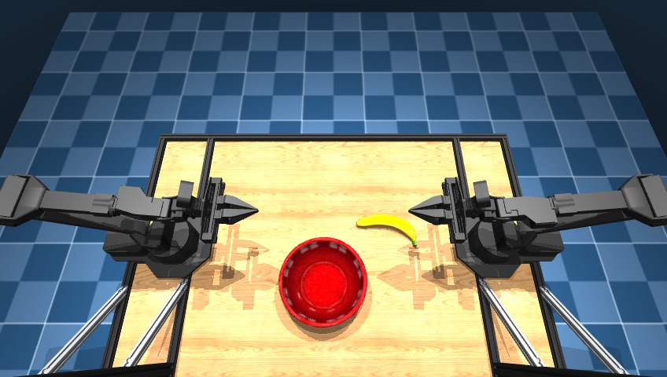

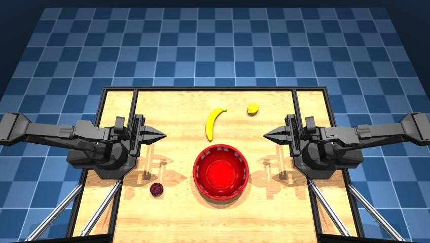

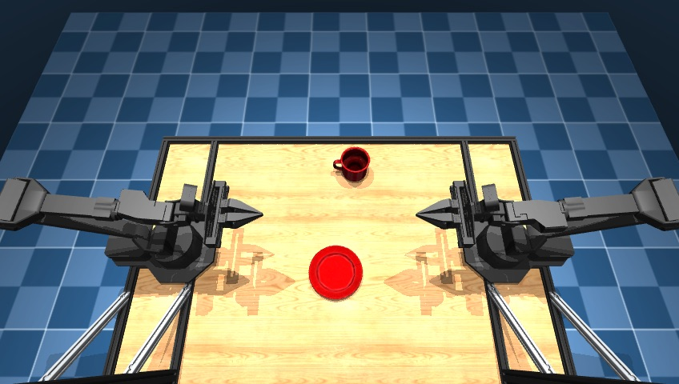

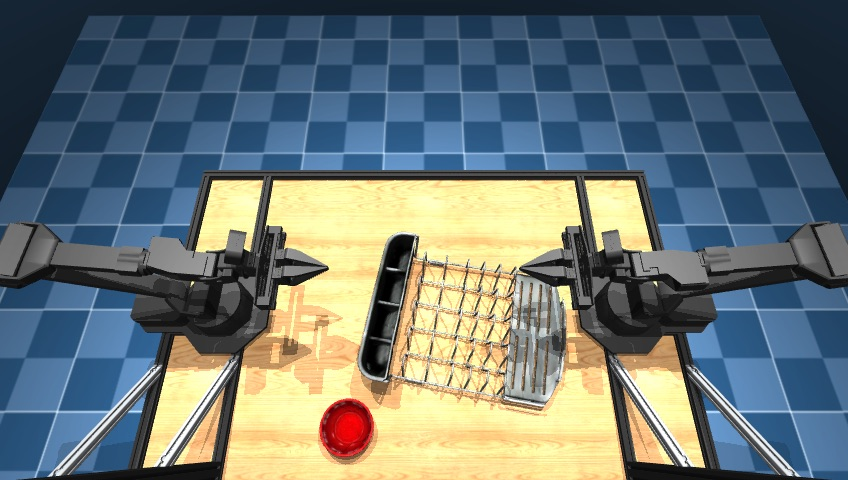

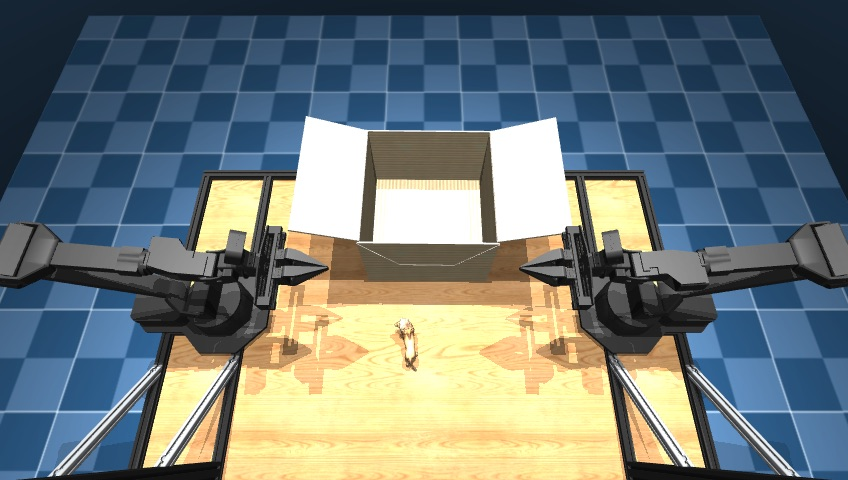

Figure 30: Environments used for simulated ALOHA 2 tasks. Top-left: Banana in Bowl, and Banana Handover. Top-middle: Banana Lift and Fruit Bowl. Top-right: Mug on Plate. Bottom-left: Bowl on Rack. Bottom-right: Pack Toy.

Report issue for preceding element

* •

  Banana Lift: The robot must lift a banana 20cm off of the table. The banana can appear anywhere on the table and at any orientation. There are also distractor objects: a bowl, a lemon, and a plum. This is the same environment used in the Fruit Bowl task.

  Report issue for preceding element
* •

  Banana in Bowl: The robot must lift a banana off of the table and place it in a bowl. The banana appears on the right side of the table and oriented roughly horizontally with a 0.1⁢π0.1𝜋0.1\pi0.1 italic\_π range. This is the same environment used in Banana Handover.

  Report issue for preceding element
* •

  Banana Handover: The robot must lift a banana off of the table with one arm, give it other arm, and then place it in a bowl.

  Report issue for preceding element
* •

  Mug on Plate: The robot must lift a mug off of the table and place it on a plate.

  Report issue for preceding element
* •

  Bowl on Rack: The robot must lift a bowl off of the table and place it on a dish rack.

  Report issue for preceding element
* •

  Fruit Bowl: The robot must lift 3 different pieces of fruit (banana, plum, and lemon) off the table and put them in a bowl.

  Report issue for preceding element
* •

  Pack Toy: The robot must lift a toy lion off the table and place it into a large box. The robot must then use each arm to close the flaps on the box.

  Report issue for preceding element

##### B.3.1.2 Real-world tasks

Report issue for preceding element

See [Fig. 31](https://arxiv.org/html/2503.20020v1#A2.F31 "In B.3.1.2 Real-world tasks ‣ B.3.1 ALOHA 2 Robot Task Descriptions ‣ B.3 ALOHA 2 Zero and Few-Shot Control ‣ Appendix B Embodied Reasoning with Gemini 2.0 ‣ Gemini Robotics: Bringing AI into the Physical World") for example initial conditions of real task environments.

Report issue for preceding element

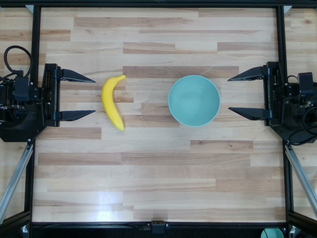

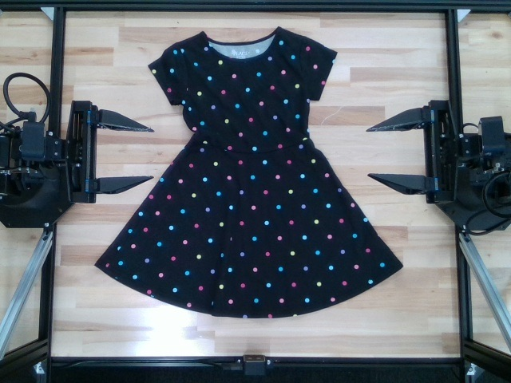

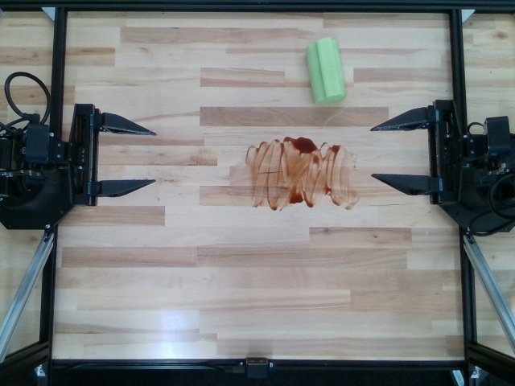

Figure 31: Environments used for real ALOHA 2 tasks. From left to right: Banana Handover, Fold Dress, and Wiping.

Report issue for preceding element

* •

  Banana Handover: The robot must lift a banana off of the table with one arm, hand it over to the other arm, and then place it in the bowl. Success is defined as the banana inside the bowl.

  Report issue for preceding element
* •

  Fold Dress: Given a dress flattened on the table, the robot must make several folds into a four-part rectangle. Success is defined as the dress folded in four parts.

  Report issue for preceding element
* •

  Wiping: Given a sponge and a stain on the table, the robot must pick up the sponge and clean up the stain. Success is defined as the entire stain surface being covered by the sponge.

  Report issue for preceding element

#### B.3.2 System Prompt for Gemini during zero-shot robot control

Report issue for preceding element

Note: The following prompt remains the same across tasks. We only change the instruction per task.

Report issue for preceding element

You are a helpful bi-arm robot - one arm is mounted on the left side of a rectangular table and one arm is mounted on the right side. The left arm will show at the left most side of the image and the right arm will show at the right most side of the image. Each arm has a parallel gripper with two fingers.
You will be asked to perform different tasks that involve interacting with the objects in the workspace. You are provided with a robot API to execute commands on the robot to complete the task.

Report issue for preceding element

The procedure to perform a task is as follows:

Report issue for preceding element

1. 1.

   Receive instruction. The user will provide a task instruction along with an initial image of the workspace area from the overhead camera, initial robot state and initial scene objects.

   Report issue for preceding element
2. 2.

   Describe the scene. Mention where the objects are located on the table.

   Report issue for preceding element
3. 3.

   Steps Planning. Think about the best approach to execute the task provided the object locations, object dimensions, robot embodiment constraints and direction guidelines provided below. Write down all of the steps you need to follow in detail to execute the task successfully with the robot. Each step should be as concise as possible and should contain a description of how the scene should look like after executing the step in order to move forward to next steps.

   Report issue for preceding element
4. 4.

   Steps Execution. After enumerating all the steps, write python code to execute each step for one step at a time on the robot using the API provided above. For each step:

   Report issue for preceding element
   1. 1.

      Rewrite a summary of the goal for the given step.

      Report issue for preceding element
   2. 2.

      When grasping an object, follow the grasping guidelines provided below.

      Report issue for preceding element
   3. 3.

      When moving a gripper to a specific position and orientation, make sure the target position is reachable according to the robot physical constraints described below and that there is enough clearance between other objects (including other gripper arms) to avoid collisions. Describe your thought process.

      Report issue for preceding element
   4. 4.

      Write code to execute the given step on the robot using the api, this includes writing code to compute cartesian trajectories.

      Report issue for preceding element
   5. 5.

      The code will be executed and you will be provided with a new image, the status of the execution and any error information that might have resulted from the code execution including anything printed to I/O. Summarize what the robot did as it executed the code based on the new image, robot state and initial scene objects as well as any execution error or user feedback.

      Report issue for preceding element
   6. 6.

      Compare your summary of what the robot did during code execution with the objective for that particular step. If they align, continue with writing code. If not, re-plan and write new steps to execute the task successfully. Consider the current state of the system when replanning (e.g., if a grasp failed the grippers may need to be reopened before attempting again).

      Report issue for preceding element
   7. 7.

      Repeat steps 4.1-4.6 until you have completed all steps successfully.

      Report issue for preceding element

In the world frame, front/back is along the y axis, left/right is along the x axis and up/down is along the z axis with following directions:
Positive x: Towards the right.
Negative x: Towards the left.
Positive y: Towards front of the table.
Negative y: Towards back of the table.
Positive z: Up, towards the ceiling.
Negative z: Down, towards the floor.
The world origin [0, 0, 0] is at the center of the workspace, between the two arms, at the center of the table and on the surface of the table.

Report issue for preceding element

Robot Physical Constraints and Table Workspace Area:

Report issue for preceding element

1. 1.

   Gripper has two parallel 0.09m fingers that can open up to 0.065m.

   Report issue for preceding element
2. 2.

   The table area is 0.80 meters wide (from left to right) and 0.40 meters long (from front to back). The center of the table belongs to the (0, 0, 0) coordinate in world frame.

   Report issue for preceding element
3. 3.

   The left arm can only reach the left side of the table which belongs to x coordinates greater than -0.40 meters but less than 0.1 meters.

   Report issue for preceding element
4. 4.

   The right arm can only reach the right side of the table which belongs to x coordinates greater than -0.1 meters but less than 0.40 meters.

   Report issue for preceding element

Grasp Guidelines:

Report issue for preceding element

1. 1.

   Always use the get\_grasp\_position\_and\_euler\_orientation function to get the grasp position and euler orientation for a specific object and gripper. This grasp pose must be used to compute a pre-grasp pose.

   Report issue for preceding element
2. 2.

   Clear visibility: Make sure the robot arms are not blocking the visibility of the object. If the arms are blocking the object, move the arms out of the way before attempting the grasp.

   Report issue for preceding element
3. 3.

   Reachability: Ensuring the gripper can reach the desired grasp points on the object given its arm length and workspace limits.

   Report issue for preceding element
4. 4.

   Make sure the gripper is open before going to the grasp pose.

   Report issue for preceding element
5. 5.

   Successful grasp: A successful grasp will be reflected in the distance\_between\_fingers state of the robot. After closing the gripper the value of distance\_between\_fingers should be greater than 0 if the grippers are successfully enclosing the object.

   Report issue for preceding element

Robot API Interface Documentation:

Report issue for preceding element

⬇

class Gripper(enum.Enum):

LEFT = "left\_gripper"

RIGHT = "right\_gripper"

class RealAlohaRobotApi:

"""Interface␣for␣interacting␣with␣the␣AlohaSim␣robot␣in␣CodeGen␣with␣a␣grasp␣pose␣prediction␣model.

␣␣"""

def close\_gripper(self, gripper: \_\_main\_\_.Gripper = <Gripper.LEFT: ’left\_gripper’>):

"""Closes␣the␣given␣gripper.

␣␣␣␣"""

def detect\_objects(self, object\_names):

"""Use␣this␣function␣to␣detect␣the␣XYZ␣centroid␣and␣size␣of␣objects␣in␣the␣scene.

␣␣␣␣The␣size␣is␣calculated␣based␣on␣a␣z-aligned␣bounding␣box␣where␣width␣is␣placed␣along␣the␣x-axis,␣depth␣is␣placed␣along␣the␣y-axis␣and␣height␣is␣placed␣along␣the␣z-axis.

␣␣␣␣Args:

␣␣␣␣␣␣object\_names:␣This␣is␣a␣list␣of␣strings␣containing␣the␣object␣names.␣The␣object␣names␣can␣include␣a␣brief␣description␣of␣the␣object␣or␣object␣part.

␣␣␣␣Returns:

␣␣␣␣␣␣A␣dictionary␣with␣the␣keys␣being␣the␣detection␣labels␣and␣the␣values␣being␣another␣dictionary␣containing␣the␣XYZ␣‘position‘␣and␣‘size‘␣␣of␣the␣detected␣objects.

␣␣␣␣␣␣Note␣that␣the␣detection␣labels␣are␣usually␣the␣same␣as␣object␣names␣but␣not␣always.

␣␣␣␣"""

def get\_grasp\_position\_and\_euler\_orientation(self, gripper: \_\_main\_\_.Gripper, object\_name: str, part\_name: str = ’middle’) -> tuple[numpy.ndarray, numpy.ndarray]:

"""Returns␣the␣grasp␣position␣and␣orientation␣for␣the␣given␣object␣and␣gripper.␣Make␣sure␣the␣robot␣arms␣are␣out␣of␣the␣way␣before␣calling␣this␣function␣to␣ensure␣a␣good␣grasp.

␣␣␣␣Args:

␣␣␣␣␣␣gripper:␣The␣gripper␣to␣use␣to␣grasp␣the␣object.

␣␣␣␣␣␣object\_name:␣The␣name␣of␣the␣object␣to␣grasp.

␣␣␣␣␣␣part\_name:␣The␣name␣of␣the␣part␣of␣the␣object␣to␣grasp.␣By␣default,␣this␣is␣’middle’.

␣␣␣␣Returns:

␣␣␣␣␣␣The␣grasp␣position␣and␣orientation␣for␣the␣given␣object␣and␣gripper.

␣␣␣␣"""

def get\_image(self):

"""Returns␣the␣image␣of␣the␣current␣camera.

␣␣␣␣"""

def move\_gripper\_to(self, position, orientation, gripper: \_\_main\_\_.Gripper = <Gripper.RIGHT: ’right\_gripper’>):

"""Moves␣the␣gripper␣to␣the␣given␣position␣and␣orientation.

␣␣␣␣Args:

␣␣␣␣␣␣gripper:␣The␣gripper␣to␣move.

␣␣␣␣␣␣position:␣The␣target␣position␣to␣move␣the␣gripper␣to␣in␣XYZ.

␣␣␣␣␣␣orientation:␣The␣the␣target␣orientation␣euler␣angles␣(roll,␣pitch,␣yaw)␣in␣degrees.

␣␣␣␣"""

def move\_gripper\_to\_safe\_position(self, gripper: \_\_main\_\_.Gripper) -> bool:

"""Moves␣the␣given␣gripper␣to␣a␣safe␣position␣out␣of␣the␣table␣area.

␣␣␣␣This␣is␣also␣its␣initial␣homeposition.

␣␣␣␣Args:

␣␣␣␣␣␣gripper:␣The␣gripper␣to␣move.␣Use␣’LEFT’␣or␣’RIGHT’␣to␣specify␣the␣gripper.

␣␣␣␣Returns:

␣␣␣␣␣␣True␣if␣the␣gripper␣was␣moved␣successfully,␣False␣otherwise.

␣␣␣␣"""

def open\_gripper(self, gripper: \_\_main\_\_.Gripper = <Gripper.LEFT: ’left\_gripper’>):

"""Opens␣the␣given␣gripper.

␣␣␣␣"""

def reset(self):

"""Resets␣the␣robot␣to␣its␣initial␣state.

␣␣␣␣"""

def state\_description(self) -> str:

"""Returns␣a␣text␣description␣of␣the␣current␣robot␣state.

␣␣␣␣"""

Assume the Robot API object is already available as robot.

Report issue for preceding element

Instructions: Pick up the banana and place it in the bowl. You may need to handover the banana from one arm to the other if the initial arm picking the banana cannot reach the bowl.
After picking the banana with one arm, you can handover the banana by first placing it carefully on the table surface and then using the other arm to pick it up. The placing position must be on the table, as far as possible from other objects but absolutely within the reachable table area of the other arm. Make sure to move the picking arm out of the way before the receiving arm moves towards grasping the object.

Report issue for preceding element

#### B.3.3 Sample output from Gemini during zero-shot robot control

Report issue for preceding element

[Fig. 32](https://arxiv.org/html/2503.20020v1#A2.F32 "In B.3.3 Sample output from Gemini during zero-shot robot control ‣ B.3 ALOHA 2 Zero and Few-Shot Control ‣ Appendix B Embodied Reasoning with Gemini 2.0 ‣ Gemini Robotics: Bringing AI into the Physical World") and [Fig. 33](https://arxiv.org/html/2503.20020v1#A2.F33 "In B.3.3 Sample output from Gemini during zero-shot robot control ‣ B.3 ALOHA 2 Zero and Few-Shot Control ‣ Appendix B Embodied Reasoning with Gemini 2.0 ‣ Gemini Robotics: Bringing AI into the Physical World") show output samples from Gemini doing planning and grasping, whilst completing robot control tasks.

Report issue for preceding element

|  |
| --- |
| 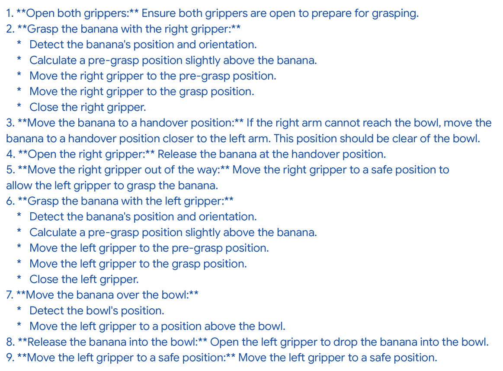 |

Figure 32: Example of planning by Gemini whilst carrying out a robot control task.

Report issue for preceding element

|  |
| --- |
|  |

Figure 33: Example of grasping and lifting by Gemini whilst carrying out a robot control task. Output is by Gemini except for the environment feedback and “\* environment output not shown for brevity \*” (shown in gray). Other colors refer to the following: blue — planning; orange — code; green — analysis or discussion.

Report issue for preceding element

|  |
| --- |
| 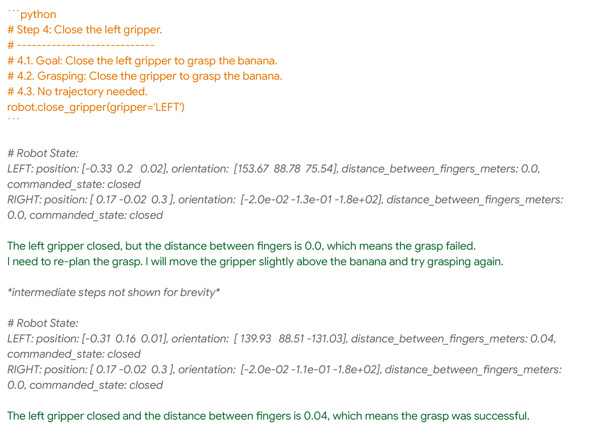 |

Figure 34: Examples of error detection and retrying by Gemini when carrying out a robot control task. Output is by Gemini except for the environment output and “\*intermediate steps not shown for brevity\*” (shown in gray). Other colors refer to the following: orange — code; green — analysis or discussion.

Report issue for preceding element

## Appendix C Robot Actions with Gemini Robotics

Report issue for preceding element

### C.1 Evaluation procedure

Report issue for preceding element

Real world robotics performance metrics (e.g., success rate and/or progress) can be noisy, because conducting experiments on robots is subject to constantly changing environments and deteriorating hardware. To address these concerns, each evaluation task (defined by an instruction and initial conditions) is run with multiple trials. These trials are repeated for each of the target models (e.g., Gemini Robotics and baselines). To reduce bias from environmental factors (e.g., network latency, wear-and-tear of motors, lighting changes, etc.) and eliminate operator bias, the target models are evaluated for each trial back-to-back in random order (A/B testing). This allows us to use a pairwise t-test to more robustly evaluate improvements over baselines.

Report issue for preceding element

Each evaluation is marked either success or failure (0 for failure, 1 for full completion). Furthermore, we also use a continuous metric, progress score, between 0 and 1, reflecting the proportion of the task completed. Given the difficulty of some of our tasks — long-horizon, highly dexterous, and in challenging generalization scenarios — reporting the continuous progress metric offers another insightful metric for comparing model performance.

Report issue for preceding element

#### C.1.1 Evaluation tasks to test out-of-the-box in-distribution performance

Report issue for preceding element

All of the evaluation tasks used for Figure [16](https://arxiv.org/html/2503.20020v1#S3.F16 "Figure 16 ‚Ä£ 3.1 Gemini Robotics: Model and Data ‚Ä£ 3 Robot Actions with Gemini Robotics ‚Ä£ Gemini Robotics: Bringing AI into the Physical World") can be found in Figure [35](https://arxiv.org/html/2503.20020v1#A3.F35 "Figure 35 ‚Ä£ C.1.1 Evaluation tasks to test out-of-the-box in-distribution performance ‚Ä£ C.1 Evaluation procedure ‚Ä£ Appendix C Robot Actions with Gemini Robotics ‚Ä£ Gemini Robotics: Bringing AI into the Physical World"), including instruction and an example of initial scene configuration.

Report issue for preceding element

Figure 35: Initial scene configuration and instructions used for our out-of-the-box evaluation in Figure [16](https://arxiv.org/html/2503.20020v1#S3.F16 "Figure 16 ‚Ä£ 3.1 Gemini Robotics: Model and Data ‚Ä£ 3 Robot Actions with Gemini Robotics ‚Ä£ Gemini Robotics: Bringing AI into the Physical World").

Report issue for preceding element

#### C.1.2 Evaluation tasks for instruction following analysis

Report issue for preceding element

Figure [36](https://arxiv.org/html/2503.20020v1#A3.F36 "Figure 36 ‚Ä£ C.1.2 Evaluation tasks for instruction following analysis ‚Ä£ C.1 Evaluation procedure ‚Ä£ Appendix C Robot Actions with Gemini Robotics ‚Ä£ Gemini Robotics: Bringing AI into the Physical World") shows the 5 scenes and the 25 instructions used to assess Gemini Robotics instruction following in Section [3.3](https://arxiv.org/html/2503.20020v1#S3.SS3 "3.3 Gemini Robotics can closely follow language instructions ‚Ä£ 3 Robot Actions with Gemini Robotics ‚Ä£ Gemini Robotics: Bringing AI into the Physical World").

Report issue for preceding element

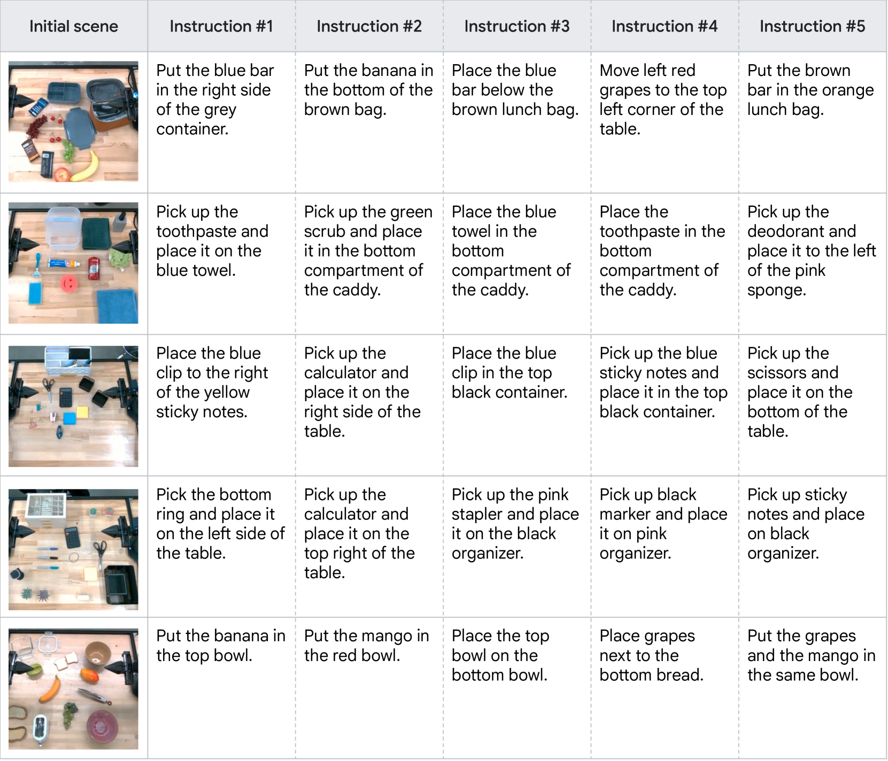

Figure 36: Examples of the initial scene configurations and instructions used for the instruction following analysis in Section [3.3](https://arxiv.org/html/2503.20020v1#S3.SS3 "3.3 Gemini Robotics can closely follow language instructions ‚Ä£ 3 Robot Actions with Gemini Robotics ‚Ä£ Gemini Robotics: Bringing AI into the Physical World").

Report issue for preceding element

#### C.1.3 Evaluation tasks for generalization study

Report issue for preceding element

In this Section we describe all the tasks and variations we used for the generalization results of Figure [21](https://arxiv.org/html/2503.20020v1#S3.F21 "Figure 21 ‣ 3.4 Gemini Robotics brings Gemini’s generalization to the physical world ‣ 3 Robot Actions with Gemini Robotics ‣ Gemini Robotics: Bringing AI into the Physical World").

Report issue for preceding element

##### C.1.3.1 Visual and Instruction generalization tasks

Report issue for preceding element

We consider 4 different tasks in a scene including objects to be packed in a lunch bag. In order to assess instruction generalization, we ask the robot to solve the task using different instructions by 1) adding typos, 2) translating the instruction to a different language (Spanish), 3) rephrasing the instruction, and 4) adding descriptive modifiers. See Figure [37](https://arxiv.org/html/2503.20020v1#A3.F37 "Figure 37 ‣ C.1.3.1 Visual and Instruction generalization tasks ‣ C.1.3 Evaluation tasks for generalization study ‣ C.1 Evaluation procedure ‣ Appendix C Robot Actions with Gemini Robotics ‣ Gemini Robotics: Bringing AI into the Physical World") for detailed examples.

Report issue for preceding element

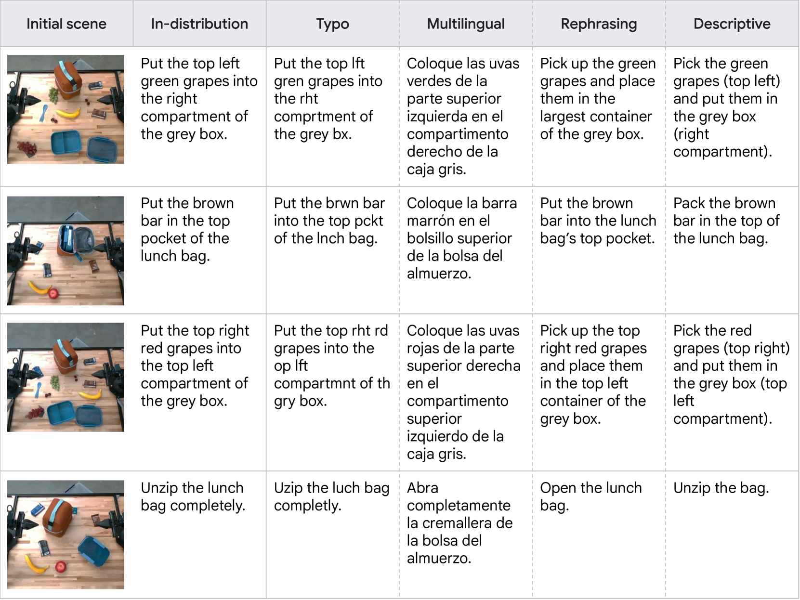

Figure 37: Examples of initial scene configurations and instructions used for instruction generalization evaluations in in Section [3.4](https://arxiv.org/html/2503.20020v1#S3.SS4 "3.4 Gemini Robotics brings Gemini’s generalization to the physical world ‣ 3 Robot Actions with Gemini Robotics ‣ Gemini Robotics: Bringing AI into the Physical World").

Report issue for preceding element

We then test our model ability to generalize to visual variations of the scene by 1) adding novel distractor objects, 2) by replacing the background (wooden tabletop) with a blue-white cloth, and 3) by changing the lighting of the scene. All these variations are not captured in the training data. See Figure [38](https://arxiv.org/html/2503.20020v1#A3.F38 "Figure 38 ‚Ä£ C.1.3.1 Visual and Instruction generalization tasks ‚Ä£ C.1.3 Evaluation tasks for generalization study ‚Ä£ C.1 Evaluation procedure ‚Ä£ Appendix C Robot Actions with Gemini Robotics ‚Ä£ Gemini Robotics: Bringing AI into the Physical World") for detailed examples.

Report issue for preceding element

Figure 38: Examples of initial scene configurations and instructions used for visual generalization evaluations in Section [3.4](https://arxiv.org/html/2503.20020v1#S3.SS4 "3.4 Gemini Robotics brings Gemini’s generalization to the physical world ‣ 3 Robot Actions with Gemini Robotics ‣ Gemini Robotics: Bringing AI into the Physical World").

Report issue for preceding element

##### C.1.3.2 Action generalization tasks

Report issue for preceding element

We consider 6 different tasks across multiple scenes. We analyse action generalization across two different axes: 1) OOD object positions and 2) different target object instance with different color, shape or size. See Figure [39](https://arxiv.org/html/2503.20020v1#A3.F39 "Figure 39 ‚Ä£ C.1.3.2 Action generalization tasks ‚Ä£ C.1.3 Evaluation tasks for generalization study ‚Ä£ C.1 Evaluation procedure ‚Ä£ Appendix C Robot Actions with Gemini Robotics ‚Ä£ Gemini Robotics: Bringing AI into the Physical World") for details.

Report issue for preceding element

Figure 39: Examples of initial scene configurations and instructions used for action generalization evaluations in Section [3.4](https://arxiv.org/html/2503.20020v1#S3.SS4 "3.4 Gemini Robotics brings Gemini’s generalization to the physical world ‣ 3 Robot Actions with Gemini Robotics ‣ Gemini Robotics: Bringing AI into the Physical World").

Report issue for preceding element

##### C.1.3.3 Task and progress definition

Report issue for preceding element

In Figure [21](https://arxiv.org/html/2503.20020v1#S3.F21 "Figure 21 ‣ 3.4 Gemini Robotics brings Gemini’s generalization to the physical world ‣ 3 Robot Actions with Gemini Robotics ‣ Gemini Robotics: Bringing AI into the Physical World"), we reported Progress Score, the continuous metric that captures the nuances of the performance beyond the success rate of the binary categorization between success and failure. Here is the definition of progress for each task.

Report issue for preceding element

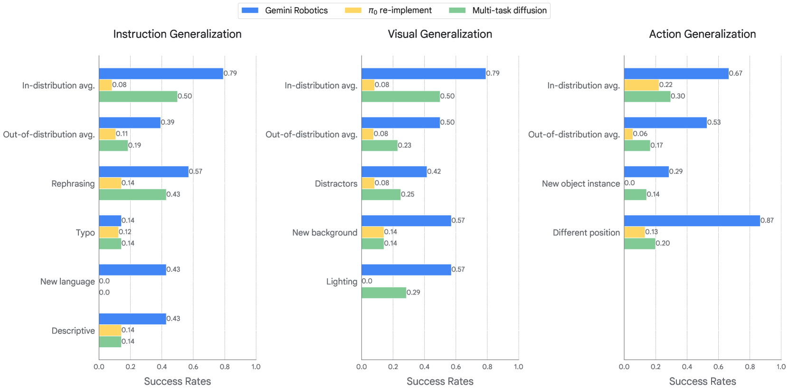

Figure 40: Breakdown of Gemini Robotics generalization capabilities with success rate. Gemini Robotics consistently outperforms the baselines and handles all three types of variations more effectively. Notably, even when baselines experience catastrophic failure — such as with instructions in a new language or visual variations of the target object, Gemini Robotics still achieves non-zero performance.

Report issue for preceding element

* •

  “Put the top left green grapes into the right compartment of the grey box.” This task requires the robot to pick up the green grapes and drop them in the right compartment of the grey bento box.

  Report issue for preceding element
  + –

    1.0  : if the grapes are placed in the correct compartment;

    Report issue for preceding element
  + –

    0.5  : if the grapes are picked and placed in the wrong compartment;

    Report issue for preceding element
  + –

    0.25: if the grapes are picked but never placed;

    Report issue for preceding element
  + –

    0.0  : if anything else happens.

    Report issue for preceding element
* •

  “Put the brown bar in the top pocket of the lunch bag.” This task requires the robot to pick up the brown bar and place it in the top pocket of the lunch bag.

  Report issue for preceding element
  + –

    1.0  : if the brown bar is placed in the lunch bag’s top pocket;

    Report issue for preceding element
  + –

    0.75: if the brown bar is placed in the lunch bag (either pocket);

    Report issue for preceding element
  + –

    0.25: if the robot picks up the brown bar;

    Report issue for preceding element
  + –

    0.0  : if anything else happens.

    Report issue for preceding element
* •

  “Put the top right red grapes into the top left compartment of the grey box.” This task requires the robot to pick up the red grapes and drop them in the top-left compartment of the grey bento box.

  Report issue for preceding element
  + –

    1.0  : if the grapes are placed in the correct compartment;

    Report issue for preceding element
  + –

    0.5  : if the grapes are picked and placed in the wrong compartment;

    Report issue for preceding element
  + –

    0.25: if the grapes are picked but never placed;

    Report issue for preceding element
  + –

    0.0  : if anything else happens.

    Report issue for preceding element
* •

  “Unzip the lunch bag completely.” This task requires the robot to fully unzip the lunch bag.

  Report issue for preceding element
  + –

    1.0  : if the robot fully unzips the lunch bag;

    Report issue for preceding element
  + –

    0.5  : if the robot successfully grasps the zipper and partially un-zips it;

    Report issue for preceding element
  + –

    0.25: if the robot successfully identifies and grasps the zipper tag;

    Report issue for preceding element
  + –

    0.0  : if anything else happens.

    Report issue for preceding element
* •

  “Put the legos into the lego bag.” This task requires the robot to pick up 4 lego blocks (one-by-one) and then place them into the lego bag.

  Report issue for preceding element
  + –

    1.0  : if all 4 blocks are placed in the bag;

    Report issue for preceding element
  + –

    0.75: if 3 blocks are placed in the bag;

    Report issue for preceding element
  + –

    0.50: if 2 blocks are placed in the bag;

    Report issue for preceding element
  + –

    0.25: if 1 block is placed in the bag;

    Report issue for preceding element
  + –

    0.0  : if no blocks are in the bag.

    Report issue for preceding element
* •

  “Tighten the cap of the water bottle.” This task requires the robot to tighten the caps of various (plastic and metal) bottles.

  Report issue for preceding element
  + –

    1.0  : if the robot has tightened the cap by at least one full rotation;

    Report issue for preceding element
  + –

    0.5  : if the robot begins to tighten the cap but does not finish one rotation;

    Report issue for preceding element
  + –

    0.1  : if the robot grips the water bottle’s cap;

    Report issue for preceding element
  + –

    0.0  : if anything else happens.

    Report issue for preceding element
* •

  “Open the bottom drawer of the jewelry box.” This task requires the robot to open the bottom drawer of the jewelry box.

  Report issue for preceding element
  + –

    1.0  : if the robot opens the bottom drawer of the jewelry box;

    Report issue for preceding element
  + –

    0.25: if the robot grasps the bottom drawer of the jewelry box;

    Report issue for preceding element
  + –

    0.0  : if anything else happens.

    Report issue for preceding element
* •

  “Fold the dress.” This task requires the robot to fold different dresses.

  Report issue for preceding element
  + –

    1.0  : if the dress is folded with all the correct folds;

    Report issue for preceding element
  + –

    0.25: if the robot gets at least one (even messy) fold;

    Report issue for preceding element
  + –

    0.0  : if anything else happens.

    Report issue for preceding element
* •

  “Put banana in bowl with handover.” This task requires the robot to pick up the banana with one arm, hand it over to the other arm, and then place it in the bowl.

  Report issue for preceding element
  + –

    1.0  : if the robot picks the banana, hands it over, and places it in the bowl;

    Report issue for preceding element
  + –

    0.5  : if the robot picks the banana and hands it over, or if the robot places the banana in the bowl without handing it over;

    Report issue for preceding element
  + –

    0.25: if the robot picks the banana and then drops it;

    Report issue for preceding element
  + –

    0.0  : if the robot does not pick the banana.

    Report issue for preceding element

For completeness, we also include the plot of success rate below (Figure [40](https://arxiv.org/html/2503.20020v1#A3.F40 "Figure 40 ‚Ä£ C.1.3.3 Task and progress definition ‚Ä£ C.1.3 Evaluation tasks for generalization study ‚Ä£ C.1 Evaluation procedure ‚Ä£ Appendix C Robot Actions with Gemini Robotics ‚Ä£ Gemini Robotics: Bringing AI into the Physical World")).

Report issue for preceding element

### C.2 Baselines

Report issue for preceding element

Our Gemini Robotics model is compared against three baselines that represent the state-of-the-art in vision-language-action models, multi-task learning and dexterity, respectively.

Report issue for preceding element

π0subscript𝜋0\pi\_{0}italic\_π start\_POSTSUBSCRIPT 0 end\_POSTSUBSCRIPT *re-implement*: This is a faithful re-implementation, to the best of our knowledge, of π0subscript𝜋0\pi\_{0}italic\_π start\_POSTSUBSCRIPT 0 end\_POSTSUBSCRIPT, an open-weights dexterous VLA model (Black et al., [2024](https://arxiv.org/html/2503.20020v1#bib.bib7)) consisting of a diffusion transformer “action expert” policy that attends to latents from an underlying PaliGemma VLM (Beyer et al., [2024](https://arxiv.org/html/2503.20020v1#bib.bib6)). The π0subscript𝜋0\pi\_{0}italic\_π start\_POSTSUBSCRIPT 0 end\_POSTSUBSCRIPT model architecture and weights have been publicly released by the authors ([openpi](https://github.com/Physical-Intelligence/openpi)). We re-implement this model to be compatible with our scalable training infrastructure to consume our diverse actions training data. We train this model on the same data mixture as Gemini Robotics. On internal evaluations, we find that our π0subscript𝜋0\pi\_{0}italic\_π start\_POSTSUBSCRIPT 0 end\_POSTSUBSCRIPT *re-implement* trained on our data mixture outperforms the π0subscript𝜋0\pi\_{0}italic\_π start\_POSTSUBSCRIPT 0 end\_POSTSUBSCRIPT *openpi* checkpoint out of the box, as well as π0subscript𝜋0\pi\_{0}italic\_π start\_POSTSUBSCRIPT 0 end\_POSTSUBSCRIPT *openpi* fine-tuned for individual tasks ([Fig. 41](https://arxiv.org/html/2503.20020v1#A3.F41 "In C.2 Baselines ‣ Appendix C Robot Actions with Gemini Robotics ‣ Gemini Robotics: Bringing AI into the Physical World")); hence, we report numbers from our re-implementation throughout the paper. In [Section 3](https://arxiv.org/html/2503.20020v1#S3 "3 Robot Actions with Gemini Robotics ‣ Gemini Robotics: Bringing AI into the Physical World"), we use a batch size of 2048204820482048 and train it for 300K steps. In [Section 4](https://arxiv.org/html/2503.20020v1#S4 "4 Specializing and Adapting Gemini Robotics for Dexterity, Reasoning, and New Embodiments ‣ Gemini Robotics: Bringing AI into the Physical World"), we fine-tune from the checkpoint from [Section 3](https://arxiv.org/html/2503.20020v1#S3 "3 Robot Actions with Gemini Robotics ‣ Gemini Robotics: Bringing AI into the Physical World"), using the same batch size for 50K steps. We also carefully select the checkpoints for evaluation to ensure fair comparisons.

Report issue for preceding element

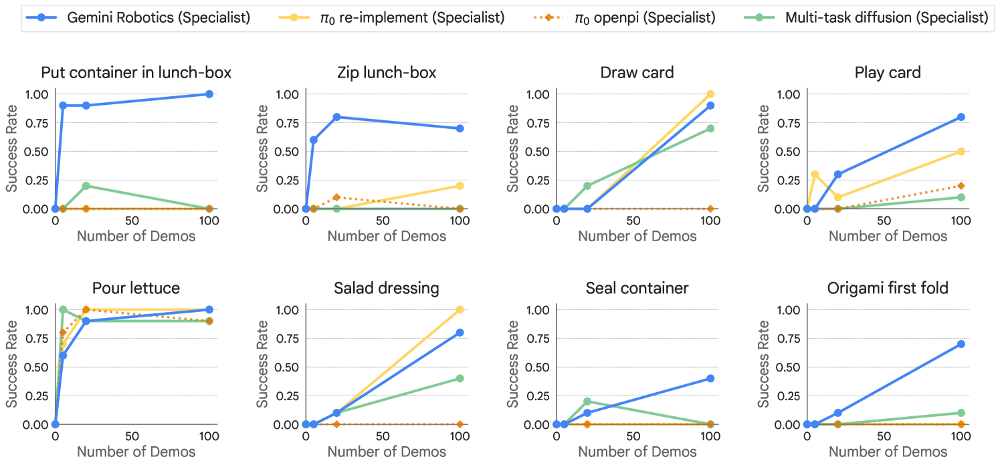

Figure 41: Fast adaptation results ([Section 4.3](https://arxiv.org/html/2503.20020v1#S4.SS3 "4.3 Fast adaptation to new tasks ‣ 4 Specializing and Adapting Gemini Robotics for Dexterity, Reasoning, and New Embodiments ‣ Gemini Robotics: Bringing AI into the Physical World")) with the π0subscript𝜋0\pi\_{0}italic\_π start\_POSTSUBSCRIPT 0 end\_POSTSUBSCRIPT *openpi* baseline. The results are consistent between π0subscript𝜋0\pi\_{0}italic\_π start\_POSTSUBSCRIPT 0 end\_POSTSUBSCRIPT *openpi* and π0subscript𝜋0\pi\_{0}italic\_π start\_POSTSUBSCRIPT 0 end\_POSTSUBSCRIPT *re-implement* in 5 out of 8 tasks, while our own implementation achieves better results for the other 3 tasks.

Report issue for preceding element

Multi-task diffusion: This is a diffusion policy architecture inspired by ALOHA Unleashed (Zhao et al., [2025](https://arxiv.org/html/2503.20020v1#bib.bib63)) and modified to be task-conditioned. We add a CLIP text encoder (Radford et al., [2021](https://arxiv.org/html/2503.20020v1#bib.bib40)) to encode the natural language task string, while the original model of Aloha Unleashed only works in single-task settings. In [Section 3](https://arxiv.org/html/2503.20020v1#S3 "3 Robot Actions with Gemini Robotics ‣ Gemini Robotics: Bringing AI into the Physical World"), we use a batch size of 512512512512 and train it for 2M steps on the identical action data mixture. For experiments in [Section 4](https://arxiv.org/html/2503.20020v1#S4 "4 Specializing and Adapting Gemini Robotics for Dexterity, Reasoning, and New Embodiments ‣ Gemini Robotics: Bringing AI into the Physical World"), we start from the checkpoint from [Section 3](https://arxiv.org/html/2503.20020v1#S3 "3 Robot Actions with Gemini Robotics ‣ Gemini Robotics: Bringing AI into the Physical World"), use the same batch size and fine-tune it for 1M steps. The batch size, training steps and evaluation checkpoints are empirically determined to optimize the model’s final performance.

Report issue for preceding element

Single-task diffusion: This is the same diffusion policy architecture from ALOHA Unleashed (Zhao et al., [2025](https://arxiv.org/html/2503.20020v1#bib.bib63)). We do not include this baseline in [Section 3](https://arxiv.org/html/2503.20020v1#S3 "3 Robot Actions with Gemini Robotics ‣ Gemini Robotics: Bringing AI into the Physical World") because it is not designed for multi-task learning. For all our specialization and adaptation experiments in [Section 4](https://arxiv.org/html/2503.20020v1#S4 "4 Specializing and Adapting Gemini Robotics for Dexterity, Reasoning, and New Embodiments ‣ Gemini Robotics: Bringing AI into the Physical World"), we initialize the model from scratch, use a batch size of 512512512512 and train it for 2M steps. Similarly, the batch size, training steps and evaluation checkpoints are empirically determined to optimize the model’s final performance.

Report issue for preceding element

## Appendix D Specializing and Adapting Gemini Robotics for Dexterity, Reasoning, and New Embodiments

Report issue for preceding element

### D.1 Long-horizon dexterity

Report issue for preceding element

#### D.1.1 Evaluation procedure

Report issue for preceding element

These evaluations primarily focus on in-distribution performance, with defined initial conditions for each task. We conduct 20 trials per task per model. The spelling game task is the only exception, where performance is analysed over 12 trials, including both in-distribution results (6 trials for printed picture cards) and out-of-distribution results (6 trials for hand-drawn sketches).

Report issue for preceding element

In [Section 4.1](https://arxiv.org/html/2503.20020v1#S4.SS1 "4.1 Long-horizon dexterity ‣ 4 Specializing and Adapting Gemini Robotics for Dexterity, Reasoning, and New Embodiments ‣ Gemini Robotics: Bringing AI into the Physical World"), we report success rates for each of the six dexterous tasks. Here, we additionally show the progress scores for each task in Figure [42](https://arxiv.org/html/2503.20020v1#A4.F42 "Figure 42 ‣ D.1.1 Evaluation procedure ‣ D.1 Long-horizon dexterity ‣ Appendix D Specializing and Adapting Gemini Robotics for Dexterity, Reasoning, and New Embodiments ‣ Gemini Robotics: Bringing AI into the Physical World") to get a more fine-grained picture of the differences between the performance of Gemini Robotics and the baseline models.

Report issue for preceding element

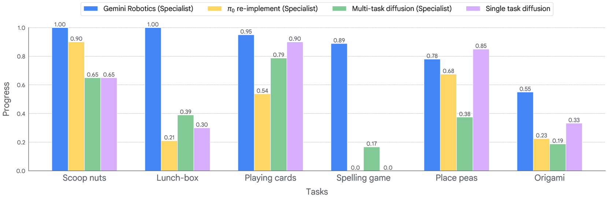

Figure 42: Average task progress score on new, dexterous and long-horizon tasks after specialization. This Figure complements Figure [23](https://arxiv.org/html/2503.20020v1#S4.F23 "Figure 23 ‚Ä£ 4.1 Long-horizon dexterity ‚Ä£ 4 Specializing and Adapting Gemini Robotics for Dexterity, Reasoning, and New Embodiments ‚Ä£ Gemini Robotics: Bringing AI into the Physical World"). The average task progress score highlights that on all tasks but Spelling game, all methods show non-zero progress towards the completion of the tasks. However, Gemini Robotics outperforms almost all baselines across all tasks except for the single task diffusion on the Place peas task according to this metric.

Report issue for preceding element

The definition of the task can be found in Section [4.1](https://arxiv.org/html/2503.20020v1#S4.SS1 "4.1 Long-horizon dexterity ‣ 4 Specializing and Adapting Gemini Robotics for Dexterity, Reasoning, and New Embodiments ‣ Gemini Robotics: Bringing AI into the Physical World"), and below we define the progress scores for each task:

Report issue for preceding element

* •

  “Make an origami fox”

  Report issue for preceding element
  + –

    1.0  : if the robot fully folds the origami fox;

    Report issue for preceding element
  + –

    0.75: if the robot completes the first three folds;

    Report issue for preceding element
  + –

    0.5  : if the robot completes the first two folds;

    Report issue for preceding element
  + –

    0.25: if the robot completes the first fold;

    Report issue for preceding element
  + –

    0.1  : if the robot attempts to make the first fold;

    Report issue for preceding element
  + –

    0.0  : if anything else happens.

    Report issue for preceding element
* •

  “Pack a lunch-box”

  Report issue for preceding element
  + –

    1.0  : if the lunch-box contains all required items inside it and is fully zipped;

    Report issue for preceding element
  + –

    0.75: if the lunch-box contains all required items inside it: the bread inside the ziploc, an energy bar, and the sealed container with grapes inside;

    Report issue for preceding element
  + –

    0.5  : if the robot transfers the zipped ziploc containing the bread into the lunch-box;

    Report issue for preceding element
  + –

    0.25: if the robot inserts the bread in the ziploc bag and zips the ziploc bag;

    Report issue for preceding element
  + –

    0.1  : if the robot inserts the bread in the ziploc bag;

    Report issue for preceding element
  + –

    0.0  : if anything else happens.

    Report issue for preceding element
* •

  “Spelling board game”

  Report issue for preceding element
  + –

    1.0  : if the robot spells all three letters correctly;

    Report issue for preceding element
  + –

    0.66: if the robot spells the first two letters correctly;

    Report issue for preceding element
  + –

    0.33: if the robot spells the first letter correctly;

    Report issue for preceding element
  + –

    0.0  : if anything else happens.

    Report issue for preceding element
* •

  “Play a game of cards”

  Report issue for preceding element
  + –

    1.0  : if the robot draws 3 cards, plays 1 card, and folds the remaining cards;

    Report issue for preceding element
  + –

    0.75: if the robot plays more than 1 card after 3 cards are drawn;

    Report issue for preceding element
  + –

    0.5  : if the robot draws 3 cards but fails to play any card;

    Report issue for preceding element
  + –

    0.25: if the robot draws 1 card;

    Report issue for preceding element
  + –

    0.0  : if anything else happens.

    Report issue for preceding element
* •

  “Add snap peas to salad”

  Report issue for preceding element
  + –

    1.0  : if the robot places at least 3 peas into the salad bowl with the tongs and then places the tongs back on the table;

    Report issue for preceding element
  + –

    0.5  : if the robot places at least 1 pea into the salad bowl with the tongs;

    Report issue for preceding element
  + –

    0.0  : If anything else happens.

    Report issue for preceding element
* •

  “Add nuts to salad”

  Report issue for preceding element
  + –

    1.0  : if the robot scoops at least 1 scoop of nuts, adds them to the salad bowl, and places the spoon back on the table;

    Report issue for preceding element
  + –

    0.5  : if the robot scoops at least 1 scoop of nuts and adds them to the salad bowl;

    Report issue for preceding element
  + –

    0.0  : if anything else happens.

    Report issue for preceding element

### D.2 Enhanced reasoning and generalization

Report issue for preceding element

#### D.2.1 Evaluation procedure

Report issue for preceding element

For the reasoning-enhanced version and the vanilla Gemini Robotics models, we perform 100 trials across 8 different tasks, each with a unique initial scene configuration. The tasks are grouped into the following categories, based on what capabilities they are designed to measure: One-step Reasoning, Semantic Generalization, and Spatial Understanding.

Report issue for preceding element

##### D.2.1.1 One-step Reasoning Tasks

Report issue for preceding element

For tasks in this category, the instruction specifies the objects of interest and/or the manipulation action indirectly, e.g., via their properties or affordances:

Report issue for preceding element

* •

  “Put the coke can into the same colored plate.” In this task the model must place the Coca-cola can into the red plate instead of the different colored distractor plates.

  Report issue for preceding element
* •

  “Sort the bottom right mouse into the matching pile.” In this task the model must sort the white toy mouse at the bottom right into a pile of white toy mice, instead of the distractor piles of brown and grey mice; all of these mice, as well as the task of sorting objects based on their color, are unseen in training.

  Report issue for preceding element
* •

  “I need to brush my teeth, pick up the correct item.” The model must retrieve a toothpaste tube through cluttered distractors (deodorant, banana, and mango).

  Report issue for preceding element

For these three instructions, the keywords of reasoning (same, matching, correct) are unseen in the training dataset of robot actions.

Report issue for preceding element

##### D.2.1.2 Semantic Generalization Tasks

Report issue for preceding element

These tasks require semantic and visual understanding beyond the complexity of the Instruction Generalization tasks in [Section 3.4](https://arxiv.org/html/2503.20020v1#S3.SS4 "3.4 Gemini Robotics brings Gemini’s generalization to the physical world ‣ 3 Robot Actions with Gemini Robotics ‣ Gemini Robotics: Bringing AI into the Physical World").

Report issue for preceding element

* •

  “Put the Japanese fish delicacy in the lunch-box.” The model must decide that the sushi is the target object among various distractor objects, and pack the sushi into the lunch-box.

  Report issue for preceding element
* •

  “Pick up the full bowl.” The model must lift up the bowl filled with dice (unseen in training) instead of the two empty bowls (seen in training).

  Report issue for preceding element

For these two instructions, the language describing the new semantic concept (Japanese fish delicacy, full) are unseen in the training dataset of actions.

Report issue for preceding element

##### D.2.1.3 Spatial Understanding Tasks

Report issue for preceding element

These tasks require understanding concepts about relative and absolute spatial relationships.

Report issue for preceding element

* •

  “Pack the smallest coke soda in the lunch-box.” The model must pack the mini-size Coca-cola can instead of distractor full-size Coca-cola cans, and place it into the lunch-box.
  The language describing the spatial concept under evaluation (smallest) is unseen in training.

  Report issue for preceding element
* •

  “Put the cold medicine in the bottom/top left bowl.” The model must find the cold medicine box out of distractors (a indigestion medicine and hand sanitizer), all of which are unseen in training, and place it into the correct bowl out of three distractor bowls placed in different locations around the table.

  Report issue for preceding element

For these two instructions, the language describing the new objects (coke soda, medicine) is unseen during training, while the language describing the spatial concepts are present varying amounts in the training distribution of action labels: smallest is unseen, top left and bottom left are rare, and left and right are common.

Report issue for preceding element

Figure 43: Tasks for fast adaptation experiments. From top to bottom: “Draw card”, “Play card”, “Pour lettuce”, “Salad dressing”, “Seal container”, “Put container in lunch-box”, “Zip lunch-box”, and “Origami first fold”.

Report issue for preceding element

### D.3 Fast adaptation to new tasks

Report issue for preceding element

#### D.3.1 Tasks and evaluation details

Report issue for preceding element

We also study the capability of Gemini Robotics to adapt rapidly (using up to 100 episodes of demonstration) to new tasks. We choose shorter segments sampled from the demonstrations for the long-horizon dexterous tasks ([Section 4.1](https://arxiv.org/html/2503.20020v1#S4.SS1 "4.1 Long-horizon dexterity ‣ 4 Specializing and Adapting Gemini Robotics for Dexterity, Reasoning, and New Embodiments ‣ Gemini Robotics: Bringing AI into the Physical World")) as the new tasks. Note that in this section, we fine-tune the Gemini Robotics checkpoint directly from [Section 3](https://arxiv.org/html/2503.20020v1#S3 "3 Robot Actions with Gemini Robotics ‣ Gemini Robotics: Bringing AI into the Physical World"), which has never seen any demonstrations introduced in [Section 4.1](https://arxiv.org/html/2503.20020v1#S4.SS1 "4.1 Long-horizon dexterity ‣ 4 Specializing and Adapting Gemini Robotics for Dexterity, Reasoning, and New Embodiments ‣ Gemini Robotics: Bringing AI into the Physical World"). This ensures that it is a fair test for adapting to new tasks. The evaluated tasks used in Figure [26](https://arxiv.org/html/2503.20020v1#S4.F26 "Figure 26 ‣ 4.3 Fast adaptation to new tasks ‣ 4 Specializing and Adapting Gemini Robotics for Dexterity, Reasoning, and New Embodiments ‣ Gemini Robotics: Bringing AI into the Physical World") are:

Report issue for preceding element

* •

  “Draw card.” The robot must draw one card from the card dispenser machine by pushing the green button, picking up the card, and placing the card into the left gripper.

  Report issue for preceding element
* •

  “Play card.” The robot must pick one of the three cards from the robot gripper and play it by placing it on the table.

  Report issue for preceding element
* •

  “Pour lettuce.” The robot must pour lettuce from the green bowl into the white salad mixing bowl.

  Report issue for preceding element
* •

  “Salad Dressing.” The robot must pick up the salad dressing bottle and squeeze the bottle over the white salad mixing bowl.

  Report issue for preceding element
* •

  “Seal container.” The robot must close the lid of the Tupperware container by aligning and pressing down on multiple locations of the container lid.

  Report issue for preceding element
* •

  “Put container in lunch-box.” The robot must pick up the Tupperware container and place it in the open lunch-box.

  Report issue for preceding element
* •

  “Zip lunch-box.” The robot must fully zip up the lunch box using the zipper tag.

  Report issue for preceding element
* •

  “Origami first fold.” The robot must diagonally fold a square piece of construction paper into a triangle shape.

  Report issue for preceding element

See [Fig. 43](https://arxiv.org/html/2503.20020v1#A4.F43 "In D.2.1.3 Spatial Understanding Tasks ‣ D.2.1 Evaluation procedure ‣ D.2 Enhanced reasoning and generalization ‣ Appendix D Specializing and Adapting Gemini Robotics for Dexterity, Reasoning, and New Embodiments ‣ Gemini Robotics: Bringing AI into the Physical World") for an illustration of each of the fast adaptation tasks.

Report issue for preceding element

For each of the fast adaptation tasks described above, we report curves of success rate with increasing amount of demonstration data (5, 20 and 100 episodes) in [Fig. 26](https://arxiv.org/html/2503.20020v1#S4.F26 "In 4.3 Fast adaptation to new tasks ‣ 4 Specializing and Adapting Gemini Robotics for Dexterity, Reasoning, and New Embodiments ‣ Gemini Robotics: Bringing AI into the Physical World") for Gemini Robotics and baselines. We run 10 trials and calculate the average success rate to draw each point in the plot. Given the short-horizon nature of these tasks, we do not define or report a progress score.

Report issue for preceding element

### D.4 Adaptation to new embodiments

Report issue for preceding element

#### D.4.1 Tasks description

Report issue for preceding element
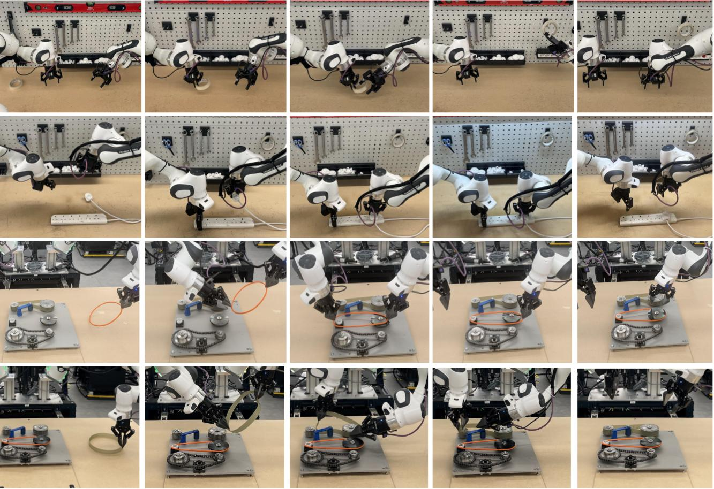

Figure 44: Model rollouts for the 4 tasks with the bi-arm Franka robot. From top to bottom: tape hanging on a workshop wall, plug insertion into socket, round belt assembly in NIST task board 2, timing belt assembly in NIST task board 2.

Report issue for preceding element

We test our Gemini Robotics model on the bi-arm Franka platform on 4 dexterous tasks relevant for industrial applications (example of rollouts in [Fig. 44](https://arxiv.org/html/2503.20020v1#A4.F44 "In D.4.1 Tasks description ‣ D.4 Adaptation to new embodiments ‣ Appendix D Specializing and Adapting Gemini Robotics for Dexterity, Reasoning, and New Embodiments ‣ Gemini Robotics: Bringing AI into the Physical World")). We describe here the tasks and define the progress score for each of them:

Report issue for preceding element

* •

  Tape hanging on a workshop wall: The robot must grasp a tape from the desk and hang it on a hook on the workshop wall.

  Report issue for preceding element
  + –

    1.0: If the robot succeeds in handing the tape over to the other arm, hangs it to the correct hook on the wall and moves the arms away;

    Report issue for preceding element
  + –

    0.9: If the robot succeeds in handing the tape over to the other arm and hangs it to the correct hook on the wall;

    Report issue for preceding element
  + –

    0.5: If the robot succeeds in handing the tape over to the other arm;

    Report issue for preceding element
  + –

    0.1: If the robot picks up the tape;

    Report issue for preceding element
  + –

    0.0: If anything else happens.

    Report issue for preceding element
* •

  Plug insertion into socket: One arm must grasp a UK electric plug and insert it into a socket to turn on a light, while the other arm must stabilize the socket.

  Report issue for preceding element
  + –

    1.0: If the robot successfully inserts the plug into the socket, the light turns on and the robot moves the arms away;

    Report issue for preceding element
  + –

    0.9: If the robot successfully inserts the plug into the socket and the light turns on;

    Report issue for preceding element
  + –

    0.7: If the robot successfully aligns the plug with respect to the socket;

    Report issue for preceding element
  + –

    0.3: If the robot successfully grasps the plug with one arm and holds the socket with the other arm;

    Report issue for preceding element
  + –

    0.2: If the robot successfully grasps the plug with one arm;

    Report issue for preceding element
  + –

    0.0: If anything else happens.

    Report issue for preceding element
* •

  Round belt task of NIST Assembly Task Board 2 (ATB) (Kimble et al., [2020](https://arxiv.org/html/2503.20020v1#bib.bib28)): The robot must assemble a flexible industrial rubber band around a pulley system. This requires handing over the flexible and draping rubber band, and stretching it to fit onto the pulleys.

  Report issue for preceding element
  + –

    1.0: If the robot inserts the rubber band on both wheels, ensures the belt is properly inserted and moves the arms away;

    Report issue for preceding element
  + –

    0.9: If the robot inserts the rubber band on both wheels;

    Report issue for preceding element
  + –

    0.7: If the robot inserts the rubber band on one of the wheels, but fails to place the rubber band on the other wheel;

    Report issue for preceding element
  + –

    0.5: If the robot manages to grasp the rubber band with both arms;

    Report issue for preceding element
  + –

    0.1: If the robot manages to grasp the rubber band with one arm;

    Report issue for preceding element
  + –

    0.0: If anything else happens.

    Report issue for preceding element
* •

  Timing belt task of NIST Assembly Task Board 2 (ATB) (Kimble et al., [2020](https://arxiv.org/html/2503.20020v1#bib.bib28)): The robot must assemble an industrial timing belt around a pulley system. This demands coordinated bi-arm action and significant force (roughly 40N) to pull the blue handle in the correct direction, enabling the timing belt’s secure placement on the pulley system.

  Report issue for preceding element
  + –

    1.0: If the robot inserts the belt on both wheels by applying enough force on the blue handle, ensures that the belt is properly inserted and moves the arms away;

    Report issue for preceding element
  + –

    0.9: If the robot inserts the belt on both wheels by apply enough force on the blue handle and ensures that the belt is properly inserted;

    Report issue for preceding element
  + –

    0.7: If the robot inserts the belt on the large wheel, pushes the blue handle but fails to place the belt on the small wheel;

    Report issue for preceding element
  + –

    0.5: If the robot just inserts the belt on the large wheel.

    Report issue for preceding element
  + –

    0.3: If the robot manages to grasp the belt with both arms;

    Report issue for preceding element
  + –

    0.1: If the robot manages to grasp the belt with one arm;

    Report issue for preceding element
  + –

    0.0: If anything else happens.

    Report issue for preceding element

#### D.4.2 Evaluation procedure

Report issue for preceding element

For in distribution evaluations, we run 20 trials per task by setting up the initial conditions based on the training data.
We now describe the benchmark used to assess the visual and the action generalization performance for our Gemini Robotics model and the single task diffusion baseline.

Report issue for preceding element

##### D.4.2.1 Visual generalization tasks

Report issue for preceding element

For each task, we vary the appearance of the scene by 1) adding novel distractor objects, 2) altering the background and 3) changing the lighting condition. Example of initial scenes used for this analysis can be found in Figure [45](https://arxiv.org/html/2503.20020v1#A4.F45 "Figure 45 ‚Ä£ D.4.2.1 Visual generalization tasks ‚Ä£ D.4.2 Evaluation procedure ‚Ä£ D.4 Adaptation to new embodiments ‚Ä£ Appendix D Specializing and Adapting Gemini Robotics for Dexterity, Reasoning, and New Embodiments ‚Ä£ Gemini Robotics: Bringing AI into the Physical World").

Report issue for preceding element

Figure 45: Example tasks used for visual generalization studies when the Gemini Robotics model is adapted to the bi-arm Franka robot.

Report issue for preceding element

##### D.4.2.2 Action generalization tasks

Report issue for preceding element

For each task, we assess action generalization by 1) putting the objects at positions that are not seen in the training data and 2) using different instances of objects to be manipulated that have different appearances, shapes or physical properties. Examples of initial scenes can be found in Figure [46](https://arxiv.org/html/2503.20020v1#A4.F46 "Figure 46 ‚Ä£ D.4.2.2 Action generalization tasks ‚Ä£ D.4.2 Evaluation procedure ‚Ä£ D.4 Adaptation to new embodiments ‚Ä£ Appendix D Specializing and Adapting Gemini Robotics for Dexterity, Reasoning, and New Embodiments ‚Ä£ Gemini Robotics: Bringing AI into the Physical World").

Report issue for preceding element

Figure 46: Example tasks used for action generalization studies when the Gemini Robotics model is adapted to the bi-arm Franka robot.

Report issue for preceding element

For completeness, in addition to Figure [28](https://arxiv.org/html/2503.20020v1#S4.F28 "Figure 28 ‚Ä£ 4.4 Adaptation to new embodiments ‚Ä£ 4 Specializing and Adapting Gemini Robotics for Dexterity, Reasoning, and New Embodiments ‚Ä£ Gemini Robotics: Bringing AI into the Physical World") where we reported the progress score, Figure [47](https://arxiv.org/html/2503.20020v1#A4.F47 "Figure 47 ‚Ä£ D.4.2.2 Action generalization tasks ‚Ä£ D.4.2 Evaluation procedure ‚Ä£ D.4 Adaptation to new embodiments ‚Ä£ Appendix D Specializing and Adapting Gemini Robotics for Dexterity, Reasoning, and New Embodiments ‚Ä£ Gemini Robotics: Bringing AI into the Physical World") reports the success rate of our model and the baseline across the tasks in the generalization benchmark.

Report issue for preceding element

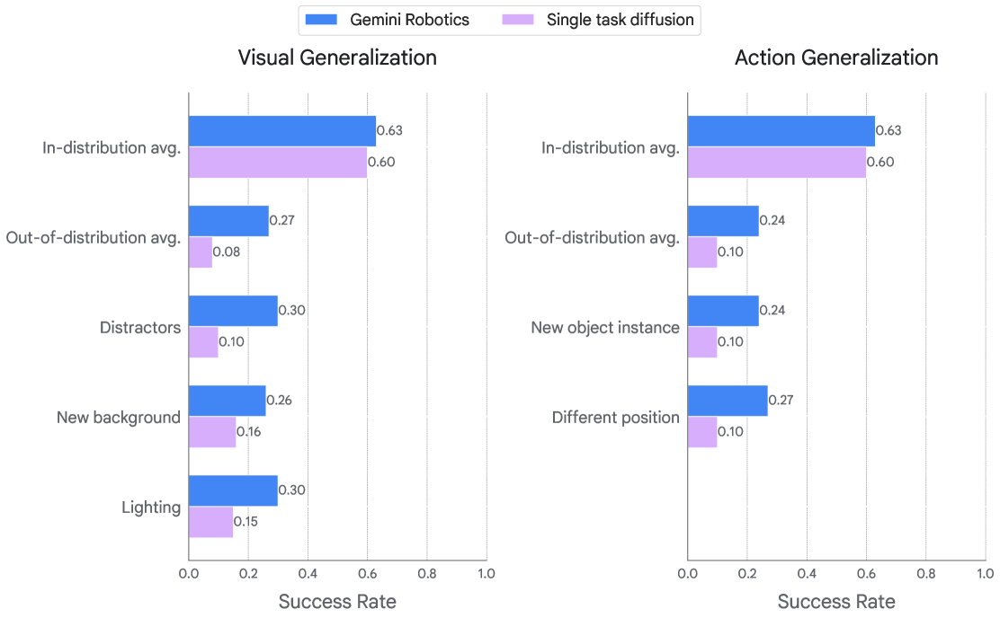

Figure 47: Breakdown of generalization metrics (success rate) when the Gemini Robotics model is adapted to the bi-arm Franka robot. Similar to the progress score used in [Fig. 28](https://arxiv.org/html/2503.20020v1#S4.F28 "In 4.4 Adaptation to new embodiments ‣ 4 Specializing and Adapting Gemini Robotics for Dexterity, Reasoning, and New Embodiments ‣ Gemini Robotics: Bringing AI into the Physical World"), our model significantly outperforms the diffusion baseline.

Report issue for preceding element

Report Issue

##### Report Github Issue

Title:Content selection saved. Describe the issue below:Description:

Submit without GithubSubmit in Github

Report Issue for Selection

Generated by
[L
A
T
E
xml
![[LOGO]](data:image/png;base64...)](https://math.nist.gov/~BMiller/LaTeXML/)

## Instructions for reporting errors

We are continuing to improve HTML versions of papers, and your feedback helps enhance accessibility and mobile support. To report errors in the HTML that will help us improve conversion and rendering, choose any of the methods listed below:

* Click the "Report Issue" button.
* Open a report feedback form via keyboard, use "**Ctrl + ?**".
* Make a text selection and click the "Report Issue for Selection" button near your cursor.
* You can use Alt+Y to toggle on and Alt+Shift+Y to toggle off accessible reporting links at each section.

Our team has already identified [the following issues](https://github.com/arXiv/html_feedback/issues). We appreciate your time reviewing and reporting rendering errors we may not have found yet. Your efforts will help us improve the HTML versions for all readers, because disability should not be a barrier to accessing research. Thank you for your continued support in championing open access for all.

Have a free development cycle? Help support accessibility at arXiv! Our collaborators at LaTeXML maintain a [list of packages that need conversion](https://github.com/brucemiller/LaTeXML/wiki/Porting-LaTeX-packages-for-LaTeXML), and welcome [developer contributions](https://github.com/brucemiller/LaTeXML/issues).